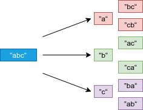

# Python剑指offer打卡-10

[toc]

## 字符流中第一个不重复的字符

题目类型：字符串

题目难度：:star2:

- 问题描述

  ```python
  问题描述：
  	在字符串 s 中找出第一个只出现一次的字符。如果没有，返
  回一个单空格。 s 只包含小写字母。
  如：
  s = "abaccdeff"
  返回 "b"
  
  s = ""
  返回 " "
  
  解题方法：
  1.哈希表
  字典
  2.有序哈希表（python3独有特性）
  
  注意：
  第一个只出现一次的字符，即有序
  ```

- 代码

  ```python
  class Solution:
  
      def firstUniqueChar(self, s: str) -> bool:
  
          dic = {}
          for c in s:
              # 重复出现，value值为False
              dic[c] = not c in dic
              
          # 查询(新版本的字典是有序字典，顺序遍历)
          for k, v in dic.items():
              if v: return k
  
          return " "
  ```
  
- 变体（牛客网）：

  ```
  问题描述：
  在一个字符串(0<=字符串长度<=10000，全部由字母组成)中找到第一个只出现一次的字符,并返回它的位置, 
  如果没有则返回 -1（需要区分大小写）.（从0开始计数）
  
  解题方法：
  与上一题不同，此题要求输出字符流中，第一个不重复字符的“位置”
  ```

- 代码

  ```python
  class Solution:
      def FirstNotRepeatingChar(self, s):
          
          dic = {}
          
          for c in s:
              dic[c] = not c in dic
              
         # python2.7(牛客) 
          for c in s:
              if dic[c]:
                  return list(s).index(c)
              
          return -1
  ```

## 滑动窗口最大值（<font color = red>重点</font>） 

题目类型：字符串

题目难度：:star2::star2::star2::star2:

- 问题描述

  ```
  问题描述：
  	给你一个整数数组 nums，有一个大小为k的滑动窗口从数组的最左侧移动到
  数组的最右侧。你只可以看到在滑动窗口内的k个数字。滑动窗口每次只向右移动一
  位。返回滑动窗口中的最大值。
  
  如：
  输入：nums = [1,3,-1,-3,5,3,6,7], k = 3
  输出：[3,3,5,5,6,7]
  解释：
  滑动窗口的位置        最大值
  　---------------        　　-----
  [1  3  -1] -3  5  3  6  7       3
   1 [3  -1  -3] 5  3  6  7       3
   1  3 [-1  -3  5] 3  6  7       5
   1  3  -1 [-3  5  3] 6  7       5
   1  3  -1  -3 [5  3  6] 7       6
   1  3  -1  -3  5 [3  6  7]      7
   
   解题方法：
  单调队列：只需要维护有可能成为窗口里最大值的元素就可以了，同时保证队里里
  的元素数值是由大到小的。
  (左删除，右添加原则)
  时间复杂度：O(N)  # 总共遍历N次
  空间复杂度：O(K)  # 队列需要存储k个值
  ```

- 代码（[解题思路](https://leetcode-cn.com/problems/hua-dong-chuang-kou-de-zui-da-zhi-lcof/solution/mian-shi-ti-59-i-hua-dong-chuang-kou-de-zui-da-1-6/)）

  ```python
  import collections
  
  
  class Solution:
      def maxSlidingWindow(self, nums: List[int], k: int) -> List[int]:
  
          # 申请队列保持当前队列最大值
          deque = collections.deque()
          res, n = [], len(nums)
  
          # 遍历窗口值
          for i, j in zip(range(1-k, n - k + 1), range(n)):
              # [-2, 0]包括边界值
              # 左删除
              if i > 0 and deque[0] == nums[i - 1]:
                  deque.popleft()
              # 保证队列当前最大
              while deque and deque[-1] < nums[j]:
                  deque.pop()
              # 添加
              deque.append(nums[j])
              # 边界最大值
              if i>= 0:
                  res.append(deque[0])
  
          return res
  ```
  
- 代码运行

  

## 数值的整数次方

题目类型：数字

题目难度：:star2:

- 问题描述

  ```python
  问题描述：
  	实现函数double Power(double base, int exponent)，求base的exponent次方。
  不得使用库函数，同时不需要考虑大数问题。
  
  解题方法：
  快速幂解析
  注意：需要将负数转换为正数进行处理
  2^5 = (2^2)^2*2
  n == 5
  res = 2 * 1
  x = 2 * 2
  
  n == 2
  res = 2 * 2
  x = (2 * 2)**2
  
  n == 1
  res = 2 ** 5
  
  n == 0
  退出
  ```

- 代码（[解题思路](https://leetcode-cn.com/problems/shu-zhi-de-zheng-shu-ci-fang-lcof/solution/mian-shi-ti-16-shu-zhi-de-zheng-shu-ci-fang-kuai-s/)）

  ```python
  class Solution:
  
      def myPow(self, x: float, n: int) -> float:
  
          if x == 0: return 0
          res = 1  # 存储计算数
  
          # 负数变为正数计算
          if n < 0: x,  n = 1/x,  -n
              
          while n:
              if n&1: res *= x  # 等价n%2
              x *= x
              n >>= 1  # 等价ｎ//2
  
          return res
  ```

## 顺时针打印矩阵（<font color = red>重点</font>）

题目类型：数组

题目难度：:star2::star2::star2:

- 问题描述

  ```
  问题描述：
  	输入一个矩阵，按照从外向里以顺时针的顺序依次打印出每一个数字。
  
  实例1：
  输入：matrix = [[1,2,3,4],[5,6,7,8],[9,10,11,12]]
  输出：[1,2,3,4,8,12,11,10,9,5,6,7]
  实例2：
  输入：matrix = [[]]
  输出：[ ]
  
  
  解题方法：
  方法1:
  zip使用旋转矩阵
   ma
  [[4, 5, 6], [7, 8, 9]]
  
  list(zip(*ma))
  [(4, 7), (5, 8), (6, 9)]
  
  list(zip(*ma))[::-1]
  [(6, 9), (5, 8), (4, 7)]
  
  方法2:
  边界条件
  需要考虑矩阵为空的情况
  ```

- 代码（[解题思路](https://leetcode-cn.com/problems/shun-shi-zhen-da-yin-ju-zhen-lcof/solution/mian-shi-ti-29-shun-shi-zhen-da-yin-ju-zhen-she-di/)）

  边界条件描述：
  
  
  
  ```python
  class Solution:
  
      def spiralOrder(self, matirx: List[List[int]]) -> List[int]:
  
          res = []
          while matirx:
              res += matirx.pop(0)
              # 旋转数组
              matirx = list(zip(*matirx))[::-1]
  
          return res
  
      def spiralOrder(self, matrix: List[List[int]]) -> List[int]:
  
          if not matrix: return []
          res = []
          #  输入边界条件
          l, r, t, b = 0, len(matrix[0]) - 1, 0, len(matrix) - 1
          while True:
              # 从左向右
              for i in range(l, r + 1): res.append(matrix[t][i])
              t += 1
              if t > b: break
              # 从上之下
              for i in range(t, b + 1): res.append(matrix[i][r])
              r -= 1
              if r < l: break
              # 从右向左
              for i in range(r, l - 1, -1): res.append(matrix[b][i])
              b -= 1
              if b < t: break
              # 从下之上
              for i in range(b, t - 1, -1): res.append(matrix[i][l])
              l += 1
              if l > r: break
  
          return res
  
  
  if __name__ == "__main__":
      obj = Solution()
      ma = [[1, 2, 3], [4, 5, 6], [7, 8, 9]]
      print(obj.spiralOrder(ma))
  
  ```

## 字符串的排列（<font color = red>重点</font>）

题目类型：字符串、回朔法

题目难度：:star2::star2::star2:

- 问题描述

  ```python
  问题描述：
  		输入一个字符串，打印出该字符串中字符的所有排列。
  你可以以任意顺序返回这个字符串数组，但里面不能有重复元素。
  
  实例：
  输入：s = "abc"
  输出：["abc","acb","bac","bca","cab","cba"]
  ```

- 代码（[解题思路](https://leetcode-cn.com/problems/zi-fu-chuan-de-pai-lie-lcof/solution/mian-shi-ti-38-zi-fu-chuan-de-pai-lie-hui-su-fa-by/)）

  
  
  ```python
  class Solution:
      
      def permutation(self, s: str) -> List[str]:
          
        c, res = list(s), []
          def dfs(x):
              if x == len(c) - 1:
                  res.append(''.join(c))   # 添加排列方案
                  return
              dic = set()
              for i in range(x, len(c)):
                  if c[i] in dic: continue # 重复，因此剪枝
                  dic.add(c[i])
                  c[i], c[x] = c[x], c[i]  # 交换，将 c[i] 固定在第 x 位
                  dfs(x + 1)               # 开启固定第 x + 1 位字符
                  c[i], c[x] = c[x], c[i]  # 恢复交换
          dfs(0)
          return res
  ```
  
- 代码运行图示
  
  
  
- 变体（牛客网）

  ```
  问题描述：
  输入一个字符串,按字典序打印出该字符串中字符的所有排列。例如输入字符串abc,则按字典序打印出由字符a,b,c所能排列出来的所有字符串abc,acb,bac,bca,cab和cba。
  
  注意：
  此时不是任意的序列，要求有序，因此，在最后的返回中加入了sorted()，从首字母开始比较，如果首字母相同则比较第二个字母，以此类推。
  ```

- 代码

  ```python
  
  class Solution:
      def Permutation(self, ss):
          # write code here
          c, res = list(ss), []
          def dfs(x):
              if x == len(c) - 1:
                  res.append("".join(c))
                  return
              dic = set()
              for i in range(x,len(c)):
                  if c[i] in dic:
                      continue
                  dic.add(c[i])
                  
                  c[i], c[x] = c[x], c[i]
                  dfs(x + 1)
                  c[i], c[x] = c[x], c[i]
                  
          dfs(0)
          return sorted(res)  # sorted()能对可迭代对象进行排序,结果返回一个新的list
             
  ```

  