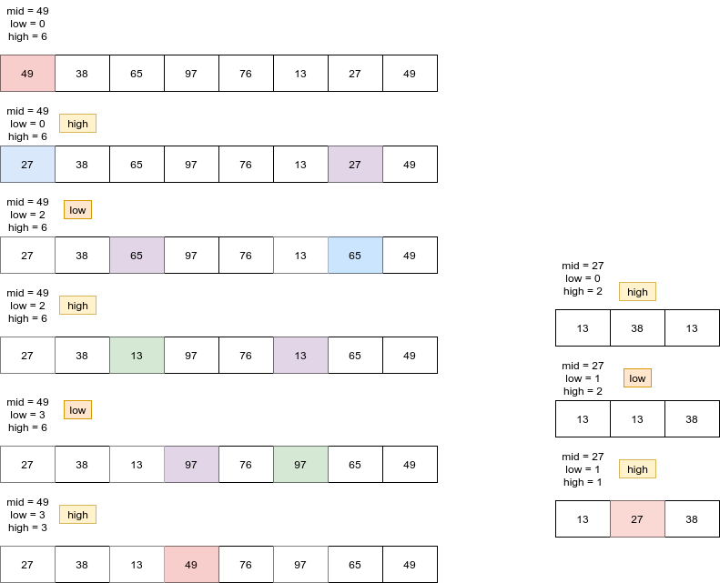
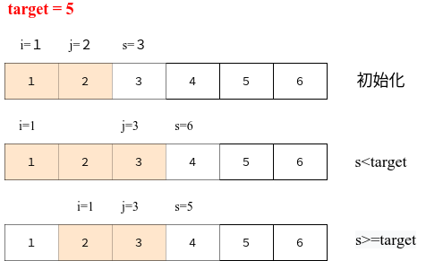

# Python剑指offer打卡-11

[toc]

## 把数组排成最小的数

题目类型：数组、快速排序

题目难度：:star2::star2:

- 问题描述

  ```
  问题描述：
  	输入一个非负整数数组，把数组里所有数字拼接起来排成一个数，打印能
  拼接出的所有数字中最小的一个。
  
  实例：
  输入: [3,30,34,5,9]
  输出: "3033459
  
  说明：
  输出结果可能非常大，所以你需要返回一个字符串而不是整数
  拼接起来的数字可能会有前导 0，最后结果不需要去掉前导0
  若拼接字符串 x + y > y + x，则 x “大于” y；
  反之，若 x + y < y + x，则 x “小于” y；
  
  
  解题方法：
  快速排序法
  时间复杂度：O(nlogn)
  空间复杂度：O(n)
  ```
  
- 知识点（快速排序法）

  快速排序图解

  

  实例图解：

  

  动图演示：

  
  
  快速排序演示代码（[排序算法：快速排序【图解+代码】](https://www.bilibili.com/video/BV1bz411e7vY?from=search&seid=17579587592323875466)）：
  
  ```python
      def quick_sort(self, nums, start, end):
          """实现快速排序法"""
  
          if start >= end:
              return
          # 基准数据(哨兵结点)
          mid = nums[start]
          low = start
          high = end
          while low < high:
              # 右半部分大(注意边界条件，右半部分个大于等于)
              while low < high and nums[high] >= mid:
                  high -= 1
              nums[low] = nums[high]
              while low < high and nums[low] < mid:
                  low += 1
              nums[high] = nums[low]
  
          # 交换分界线
          nums[low] = mid
          # 左半部分(递归调用)
          self.quick_sort(nums, start, low - 1)
          self.quick_sort(nums, low + 1, end)
  ```
  
- 代码[解题思路](https://leetcode-cn.com/problems/ba-shu-zu-pai-cheng-zui-xiao-de-shu-lcof/solution/mian-shi-ti-45-ba-shu-zu-pai-cheng-zui-xiao-de-s-4/)

  ```python
  class Solution:
  
      def minNumber(self, nums):
  
          def quick(l, r):
              if l >= r:
                  return
  
              low, hight = l, r
              while low < hight:
                  while low < hight and strs[low] + strs[l] < strs[l] + strs[low]: low += 1
                  while low < hight and strs[hight] + strs[l] >= strs[l] + strs[hight]: hight -= 1
                  # change
                  strs[low], strs[hight] = strs[hight], strs[low]
              strs[low], strs[l] = strs[l], strs[low]
              quick(l, low - 1)
              quick(low + 1, r)
  
          strs = [str(c) for c in nums]
          quick(0, len(strs) - 1)
  
          return "".join(strs)
  
  
  if __name__ == "__main__":
      obj = Solution()
      print(obj.minNumber(nums=[3, 30, 34, 5, 9]))
  ```

## 数组在升序数组中出现的次数

题目类型：数组、二分法

题目难度：:star2::star2::star2:

- 问题描述

  ```python
  问题描述：
  统计一个数字在排序数组中出现的次数
  
  实例：
  输入: nums = [5,7,7,8,8,10], target = 8
  输出: 2
  
  解题方法：
  因为题目中出现了"排序"，所以应该首先想到二分查找
  二分法查找
  时间复杂度：O(logn)
  ```

- 知识点

  二分法（[二分法查找](https://www.cnblogs.com/johnhery/p/9936335.html)）

  二分法查找适用于数据量较大时，但是数据需要<font color ="red">先排好顺序</font>。主要思想是：（设查找的数组区间为array[low, high]）
  
  
  
  二分查找演示代码
  
  注意:二分查找边界值为:==low <= high==
  
  
  
  ```python
  class Solution:
  
      def binarySearch(self, nums, target):
          """
          二分查找法
          :param nums: 有序列表 
          :param target: 查找目标
          :return: 指定元素值，无则返回-1
          """
          
          low = 0
          high = len(nums) - 1
          
          while low <= high:
              mid = (low + high) >> 1
              if nums[mid] > target:
                  high = mid - 1
              elif nums[mid] < target:
                  low = mid + 1
              else:
                  return nums[mid]
  
          return -1
  ```
  
- 代码（[解题思路](https://leetcode-cn.com/problems/zai-pai-xu-shu-zu-zhong-cha-zhao-shu-zi-lcof/solution/)）
  
  ```python
  class Solution:
      def search(self, nums: List[int], target: int) -> int:
  
          def helper(tar):
              """寻找指定数值的右边界"""
  
              i, j = 0, len(nums) - 1
  
              while i<=j:
                  mid = (i + j) // 2
                  if nums[mid] <= tar:  # j == i
                      i = mid + 1
                  else:
                      j = mid - 1  # j < i　越界
              return i   # 返回右边界的索引
          
          return helper(target) - helper(target - 1)
  ```
## 和为S的连续正数序列

题目类型：数组

题目难度：:star2:

- 问题描述

  ```python
  问题描述：
  	输入一个正整数 target ，输出所有和为 target 的连续正整数序列
     （至少含有两个数）。序列内的数字由小到大排列，不同序列按照
  首个数字从小到大排列。
  
  实例：
  输入：target = 15
  输出：[[1,2,3,4,5],[4,5,6],[7,8]]
  
  解题方法：
  1. 初始化： 左边界 i = 1 ，右边界 j = 2，元素和 s = 3，结果列表 res ；
  2. 循环： 当 i≥j 时跳出；
      当 s > targets 时： 向右移动左边界 i = i + 1 ，并更新元素和 s ；
      当 s < targets 时： 向右移动右边界 j = j + 1，并更新元素和 s ；
      当 s = targets 时： 记录连续整数序列，并向右移动左边界 i = i + 1 ；
  3. 返回值： 返回结果列表 res 。
  时间复杂度：O(N)
  空间复杂度：O(1)
  
  注意：
  １．至少含有两个数
  ２．连续数组
  ３．由小到大
  ```

- 代码（[解题思路](https://leetcode-cn.com/problems/he-wei-sde-lian-xu-zheng-shu-xu-lie-lcof/solution/jian-zhi-offer-57-ii-he-wei-s-de-lian-xu-t85z/)）

  
  
  ```python
  class Solution:
  
      def findContinuousSequence(self, target):
  
          # 初始化连续区间
          i, j, s, res = 1, 2, 3, []
          
          while i < j:
              if s == target:
                  res.append(list(range(i, j+1)))
              if s >= target:
                  s -= i  # 先减后加
                  i += 1
              else:
                  j += 1  # 先加后加
                  s += j
  
        return res
  ```

## 左旋转字符串

题目类型：字符串

题目难度：:star:

- 问题描述

  ```python
  问题描述：
  	字符串的左旋转操作是把字符串前面的若干个字符转移到字符串的尾部。请定义
  一个函数实现字符串左旋转操作的功能。比如，输入字符串"abcdefg"和数字2，该函
  数将返回左旋转两位得到的结果"cdefgab"。
  
  解题方法：
  遍历
  时间复杂度：O(N)
  空间复杂度：O(N)
  ```

- 代码（[解题思路](https://leetcode-cn.com/problems/zuo-xuan-zhuan-zi-fu-chuan-lcof/solution/mian-shi-ti-58-ii-zuo-xuan-zhuan-zi-fu-chuan-qie-p/)）

  
  
  ```python
  class Solution:
  
      def reverseSelectWords_fun1(self, s: str, n: int) -> str:
          """切片方法"""
  
          return s[n:] + s[:n]
  
      def reverseSelectWords_fun2(self, s: str, n: int) -> str:
          """遍历算法"""
  
          res = []
          for i in range(n, len(str) + n):
              res.append(s[i % len(s)])
  
          return "".join(res)
  
      def recverseSelectWords_fun3(self, s: str, n: int) -> str:
          """先尾后头法"""
  
          res = []
          # 尾部
          for i  in range(n, len(str)):
              res.append(str[i])
          # 头部
          for i in range(n):
              res.append(str[i])
  
          return "".join(res)
  ```

## 翻转单词顺序列

题目类型：字符串

题目难度：:star2:

- 问题描述

  ```python
  问题描述：
  	输入一个英文句子，翻转句子中单词的顺序，但单词内字符的顺序不变。为简单起
  见，标点符号和普通字母一样处理。例如输入字符串"I am a student. "，则输出"studen" 
   + "t. a am I"。
  
  解题方法：
  1. 倒置排序
  
  注意：
  while 表示：
  i = 0 时，字符为“I”还需要进行遍历
  下一步：i = -1，退出while循环，返回倒转结果
  ```

- 代码

  ```python
  class Solution:
  
      def reverseWords(self, s:str) -> str:
          """双指针法"""
  
          # 消除首尾空格
          s = s.strip()
          i = j = len(str) - 1
          res = []
          while i >= 0:
              # 搜索单词首字符
              while i >= 0 and s[i] != " ": i -= 1
              res.append(s[i+1, j+1])
              while s[i] == " ": i -= 1
              j = i
          return " ".join(res)
  
      def reverseWords(self, s:str) -> str:
  
          return " ".join(s.strip().split()[::-1])  # 分割倒置
  ```

  


  