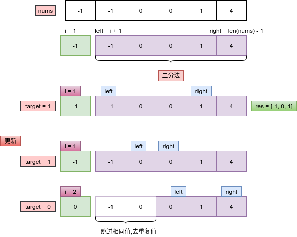

# Python剑指offer打卡-16

[toc]

## 最长递增子序列（<font color=red>重点</font>）

题目类型：数组、动态规划

题目难度：:star2::star2::star2:

- 问题描述

  ```
  问题描述：
      　给你一个整数数组 nums ，找到其中最长严格递增子序列的长度。子序列是
  由数组派生而来的序列，删除（或不删除）数组中的元素而不改变其余元素的顺序。
  例如，[3,6,2,7] 是数组 [0,3,1,6,2,2,7] 的子序列。
  
  示例：
  输入：nums = [10,9,2,5,3,7,101,18]
  输出：4
  解释：最长递增子序列是 [2,3,7,101]，因此长度为 4 。
  
  解题方法：
  1. 动态规划四步走原则
  (1)转态定义：dp[i]表示到当前结点i所表示的子序列的长度
  (2)转态转移：dp[i] = max(dp[i], dp[j] + 1)，表示为i之前最大的递增子序列
  (3)初始值：dp = [1]*len(nums)
  (4)返回值：max(dp)
  时间复杂度：O(N^2)  两层循环
  空间复杂度：O(N)  dp状态的存储
  2. 二分法
  时间复杂度：O(NlogN)
  空间复杂度：O(1)
  ```

- 代码（[解题思路](https://leetcode-cn.com/problems/longest-increasing-subsequence/solution/zui-chang-shang-sheng-zi-xu-lie-dong-tai-gui-hua-2/)）

  动态规划
  
  算法图解：
  
  
  
  ```python
  class Solution:
      def lengthOfLIS(self, nums: List[int]) -> int:
          
          if not nums: return 0
          # 定义dp,并设置初始值
          dp = [1]*len(nums)
          # 遍历转态
          for i in range(len(nums)):
              for j in range(i):
                  if nums[j] < nums[i]:
                      # 更新状态(已有子序列的前提上进行更新)
                      dp[i] = max(dp[i], dp[j] + 1)
          # 返回值
          return max(dp)
  ```
  
  ==变形：输出最长递增子序列==
  
  ```python
  class Solution:
      def LIS(self , arr ):
          # write code here
          n = len(arr)
          if n < 2:
              return n
          # 设定初始状态
          dp = [1]*n
          # 状态转移
          for i in range(n):
              for j in range(i):
                  if arr[i] > arr[j]:
                      dp[i] = max(dp[i], dp[j] + 1)
           # 获取序列
          m = max(dp)
          index = dp.index(m)
          res = [0]*m
          m -= 1
          res[m] = arr[index]
          for i in range(index, -1, -1):
              if arr[i] < arr[index] and dp[i] == dp[index] - 1:
                  m -= 1
                  res[m] = arr[i]
                  index = i
          return res
  ```
  
  二分法优化
  
  原理：
  
  1.插入2，[2]
  
  2.插入3，[2,3]
  
  3.插入4,   [2,3,4] 
  
  4.插入5，[2,3,4,5]
  
  5.插入1，[1,3,4,5] 
  
  6,插入6， [1,3,4,5,6]
  
  7.插入2， [1,2, 4,5,6]
  
  ```python
  class Solution:
      def lengthOfLIS(self, nums: List[int]) -> int:
          size = len(nums)
          if size<2:
              return size
          
          cell = [nums[0]]
          for num in nums[1:]:
              if num>cell[-1]:
                  cell.append(num)
                  continue
              
              l,r = 0,len(cell)-1
              while l<r:
                  mid = l + (r - l) // 2
                  if cell[mid]<num:
                      l = mid + 1
                  else:
                      r = mid
              cell[l] = num
          return len(cell)
  ```

## 两数之和（<font color=red>重点</font>）

题目类型：数组

题目难度：:star2::star2:

- 问题描述

  ```python
  问题描述：
  	给定一个整数数组 nums 和一个整数目标值 target，请你在该数组中找出和
  为目标值 的那两个 整数，并返回它们的数组下标。你可以假设每种输入只会对应
  一个答案。但是，数组中同一个元素在答案里不能重复出现。你可以按任意顺序
  返回答案。
  
  解题方法：
  方法一：暴力求解
  时间复杂度O(N^2)
  空间复杂度O(1)
  
  方法二：哈希表（空间换时间）
  原理：将数组中的一个整数固定，另一个整数采用target - num的形式表现。
  时间复杂度O(N)
  空间复杂度O(N)
  
  注意：
  同一个元素不能重复出现
  [4, 4, 2, 1, 2]   target = 4
  不能出现[2, 2] or [4, 4] 应该出现[2, 4]的索引组合，index从0开始
  ```

- 代码

  ```python
  class Solution:
      def twoSum(self, nums: List[int], target: int) -> List[int]:
  	"""暴力求解"""
      
          for i in range(len(nums)):
              for j in range(i + 1, len(nums)):
                  if nums[i] + nums[j] == target:
                      return [i, j]
          
          return []
      
      def twoSum(self, nums: List[int], target: int) -> List[int]:
      	"""哈希表"""    
          
          hashtable = dict()
          for i, num in enumerate(nums):
              if target - num in hashtable:
                  return [hashtable[target - num], i]
              # {values: index}
              hashtable[nums[i]] = i
          
          return []
  ```

## 两数相加（<font color=red>重点</font>）

题目类型：链表

题目难度：:star2::star2::star2:

- 问题描述

  ```
  问题描述：
      　给你两个非空 的链表，表示两个非负的整数。它们每位数字都是按照逆序的方式
  存储的，并且每个节点只能存储一位数字。请你将两个数相加，并以相同形式返回一
  个表示和的链表。你可以假设除了数字 0 之外，这两个数都不会以 0开头。
  
  解题方法：
  题目难点在于进位计算，即标识进位标记。
  新值＝l1.val + l2.val + 进位值
  
  时间复杂度:O(max(L1, L2))
  空间复杂度O(1)
  
  注意：
  1. 逆序意味着低位在链表的前面，例如链表：1->2->3 表示数字：321。
  2. 每个节点只能存储一位数值，且题目要求返回一个表示和的链表。
  ```

- 代码

  算法图解：

  

  ```python
  class ListNode:
  
      def __init__(self, val=0, next=None):
          self.val = val
          self.next = next
  
  
  class Solution:
  
      def addTwoNumbers(self, l1: ListNode, l2: ListNode) -> ListNode:
  
          # 申请头结点
          dummy = cur = ListNode()
          # 进位节点
          carry = 0
          while l1 or l2:
  
              x = l1.val if l1 else 0
              y = l2.val if l2 else 0
              # 存储节点值
              sum = x + y + carry
              cur.next = ListNode(sum % 10)
              carry = sum // 10
              # 更新节点
              cur = cur.next
              if l1: l1 = l1.next
              if l2: l2 = l2.next
          # 进位的最后节点
          if carry: cur.next = ListNode(carry)
  
          return dummy.next
  ```

## 三数之和（<font color = red>重点</font>）

题目类型：数组

题目难度：:star2::star2::star2::star2:

- 问题描述

  ```
  问题描述：
  	给你一个包含 n 个整数的数组nums，判断nums中是否存在三个元素 a，b，c ，
  使得a + b + c = 0 ？请你找出所有和为 0 且不重复的三元组。
  
  解题方法:
  （1）暴力求解
  时间复杂度：O(N^3)
  （2）二分法查找
  需要消除重复值：固定点消除，子区间内消除
  时间复杂度：O(N^2)
  注意：
  返回的list中不能含有重复的列表值
  如 [-1, 1, 0] [1, 0, -1]
  ```

- 代码（[解题思路](https://leetcode-cn.com/problems/3sum/solution/suan-fa-si-wei-yang-cheng-ji-er-fen-cha-5bk43/)）

  图解
  
  说明在二分法中求和，需要注意在left 和 right 的移动中要消去重复出现的值，而在外层固定值i 的变换中要消去i领域内的重复值。 
  
  
  
  ```python
  import numpy as np
  
  class Solution:
      
      def threeSum(self, nums: List[int]) -> List[List[int]]:
  
          res = []
          nums = sorted(nums)
          for i in range(len(nums)):
              for j in range(i + 1, len(nums)):
                  for k in range(j + 1, len(nums)):
                      if nums[i] + nums[j] + nums[k] == 0:
                          res.append([nums[i], nums[j], nums[k]])
          
          return np.unique(np.array(res), axis = 0).tolist()
      
      def threeSum(self, nums: List[int]) -> List[List[int]]:
  
          nums.sort()
          res = []
  
          for i in range(len(nums) - 2):
              # 正负相抵(提前终止)
              if nums[i] > 0: break
              if i > 0 and nums[i] == nums[i - 1]: continue
              # 固定当前值
              target = -nums[i]
              # 二分算法
              left, right = i + 1, len(nums) - 1
              while left < right:
                  if target == nums[left] + nums[right]:
                      res.append([nums[i], nums[left], nums[right]])
                      # 更新边界
                      left += 1
                      right -= 1
                      while left < right and nums[left] == nums[left - 1]:
                          left += 1
                      while left < right and nums[right] == nums[right + 1]:
                          right -= 1
                  elif target > nums[left] + nums[right]:
                      left += 1
                  else:
                      right -= 1
          return res
  ```

## 无重复字符的最长子串（<font color = red>重点</font>）

题目类型：字符串

题目难度：:star2::star2::star2::star2:

- 问题描述

  ```
  问题描述：
  	给定一个字符串，请你找出其中不含有重复字符的最长子串的长度。
  
  解题方法：
  滑动窗口
  两种情况下滑动窗口的移动：
  （1）[abcdef]a  ----> [bcdefa]
  （2）[bdefa]a  ----> [a]
  时间复杂度：O(N)
  空间复杂度：O(N) 使用集合临时存储了最长字符串，极端情况下需要存储N
  ```

- 代码（[解题思路](https://leetcode-cn.com/problems/longest-substring-without-repeating-characters/solution/hua-dong-chuang-kou-by-powcai/)）

  图解:窗口内无重复数值

  

  ```python
  class Solution:
      def lengthOfLongestSubstring(self, s: str) -> int:
  
          if not s: return 0
          # left 记录窗口左边界索引值
          left, max_len, cur_len = 0, 0, 0
          # 集合保证了无重复性
          look_up = set()
  
          for i in range(len(s)):
              cur_len += 1
              # 循环判断，直到左边界唯一
              while s[i] in look_up:
                  look_up.remove(s[left])
                  left += 1
                  cur_len -= 1
              # 记录字符串最长长度
              if cur_len > max_len: max_len = cur_len
              look_up.add(s[i])
  
          return max_len
  ```
