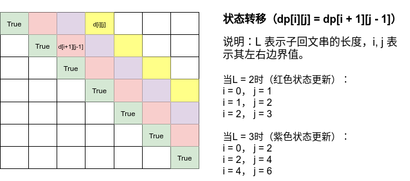

# Python剑指offer打卡-17

[toc]

## 最长回文子串（<font color=red>重点</font>）

题目类型：字符串

题目难度：:star2::star2::star2::star2:

回文的意思是正着念和倒着念一样，如：==上海自来水来自海上==

- 问题描述

  ```
  问题描述：
  给你一个字符串 s，找到 s 中最长的回文子串。
  
  字符串的回文：
          对于一个子串而言，如果它是回文串，并且长度大于 2，那么将它首尾的
  两个字母去除之后，它仍然是个回文串。例如对于字符串“ababa”，如果我
  们已经知道“bab” 是回文串，那么 “ababa” 一定是回文串，这是因为它
  的首尾两个字母都是a”。
  
  
  解题方法：
  动态规划
  (1)状态定义：d[i][j]表示s[i:j]为回文子串；
  (2)状态转移：d[i][j] = dp[i + 1][j - 1]，子问题是否为回文子串；
  (3)初始状态：dp[i][i] = True，表示只有一个字符时为回文子串；
  (4)返回值：最长的回文子串长度。
  时间复杂度O(n^2)
  空间复杂度O(n^2)
  ```

- 代码（[解题思路](https://leetcode-cn.com/problems/longest-palindromic-substring/solution/zui-chang-hui-wen-zi-chuan-by-leetcode-solution/)）

  图解：

  

  ```python
  class Solution:
      def longestPalindrome(self, s: str) -> str:
          
          n = len(s)
          # 当s只有一个字符和无字符时
          if n < 2:
              return s
          # 转态定义
          dp = [[False]*n for _ in range(n)]
          # 初始状态
          for i in range(n):
              dp[i][i] = True
          max_len, begin = 1, 0
          # 遍历状态
          for L in range(2, n + 1):
              # 左右边界
              for i in range(n):
                  j = i + L - 1
                  if j >= n:
                      break
                  if s[i] != s[j]:
                      dp[i][j] = False
                  else:
                      if j - i < 3:
                          dp[i][j] = True
                      else:
                          dp[i][j] = dp[i + 1][j - 1]
                  # 更新最长回文子串长度起始值
                  if dp[i][j] and j - i + 1 > max_len:
                      max_len = j - i + 1
                      begin = i
          
          return s[begin: begin + max_len]
  ```

## Z字形变换

题目类型：字符串

题目难度：:star2:

- 问题描述

  ```
  问题描述：
  	将一个给定字符串 s 根据给定的行数 numRows ，以从上往下、从左到右进
  行 Z 字形排列。
  
  实例：
  输入：s = "PAYPALISHIRING", numRows = 4
  输出："PINALSIGYAHRPI" (行字符串连接)
  解释：
  P        I        N
  A   L  S   I   G
  Y   A H  R
  P        I
  
  解题方法：
  设置flag，使得转换遇见头尾进行转换
  遍历：从上向下（flag = 1）从下向上（flag = -1）
  时间复杂度：O(n)
  空间复杂度：O(n)
  ```

- 代码（[解题思路](https://leetcode-cn.com/problems/zigzag-conversion/solution/zzi-xing-bian-huan-by-jyd/)）

  图解（从上向下（flag = 1）从下向上（flag = -1），转变过程以指定行为标准）

  

  ```python
  class Solution:
      def convert(self, s: str, numRows: int) -> str:
  
          if numRows < 2:
              return s
          # 初始化行存储
          res = ["" for _ in range(numRows)]
          i, flag = 0, -1
          # 遍历存储
          for c in s:
              res[i] += c
              if i == 0 or i == numRows - 1:
                  flag = -flag
              i += flag
  
          return "".join(res)
  ```

## 整数反转

题目类型：数值

题目难度：:star2::star2:

- 问题描述

  ```
  问题描述：
  	给你一个 32 位的有符号整数 x ，返回将 x 中的数字部分反转后的结果。如
  果反转后整数超过 32 位的有符号整数的范围[−2^31, 2^31− 1] ，就返回 0。假设
  环境不允许存储 64 位整数（有符号或无符号）。
  ```
  
- 代码（[解题思路](https://leetcode-cn.com/problems/reverse-integer/solution/zheng-shu-fan-zhuan-by-leetcode-solution-bccn/)）

  ```python
  class Solution:
      def reverse(self, x: int) -> int:
          
          INT_MIN, INT_MAX = -2 ** 31, 2 ** 31 - 1
          rev = 0
          while x != 0:
              # 边界值考虑
              if rev < INT_MIN//10 + 1 or rev > INT_MAX//10:
                  return 0
              # 取余数
              # -19 % 10 = 1
              digit = x % 10
              if digit > 0 and x < 0:
                  digit -= 10
              # 求整数
              # -19 // 10 = -2
              x = (x - digit) // 10
  
              rev = rev * 10 + digit
  
          return rev
  ```

## 二叉树的中序遍历

题目类型：二叉树

题目难度：:star2::star2:

- 问题描述

  ```
  问题描述：
  给定二叉树的根节点root，返回它的中序遍历。
  
  解题方法：
  （1）递归
  时间复杂度：O(N)，n为节点数，访问每个节点恰好一次。
  空间复杂度：空间复杂度：O(H)，H为树的高度。最坏情况下需要
  空间O(n)，平均情况为O(logN)。
  
  （2）使用栈进行模拟,迭代法
  时间复杂度：O(N)
  空间复杂度：O(H)
  ```

- 代码（[解题思路](https://leetcode-cn.com/problems/binary-tree-inorder-traversal/solution/python3-er-cha-shu-suo-you-bian-li-mo-ban-ji-zhi-s/)）

  ```python
  class Solution:
      def inorderTraversal(self, root: TreeNode) -> List[int]:
  	"""经典递归方式(通用模板)"""
          # 定义返回值
          res = []
          # 定义dfs
          def dfs(cur):
              if cur is None:
                  return 
              ## 前序递归
              # res.append(cur.val)
              # dfs(cur.left)
              # dfs(cur.right) 
               # 中序递归
              dfs(cur.left)
              res.append(cur.val)
              dfs(cur.right)
              # # 后序递归
              # dfs(cur.left)
              # dfs(cur.right)
              # res.append(cur.val)
          dfs(root)
          
          return res
      
      def inorderTraversal(self, root: TreeNode) -> List[int]:
          """模拟递归"""
  
          stack, res = [], []
          while stack or root:
              if root:
                  stack.append(root)
                  root = root.left
              else:
                  tmp = stack.pop()
                  res.append(tmp.val)
                  root = tmp.right
                  
          return res
  ```

## 不同的二叉搜索树

题目难度：:star2::star2::star2::star2:

题目类型：树、动态规划

- 问题描述

  ```
  问题描述
  	给你一个整数 n ，求恰由 n 个节点组成且节点值从 1 到 n 互不相同的二
  叉搜索树 有多少种？返回满足题意的二叉搜索树的种数。
  
  解题方法：
  动态规划(四步走原则)
  (1)定义转态：dp[i]表示连续的i个数，所有可能的BST组合个数；
  (2)状态转移：dp[i] += dp[j]*dp[i - j - 1]  2 <= i <= n, 2 <=  j <=  i - 1；
  eg:
        dp[2] = dp[1] * dp[0] + dp[0] * dp[1]
        dp[3] = dp[2] * dp[0] + dp[1] * dp[1] + dp[0]*[2]
  (3)初始状态：dp[0] = 1, dp[1] = 1 表示无节点和只有一个结点时, BST个数为1 ；
  (4)返回值：dp[n]连续n个结点的BST组合个数。
  时间复杂度：O(N^2)
  空间复杂度：O(N)
  ```

- 代码（[解题思路](https://leetcode-cn.com/problems/unique-binary-search-trees/solution/shou-hua-tu-jie-san-chong-xie-fa-dp-di-gui-ji-yi-h/)）

  ```python
  class Solution:
  
      def numTrees(self, n: int) -> int:
          # 定义转态
          dp = [0] * (n + 1)
          # 初始状态
          dp[0], dp[1] = 1, 1
          # 状态转移
          for i in range(2, n + 1):
              # 将 i - 1 个数左右对分
              # 左：j 右：i - j - 1
              for j in range(i):
                  dp[i] += dp[j] * dp[i - j - 1]
          # 返回值
          return dp[n]
  ```
  
  

