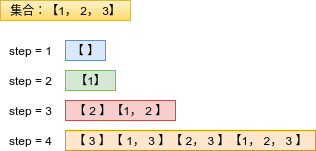
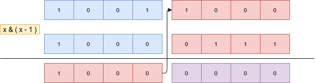

# Python剑指offer打卡-18

[toc]

## 合并二叉树

题目类型：二叉树

题目难度：:star2:

- 问题描述

  ```
  问题描述：
     　 给定两个二叉树，想象当你将它们中的一个覆盖到另一个上时，两个二叉树
  的一些节点便会重叠。你需要将他们合并为一个新的二叉树。合并的规则是如果
  两个节点重叠，那么将他们的值相加作为节点合并后的新值，否则不为NULL的
  节点将直接作为新二叉树的节点。
  
  示例：
  输入:
  　Tree 1                Tree 2
            1                         2
           / \                       / \
          3   2                     1   3
         /                           \   \
        5                             4   7
  输出:
  合并后的树:
  	     3
  	    / \
  	   4   5
  	  / \   \
  	 5   4   7
  
  解题方法：
  两棵二叉树同时先序遍历，需要判断两个节点是否同时存在。
  时间复杂度：O(min(m, n))
  空间复杂度：O(min(m, n))
  
  注意：
     　 题目要求此题为覆盖（一个树的覆盖到另一个树上），因此，需要直接在原
  有二叉树上进行修改l，而另一种情况，需要创建一棵新的二叉树来保存合并后的
  结果，两种题型需要注意审题。
  ```

- 代码（[解题思路](https://leetcode-cn.com/problems/merge-two-binary-trees/solution/dong-hua-yan-shi-di-gui-die-dai-617he-bing-er-cha-/)）

  ```python
  class Solution:
  
      def mergeTrees1(self, t1, t2):
          """合并两个二叉树，需要创建新树"""
  
          def dfs(t1, t2):
              # 判断是否同时存在
              if not (t1 and t2):
                  return t1 if t1 else t2
              # 合并节点
              merge = TreeNode(t1.val + t2.val)
              merge.left = dfs(t1.left, t2.left)
              merge.right = dfs(t1.right, t2.right)
  
              return merge
  
          return dfs(t1, t2)
      
      def mergeTrees2(self, root1: TreeNode, root2: TreeNode) -> TreeNode:
          """不需要创建一个新树"""
  
          def dfs(root1, root2):
  
              if not (root1 and root2):
                  return  root1 if root1 else root2
           
              # root1做主，root2做辅
              root1.val = root1.val + root2.val
              root1.left = dfs(root1.left, root2.left)
              root1.right = dfs(root1.right, root2.right)
  
              return root1
  
          return dfs(root1, root2)
  ```

## 旋转图像（<font color = red>重点</font>）

题目类型：遍历

题目难度：:star2:

- 问题描述

  ```
  问题描述：
      　给定一个 n×n 的二维矩阵 matrix 表示一个图像。请你将图像顺时针旋转90度。
  你必须在原地旋转图像，这意味着你需要直接修改输入的二维矩阵。请不要使用另一
  个矩阵来旋转图像。
  
  解题方法：
  (1) 暴力解法
  变换规则
  行 列
  1   n 
  2   n - 1
  3   n - 2
  ......
  n   1
  时间复杂度：O(N^2)
  空间复杂度：O(N^2)
  (2)中心旋转法
  len(matrix) == 4
  4 // 2 = 2  意味着当外层的旋转完成后，内层还要继续进行旋转。
  时间复杂度：O(N^2)
  空间复杂度：O(1)
  
  注意：
  题目要求必须在原地旋转图像
  ```

- 代码（[解题思路](https://leetcode-cn.com/problems/rotate-image/solution/0048xuan-zhuan-tu-xiang-by-jasonchiucc-a-2dfs/)）

  暴力法图解（有助于理解题意）

  

  ```python
  class Solution:
  
      def rotate1(self, matrix):
          """暴力求解"""
  
          n = len(matrix)
          # 构建临时旋转矩阵
          matrix_new = [[0] * n for _ in range(n)]
          for i in range(n):
              for j in range(n):
                  matrix_new[j][n - i - 1] = matrix[i][j]
  
          matrix[:] = matrix_new
  ```

  旋转变换法图解

  

  ```python
  class Solution:
  
      def rotate(self, matrix):
          """旋转变换"""
          
          T, L, B, R = 0, 0, len(matrix) - 1, len(matrix) - 1
          # k为旋转次数
          move = len(matrix)
          for k in range(len(matrix) // 2):
              for i in range(move - 1):
                  matrix[T][L + i], matrix[T + i][R] = matrix[T + i][R], matrix[T][L + i]
                  matrix[T][L + i], matrix[B][R - i] = matrix[B][R - i], matrix[T][L + i]
                  matrix[T][L + i], matrix[B - i][L] = matrix[B - i][L], matrix[T][L + i]
              # 由外向内收缩
              T += 1
              L += 1
              B -= 1
              R -= 1
              move -= 2
  ```

## 盛水最多的容器

题目类型：双指针

题目难度：:star2:

- 问题描述

  ```
  问题描述:
          给你 n 个非负整数 a1，a2，...，an，每个数代表坐标中的一个点(i,ai) 。在
  坐标内画 n 条垂直线，垂直线 i的两个端点分别为(i,ai) 和 (i, 0) 。找出其中的两
  条线，使得它们与x轴共同构成的容器可以容纳最多的水。
  说明：你不能倾斜容器。
  
  解题方法：
  解题原则，容器盛水的容量是由短边决定的。
  (1)暴力法
  时间复杂度:O(N^2)
  空间复杂度:O(1)
  
  (2)双指针法
  原则：容器的最大面积是由短板决定的，固定长板，移动短板。
  时间复杂度:O(N)
  空间复杂度:O(1)
  
  双指针移动的合理性：
          其实无论是移动短指针和长指针都是一种可行求解。 只是一开始就已经把指针定义
  在两端，如果短指针不动，而把长指针向着另一端移动，两者的距离已经变小了，无论
  会不会遇到更高的指针，结果都只是以短的指针来进行计算。 故移动长指针是无意义的。
  ```

- 代码（[解题思路](https://leetcode-cn.com/problems/container-with-most-water/solution/container-with-most-water-shuang-zhi-zhen-fa-yi-do/)）

  ```python
  class Solution:
  
      def maxArea(self, height) -> int:
          """暴力法"""
  
          # 双重遍历
          max_area = 0
          for i in range(len(height)):
              for j in range(i + 1, len(height)):
                  # 短边决定
                  if height[i] < height[j]:
                  	max_area = max(max_area, height[i] * (j - i))
  	       else:
              	    max_area = max(max_area, height[j] * (j - i))	
          return max_area
  
      def maxArea(self, height) -> int:
          """双指针"""
  
          i, j, res = 0, len(height) - 1, 0
  
          while i < j:
              # 始终移动短指针
              if height[i] < height[j]:
                  res = max(res, height[i] * (j - i))
                  i += 1
              else:
                  res = max(res, height[j] * (j - i))
                  j -= 1
          return res
  ```

## 子集（<font color = red>重点</font>）

题目类型：回朔法

题目难度：:star2:

- 问题描述

  ```
  问题描述：
          给你一个整数数组 nums ，数组中的元素 互不相同 。返回该数组所有
  可能的子集（幂集）。解集不能包含重复的子集。你可以按 任意顺序 返回
  解集。
  
  实例：
  输入：nums = [1,2,3]
  输出：[[],[1],[2],[1,2],[3],[1,3],[2,3],[1,2,3]]
  
  解题方法：
  （１）迭代法(从尾到头)
  （２）回朔法
  
  注意：
  空集是任何形式的子集, 子集包含自身，真子集不包含自身。
  ```

- 代码

  迭代法:

  

  

  ```python
  class Solution:
      def subsets(self, nums):
          """迭代法"""
  
          res = [[]]
          for i in range(len(nums) - 1, -1, -1):
              # 在原有子集的基础上，增加新的元素构成新的子集
              for subres in res[:]: 
                  res.append(subres + [nums[i]])
  
          return res
  ```
  
  回朔法：
  
  
  
  ```python
  class Solution:
      def subsets(self, nums):
          """回朔法"""
          res = []
          n = len(nums)
  
          def helper(i, tmp):
              res.append(tmp)
              # 横向遍历
              for j in range(i, n):
                  helper(j + 1, tmp + [nums[j]])
  
          helper(0, [])
          return res
  ```

## 比特位计数

题目类型：位运算

题目难度：:star2:

- 问题描述

  ```python
  问题描述：
          给定一个非负整数 num。对于 0 ≤ i ≤ num 范围中的每个数字 i ，计算
  其二进制数中的 1 的数目并将它们作为数组返回。
  
  解题方法：
  时间复杂度：O(Nlog(N))
  空间复杂度：O(1)
  
  知识点：
  x &=(x - 1)能够实现每一次消除最后一位1
  ```

- 代码（[解题思路](https://leetcode-cn.com/problems/counting-bits/solution/bi-te-wei-ji-shu-by-leetcode-solution-0t1i/)）

  图解：x = x & (x - 1) 消除二进制中的最后一个1（**抹１操作**）

  

  ```python
  class Solution:
      def countBits(self, n: int) -> List[int]:
  
          def countOnes(x: int) -> int:
  
              ones = 0
              while x > 0:
                  x &=(x - 1)
                  ones += 1
              return ones
          
          res = [countOnes(i) for i in range(n + 1)]
  
          return res
  ```

  
