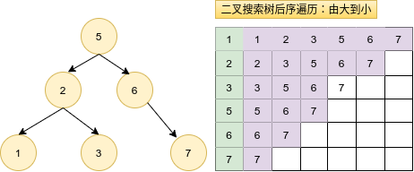

# Python剑指offer打卡-22

[toc]

## 回文数

题目类型：字符串

题目难度：:star2::star2:

- 问题描述

  ```
  问题描述:
         给你一个整数x，如果x是一个回文整数，返回true；否则，返回
  false。回文数是指正序（从左向右）和倒序（从右向左）读都是一样
  的整数。例如，121 是回文，而 123 不是。
  进阶：你能不将整数转为字符串来解决这个问题吗？
  
  解题方法:
  (1)字符串判断
  s[::-1] == s
  
  (2)求整得头　＝＝　求余得尾
  情况１：当整数为负数时，不是回文数
  eg: -121(-121和121-不相等)
  
  情况２：当整数能够被10整除，且不为０时，不是回文数
  即不存在02020这种情况的整数
  eg: 120、112020
  
  情况3：数字长度奇偶情况下，退出原则
  while res < x:
  偶数：1221
  res: 1 12
  x:  122 12
  res == x
  奇数：121
  res: 1 12
  x: 12 1
  x = res // 10
  时间复杂度：O(N)
  空间复杂度:O(1)
  ```

- 代码

  图解代码思路
  
  
  
  ```python
  class Solution:
      def isPalindrome1(self, x: int) -> bool:
  
          s = str(x)
          return s == s[::-1]
  
      def isPalindrome2(self, x: int) -> bool:
  
          if x < 0 or (x % 10 == 0 and x != 0):
              return False
  
          res = 0
          while res < x:
              res = res * 10 + x % 10
              x = x // 10
  
          return x == res or x == res // 10
  ```


## 前K个高频元素

题目类型：排序

题目难度：:star2:

- 问题描述

  ```
  问题描述：
      给你一个整数数组 nums 和一个整数 k ，请你返回其中出现频率前 k 高的元素。
  你可以按 任意顺序 返回答案。
  
  实例：
  输入: nums = [1,1,1,2,2,3], k = 2
  输出: [1,2]
  ```

- 代码

  ```python
  from typing import List
  from collections import defaultdict
  from collections import Counter
  import heapq
  
  class Solution:
  
      def topKFrequent1(self, nums, k):
          """直接排序"""
  
          count = Counter(nums)
          return [item[0] for item in count.most_common(k)]
  
      def topkFrequent(self, nums, k):
          """堆排序"""
  
          count = Counter(nums)
          hp = [(val, key) for key, val in count.items()]
          return [item[1] for item in heapq.nlargest(k, hp)]
  
      def topKFrequent2(self, nums: List[int], k: int) -> List[int]:
          """字典计数"""
          count = defaultdict(int)
          res = []
  
          for num in nums:
              count[num] += 1
  
          for key, value in sorted(count.items(), key=lambda x: x[1], reverse=True)[:k]:
              res.append(key)
  
          return res
  
  
  if __name__ == "__main__":
      obj = Solution()
      print(obj.topKFrequent1(nums=[1, 2, 2, 5, 4, 4, 4, 4, 6], k=2))
  ```

## 把二叉树搜索树装换为累加树

题目类型：二叉树

题目难度：:star2:

- 问题描述

  ```
  """
  问题描述：
         给出二叉搜索树的根节点，该树的节点值各不相同，请你将其转换为累加树（
  Greater Sum Tree），使每个节点 node的新值等于原树中大于或等于node.val
  的值之和。
  
  解题方法：
  二叉搜索树中序遍历，其遍历方向为：
  left-->right：由小到大
  right-->left:由大到小
  
  时间复杂度：O(n)
  空间复杂度：O(n)
  ```

- 代码

  算法图解

  

  ```python
  class Solution:
  
      def convertBST(self, root: TreeNode) -> TreeNode:
          def dfs(root):
              if root is None:
                  return
  
              dfs(root.right)
              root.val += self.num
              self.num = root.val
              dfs(root.left)
              return root
          # 保存当前节点的累加值
          self.num = 0
  
          return dfs(root)
  ```

## 接雨水

题目类型：双指针

题目难度：:star2::star2::star2::star2::star2:

- 问题描述

  ```
  问题描述：
      　给定 n 个非负整数表示每个宽度为 1 的柱子的高度图，计算按此排列的柱子，
  下雨之后能接多少雨水。
  示例：
  输入：height = [0,1,0,2,1,0,1,3,2,1,2,1]
  输出：6
  解释：上面是由数组 [0,1,0,2,1,0,1,3,2,1,2,1] 表示的高度图，
  在这种情况下，可以接 6 个单位的雨水（蓝色部分表示雨水）。
  
  解题方法：
  (1）暴力法
  遍历每一个下标的额左右区间，寻找可能的凹槽
  时间复杂度：O(N^2)
  空间复杂度：O(1)
  (2)双指针
  使用left和right指针，遍历所有节点
  时间复杂度：O(N)
  空间复杂度：O(1)
  ```

- 代码（[解题思路](https://leetcode-cn.com/problems/trapping-rain-water/solution/dong-tai-gui-hua-shuang-zhi-zhen-tu-jie-by-ml-zimi/)）

  图解算法
  
  
  
  ```python
  from typing import List
  
  
  class Sulution:
  
      def trap(self, height: List[int]) -> int:
          """接雨水（暴力法）"""
  
          ans = 0
          # 遍历下标
          for i in range(len(height)):
              max_left, max_right = 0, 0
              for j in range(0, i):
                  max_left = max(max_left, height[j])
              for j in range(i, len(height)):
                  max_right = max(max_right, height[j])
              # 盛雨水，形成凹槽
              if min(max_left, max_right) > height[i]:
                  ans += min(max_left, max_right) - height[i]
  
          return ans
  
      def trap(self, height:List[int]) -> int:
          """双指针法"""
  
          if not height: return 0
          n = len(height)
          ans = 0
          left, right = 0, n - 1
          max_left, max_right = height[0], height[n - 1]
  
          while left <= right:
              max_left = max(max_left, height[left])
              max_right = max(max_right, height[right])
              if max_left < max_right:
                  ans += max_left - height[left]
                  left += 1
              else:
                  ans += max_right - height[right]
                  right -= 1
  
          return ans
  ```


## 移动零

题目类型：双指针

题目难度：:star2:

- 问题描述

  ```
  问题描述：
      　给定一个数组 nums，编写一个函数将所有 0 移动到数组的末尾，同时保持
  非零元素的相对顺序。
  
  要求：
  (1) 必须在原数组上操作，不能拷贝额外的数组。
  (2) 尽量减少操作次数。
  
  示例：
  输入: [0,1,0,3,12]
  输出: [1,3,12,0,0]
  
  解题方法：
  １．暴力法：
  时间复杂度：O(N)
  空间复杂度：O(N)
  
  ２．双指针
  首次快慢指针分离之后：
  slow 始终指向第一个为零的数组的位置
  fast 始终指向不为零的数组位置
  时间复杂度：O(N)
  空间复杂度：O(1)
  ```

- 代码

  图解

  

  ```python
  class Solution:
  
      def moveZeros1(self, nums):
          """暴力法"""
  
          if not nums:
              return
          j = 0
          tmp_array = [0] * len(nums)
          for i in range(len(nums)):
              if nums[i] != 0:
                  tmp_array[j] = nums[i]
                  j += 1
  
          return tmp_array
  
      def moveZeroes2(self, nums: List[int]) -> None:
          """
          Do not return anything, modify nums in-place instead.
          """
          slow = fast = 0
          while fast < len(nums):
              if nums[fast] != 0:
                  # 保证快慢的前提条件
                  if fast != slow:
                      nums[slow], nums[fast] = nums[fast], nums[slow]
                  slow += 1
              fast += 1
  ```

  