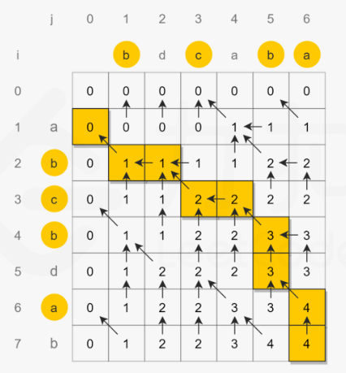
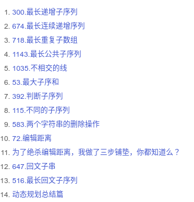

# Python剑指offer打卡-25

[toc]

## 缺失的第一个正数

题目类型：数组

题目难度：:star2::star2:

- 问题描述

  ```
  问题描述：
  	给你一个未排序的整数数组 nums ，请你找出其中没有出现的最小的正整数。
  请你实现时间复杂度为 O(n) 并且只使用常数级别额外空间的解决方案。
  
  解题方法：
  索引对其原则
  时间复杂度：O(N)
  空间复杂度：O(1)
  ```

- 代码

  ```python
  class Solution:
      def firstMissingPositive(self, nums: List[int]) -> int:
  
          n = len(nums)
          # 1. 标记非正数
          # 1 -2 -5 5 6
          for i in range(n):
              if nums[i] <= 0:
                  nums[i] = n + 1
          # 2. index标记
          for i in range(n):
              # 3 4 -1 1
              index = abs(nums[i])
              if index <= n:
                  nums[index - 1] = -abs(nums[index - 1])
          
          # 3. 找出第一个正数
          # 1 3 4 5
          for i in range(n):
              if nums[i] > 0:
                  return i + 1
          # 1 2 3 4
          return n + 1
  ```

## 转秩矩阵

题目类型：数组

题目难度：:star2::star2:

- 问题描述

  ```
  问题描述：
  	给你一个二维整数数组 matrix， 返回 matrix 的 转置矩阵 。矩阵的
  转置 是指将矩阵的主对角线翻转，交换矩阵的行索引与列索引。
  
  解题方法：
  暴力法遍历
  
  时间复杂度：O(m*n)
  空间复杂度：O(m*n)
  ```

- 代码

  ```python
  class Solution:
      def transpose(self, matrix: List[List[int]]) -> List[List[int]]:
          m, n = len(matrix), len(matrix[0])
          transposed = [[0] * m for _ in range(n)]
          for i in range(m):
              for j in range(n):
                  transposed[j][i] = matrix[i][j]
          return transposed
  ```

## 最长公共子序列

题目类型：字符串、动态规划

题目难度：:star2::star2::star2::star2:

- 问题描述

  ```
  问题描述：
  	给定两个字符串 text1 和 text2，返回这两个字符串的最长 公共子序列 的长度。如果不存在 
  公共子序列 ，返回 0 。一个字符串的 子序列 是指这样一个新的字符串：它是由原字符串在不改变
  字符的相对顺序的情况下删除某些字符（也可以不删除任何字符）后组成的新字符串。
  
  例如，"ace" 是 "abcde" 的子序列，但 "aec" 不是 "abcde" 的子序列。
  两个字符串的 公共子序列 是这两个字符串所共同拥有的子序列。
  
  解题方法：
  动态规划
  1.状态定义，dp[i][j]表示text1[:i]和text2[:j]最长的公共子序列
  2.起始状态，dp[0][i] = 0, dp[j][0] = 0表示空字符和任何字符串的公共子序列长度为0
  3.状态转移
                  if text1[i - 1] == text2[j - 1]:
                      dp[i][j] = dp[i - 1][j - 1] + 1
                  else:
                      dp[i][j] = max(dp[i - 1][j], dp[i][j - 1]) 
  4.返回值，dp[m][n]
  
  时间复杂度：O(m*n)
  空间复杂度：O(m*n)
  ```
  
- 代码（[解题思路](https://leetcode-cn.com/problems/longest-common-subsequence/solution/zui-chang-gong-gong-zi-xu-lie-by-leetcod-y7u0/)）

  算法图解
  
  
  
  ```python
  class Solution:
      def longestCommonSubsequence(self, text1: str, text2: str) -> int:
  
          m, n = len(text1), len(text2)
          # 状态定义和起始值
          dp = [[0]*(n + 1) for _ in range(m + 1)]
          # 状态转移
          for i in range(1, m + 1):
              for j in range(1, n + 1):
                  if text1[i - 1] == text2[j - 1]:
                      dp[i][j] = dp[i - 1][j - 1] + 1
                  else:
                      dp[i][j] = max(dp[i - 1][j], dp[i][j - 1])
                      
          return dp[m][n] 
  ```
  
- 相似题目（最长重复子数组）

  ==注意：子数组不连续、子数组不连续、子数组不连续==

  ```
  问题描述：
  	给两个整数数组 A 和 B ，返回两个数组中公共的、长度最长的子数组的长度。
  示例：
  输入：
  A: [1,2,3,2,1]
  B: [3,2,1,4,7]
  输出：3
  解释：
  长度最长的公共子数组是 [3, 2, 1] 。注意每一次的更新只能从左上角进行更新
  ```

- 代码

- 算法图解

  

- ```python
  class Solution:
      def findLength(self, nums1: List[int], nums2: List[int]) -> int:
  
          m, n = len(nums1), len(nums2)
  
          # 定义状态和起始值
          dp = [[0]*(n + 1) for _ in range(m + 1)]
          ans = 0
  
          # 状态转移
          for i in range(1, m + 1):
              for j in range(1, n + 1):
                  if nums1[i - 1] == nums2[j - 1]:
                      dp[i][j] = dp[i - 1][j - 1] + 1
                      ans = max(ans, dp[i][j])
          # 返回值
          return ans  
  ```

  更多类似题目

  

## 编辑距离

题目类型：字符串、动态规划

题目难度：:star2::star2::star2::star2:

- 问题描述

  ```
  问题描述:
  	给你两个单词 word1 和 word2，请你计算出将 word1 转换成 word2 所使用的最少操作数 。
  你可以对一个单词进行如下三种操作：
  
  - 插入一个字符
  - 删除一个字符
  - 替换一个字符
  解题方法:
  
  动态规划
  1.状态定义，dp[i][j]表示word1[:i]到word2[:j]的最小编辑距离
  2.起始状态，dp[0][i] = 0, dp[j][0] = 0表示空字符编辑
  3.状态转移
  
                  if word1[i - 1] == word2[j - 1]:
                      dp[i][j] = dp[i - 1][j - 1]
                  else:
                      dp[i][j] = min(dp[i - 1][j], dp[i][j - 1], dp[i - 1][j - 1]) + 1
                      
  4.返回值，dp[m][n]
  
  时间复杂度：O(m*n)
  空间复杂度：O(m*n)
  ```

- 代码

  ```python
  class Solution:
      def minDistance(self, word1: str, word2: str) -> int:
  
          m, n = len(word1), len(word2)
          
          if n * m == 0:
              return m + n
  
          # 状态定义
          dp = [[0]*(n + 1) for _ in range(m + 1)]
          # 起始状态
          # 第一列
          for i in range(m + 1):
              dp[i][0] = i
          # 第一行
          for j in range(n + 1):
              dp[0][j] = j
          # 状态转移
          for i in range(1, m + 1):
               for j in range(1, n + 1):
                  if word1[i - 1] == word2[j - 1]:
                      dp[i][j] = dp[i - 1][j - 1]
                  else:
                      dp[i][j] = min(dp[i - 1][j], dp[i][j - 1], dp[i - 1][j - 1]) + 1
          # 返回值
          return dp[m][n]
  ```


## 对角线遍历

题目类型：数组

题目难度：:star2::star2:

- 问题描述

  ```
  问题描述：
  	给定一个含有 M x N 个元素的矩阵（M 行，N 列），请以对角线遍历的顺序返回
  这个矩阵中的所有元素，对角线遍历如下图所示。
  
  解题方法：
  遍历
  ```

- 代码

  算法图解

  

  ```python
  import collections
  
  
  class Solution:
      def findDiagonalOrder(self, mat: List[List[int]]) -> List[int]:
  
          dic = collections.defaultdict(list)
          
          # 存储对角元素
          for i in range(len(mat)):
              for j in range(len(mat[0])):
                  dic[i + j].append(mat[i][j])
          
          # 蛇形遍历
          res = []
          for i in sorted(dic):
              if i % 2 == 0:
                  res.extend(dic[i][::-1])
              else:
                  res.extend(dic[i])
          
          return res
  ```

  