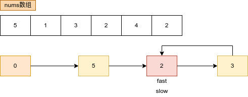
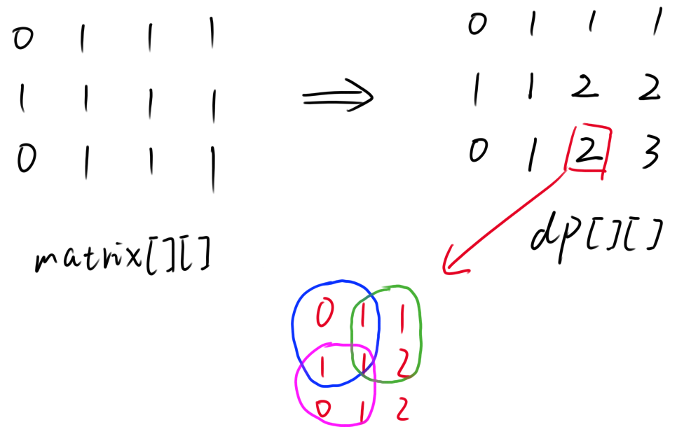
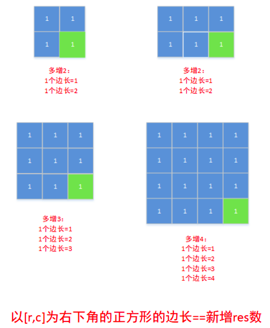

# Python剑指offer打卡-34

[toc]

## 寻找重复数

题目类型：动态规划

题目难度：:star2::star2::star2::star2:

相似题目：环形链表

- 问题描述

  ```
  问题描述：
      给定一个包含n + 1 个整数的数组nums ，其数字都在 1 到 n之间（包括 1 和 n），
  可知至少存在一个重复的整数。假设 nums 只有 一个重复的整数 ，找出 这个重复
  的数 。你设计的解决方案必须不修改数组 nums 且只用常量级 O(1) 的额外空间。
  
  解题方法：
  快慢指针，环形链表
  时间复杂度：O(N)
  空间复杂度：O(1)
  ```
  
- 代码

  图解算法
  
  

  ```python
  class Solution:
      def findDuplicate(self, nums: List[int]) -> int:
  
          if not nums: return 0
          slow, fast = 0, 0
          slow, fast = nums[slow], nums[nums[fast]]
          # 判断是否有环
          while fast != slow:
              slow = nums[slow]
              fast = nums[nums[fast]]
          # 寻找环的入口结点
          fast = 0
          while fast != slow:
              fast = nums[fast]
              slow = nums[slow]
          # 返回重复数字
          return fast
  ```

## 单词拆分

题目类型：动态规划

题目难度：:star2::star2::star2::star2:

相似题目：最长递增子序列

- 问题描述

  ```
  问题描述：
      给你一个字符串 s 和一个字符串列表 wordDict 作为字典，判定s 是否可以由空
  格拆分为一个或多个在字典中出现的单词。说明：拆分时可以重复使用字典中的单词。
  实例：
  输入: s = "leetcode", wordDict = ["leet", "code"]
  输出: true
  解释: 返回 true 因为 "leetcode" 可以被拆分成 "leet code"
  
  解题方法：
  动态规划
  时间复杂度：O(N^2)
  空间复杂度：O(N)
  
  原题链接：https://leetcode-cn.com/problems/word-break/
  ```
  
- 代码

  图解算法
  
  dp变化过程演示图

  
  
  
  
  ```python
  class Solution:
      def wordBreak(self, s: str, wordDict: List[str]) -> bool:
  
          n = len(s)
          # 定义dp问题
          dp = [False] * (n + 1)
          # 初始化dp
          dp[0] = True
          # 状态转移
          for i in range(n):
              for j in range(i + 1, n + 1):
                  if dp[i] and s[i:j] in wordDict:
                      dp[j] = True
          # 返回值
          return dp[-1]
  ```

## 下一个排列

题目类型：双指针

题目难度：:star2::star2::star2:

- 问题描述

  ```
  问题描述：
      实现获取 下一个排列 的函数，算法需要将给定数字序列重新排列成字典序中下
  一个更大的排列（即，组合出下一个更大的整数）。如果不存在下一个更大的排列，则
  将数字重新排列成最小的排列（即升序排列）。必须原地修改，只允许使用额外常数空间。
  
  解题方法：
  １．先找出最大的索引 k 满足 nums[k] < nums[k+1]，如果不存在，就翻转整个数组；
  ２．再找出另一个最大索引 l 满足 nums[l] > nums[k]；
  ３．交换 nums[l] 和 nums[k]；
  ４．最后翻转 nums[k+1:]。
  
  时间复杂度：O(N)
  空间复杂度：O(1)
  
  原题链接：https://leetcode-cn.com/problems/next-permutation/solution/xia-yi-ge-pai-lie-by-powcai/
  ```

- 代码

  ```python
  class Solution:
      def nextPermutation(self, nums: List[int]) -> None:
          """
          Do not return anything, modify nums in-place instead.
          """
  
          first_index = -1
          n = len(nums)
  
          def reverse(nums, i, j):
              """翻转列表（双指针）"""
  
              while i < j:
                  nums[i], nums[j] = nums[j], nums[i]
                  i += 1
                  j -= 1
  
          # 条件1
          # 选择以第一个最大的index(倒排查找)
          for i in range(n - 2, -1, -1):
              if nums[i] < nums[i + 1]:
                  first_index = i
                  break
  
          # 已经是最大值[3, 2, 1]
          if first_index == -1:
              reverse(nums, 0, n - 1)
              return
          # 条件2
          second_index = -1
          for i in range(n - 1, first_index, -1):
              if nums[i] > nums[first_index]:
                  second_index = i
                  break
          # 交换
          nums[first_index], nums[second_index] = nums[second_index], nums[first_index]
          reverse(nums, first_index + 1, n - 1)
  ```

## 完全平方数

题目类型：动态规划

题目难度：:star2::star2::star2:

相似题目：零钱兑换

- 问题描述

  ```
  问题描述：
      给定正整数n，找到若干个完全平方数（比如1, 4, 9, 16, ...）使得它们的和等于 n。你
  需要让组成和的完全平方数的个数最少。给你一个整数 n ，返回和为 n 的完全平方数的 最少数量
  。完全平方数 是一个整数，其值等于另一个整数的平方；换句话说，其值等于一个整数自乘的积。
  例如，1、4、9 和 16 都是完全平方数，而 3 和 11 不是。
  
  解题方法：
  动态规划
  1.定义dp：dp[i]表示构成正整数i的最小平方个数
  2.初始值：dp[0] = 0
  3.转态转移：dp[i] = min(dp[i - j*j] + 1, dp[i])
  4.返回值：最小平方个数
  时间复杂度：O(N*sqrt(N))
  空间复杂度：O(N)
  
  原题链接：https://leetcode-cn.com/problems/perfect-squares/
  ```

- 代码

  图解算法

  举例：dp[12]向前推的过程，等于上一个可能的状态再加1

  

  ```python
  class Solution:
      def numSquares(self, n: int) -> int:
  
          # 定义dp
          dp = list(range(n + 1))
          # 状态转移
          for i in range(1, n + 1):
              j = 1
              while i - j*j >= 0:
                  dp[i] = min(dp[i - j*j] + 1, dp[i])
                  j += 1
          # 返回值
          return dp[n] 
  ```

## 最大正方形

题目类型：动态规划

题目难度：:star2::star2::star2::star2:

- 问题描述

  ```
  问题描述：
      在一个由 '0' 和 '1' 组成的二维矩阵内，找到只包含 '1' 的最大正方形，并返回其面积。
  示例:
  输入：matrix = [["1","0","1","0","0"]
              ,["1","0","1","1","1"]
              ,["1","1","1","1","1"]
              ,["1","0","0","1","0"]]
  输出：4
  
  解题方法：
  动态规划
  1.定义dp：dp[i][j]表示以i,j为右下角的最大正方形
  2.初始值：
  3.转态转移：dp[i][j] = min(dp[i - 1][j], dp[i][j - 1], dp[i - 1][j - 1]) + 1
  4.返回值：最大面积
  时间复杂度：O(MN)
  空间复杂度：O(MN)
  
  原题链接：https://leetcode-cn.com/problems/maximal-square/
  ```

- 代码

  图解算法
  

  ```python
  class Solution:
      def maximalSquare(self, matrix: List[List[str]]) -> int:
  
          m, n = len(matrix), len(matrix[0])
          # 如果只有一列或者一行， 则不可能构成正方形
          if m == 0 or n == 0:
              return 0
          # 定义dp
          dp = [[0] * n for _ in range(m)]
          max_slide = 0
  
          # 转态转移
          for i in range(m):
              for j in range(n):
                  # 边界条件， dp[i][j]表示以i,j为右下角的最大正方形
                  if matrix[i][j] == "1":
                      if i == 0 or j == 0:
                          dp[i][j] = 1
                      else:
                          dp[i][j] = min(dp[i - 1][j], dp[i][j - 1], dp[i - 1][j - 1]) + 1
                      max_slide = max(max_slide, dp[i][j])
  
          # 返回值
          return max_slide * max_slide
  ```

- 相似题型：[统计全为 1 的正方形子矩阵](https://leetcode-cn.com/problems/count-square-submatrices-with-all-ones/)

  ```
  问题描述：
  	给你一个 m * n 的矩阵，矩阵中的元素不是 0 就是 1，请你统计并返回其中完全由 1 组成
  的 正方形 子矩阵的个数。
  ```

  状态转移分析：

  

  状态解释：
  
  
  
  ```python
  class Solution:
      def countSquares(self, matrix: List[List[int]]) -> int:
  
          # 初始变量
          ans = 0
          m, n = len(matrix), len(matrix[0])
          # 定义dp
          # 表示到(i, j)所能组成的最大正方形的个数
          dp = [[0]*n for _ in range(m)]
          # 转态转移
          for i in range(m):
              for j in range(n):
                  if matrix[i][j] == 1:
                      if i == 0 or j ==0:
                          dp[i][j] = matrix[i][j]
                      else:
                          dp[i][j] = min(dp[i - 1][j], dp[i][j - 1], dp[i - 1][j - 1]) + 1
                      ans += dp[i][j]
          # 返回值
          return ans
  ```
  
  

