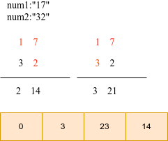

# Python剑指offer打卡-35

[toc]

## 翻转字符串里的单词

题目类型：双指针

题目难度：:star2::star2::star2:

- 问题描述

  ```
  问题描述：
      给你一个字符串 s ，逐个翻转字符串中的所有 单词 。单词 是由非空格
  字符组成的字符串。s 中使用至少一个空格将字符串中的 单词 分隔开。请你
  返回一个翻转 s 中单词顺序并用单个空格相连的字符串。说明：输入字符串 s
  可以在前面、后面或者单词间包含多余的空格。翻转后单词间应当仅用一个空格
  分隔。翻转后的字符串中不应包含额外的空格。
  
  解题方法：
  双指针
  时间复杂度：O(N)
  空间复杂度：O(N)
  
  原题链接：https://leetcode-cn.com/problems/reverse-words-in-a-string/
  ```

- 代码

  ```python
  class Solution:
      def reverseWords(self, s: str) -> str:
  
          s = s.strip()
          i = j = len(s) - 1
          res = []
          while i >= 0:
              # 取单词的左边界点
              while i >= 0 and s[i] != " ": i -= 1
              res.append(s[i + 1:j + 1])
              # 跳过空白的部分
              while s[i] == " ": i -= 1
              j = i
          return " ".join(res)
  ```

## 字符串相乘

题目类型：字符串

题目难度：:star2::star2:

- 问题描述

  ```
  问题描述：
      给定两个以字符串形式表示的非负整数 num1 和 num2，返回 num1 和 num2 的乘积，
  它们的乘积也表示为字符串形式。
  
  解题方法：
  时间复杂度：O(mn)
  空间复杂度：O(m + n)
  ```

- 代码

  图解算法

  

  ```python
  class Solution:
      def multiply(self, num1: str, num2: str) -> str:
          """模拟乘法运算"""
  
          # 申请额外空间进行运算
          if num1 == "0" or num2 == "0":
              return "0"
          m, n = len(num1), len(num2)
          ansArr = [0]*(m + n)
          # 模拟运算
          for i in range(m  - 1, -1, -1):
              x = int(num1[i])
              for j in range(n - 1, -1, -1):
                  ansArr[i + j + 1] += x*int(num2[j])
  
          for i in range(m + n - 1, 0, -1):
                  ansArr[i - 1] += ansArr[i] // 10
                  ansArr[i] %= 10
          index  = 1 if ansArr[0] == 0 else 0
          return "".join( str(i) for i in ansArr[index:])
  ```

## 用Rand7()实现Rand10()

神奇的事情发生了，奇怪的知识增加了

题目类型：数学推导

题目难度：:star2::star2::star2:

- 问题描述

  ```
  问题描述：
      已有方法rand7可生成 1 到 7 范围内的均匀随机整数，试写一个方法rand10生成 1 到 10 范围
  内的均匀随机整数。不要使用系统的Math.random()方法。
  
  解题方法：
  要利用rand7()实现rand10()
  第 1 步： 我们根据推导结论，利用rand7()方法来随机选取 7 * 7 矩阵中的某个元素
  计算表达式为：(rand7() - 1) * 7 + rand7()
  第 2 步： 判断选出的元素是否属于前 40 个，如果不是需要返回第 1 步重新选取元素
  第 3 步： 若该属于前 40 个，但是直接输出的话超出 [1,10] 的范围，该怎么处理呢？
  
  规律：
  已知 rand_N() 可以等概率的生成[1, N]范围的随机数
  那么：
  (rand_X() - 1) × Y + rand_Y() ==> 可以等概率的生成[1, X * Y]范围的随机数
  即实现了 rand_XY()
  
  时间复杂度：O(1)
  空间复杂度：O(1)
  
  原题链接：https://leetcode-cn.com/problems/implement-rand10-using-rand7/
  ```

- 代码

  ```python
  
  class Solution:
      def rand10(self):
          """
          :rtype: int
          """
          while True:
              col = rand7()
              row = rand7()
              index = (col - 1)*7 + row
              if index <= 40:
                  return (index - 1)%10 + 1
  ```

## 堆排序

题目类型：排序

题目难度：:star2::star2::star2::star2:

- 问题描述

  ```
  问题描述：
      要求手写出堆排序的迭代和递归写法，并分析其时间复杂度和空间复杂度。
  解题方法：
  时间复杂度：O(nlog(n))
  空间复杂度：O(1)
  ```

- 代码

  图解算法

  

  ```python
  class Solution:
  
      def heap_sort(self, nums):
  
          def adjust_heap(nums, start_pos, end_pos):
              new_item = nums[start_pos]
              pos = start_pos
              left_pos = pos * 2 + 1
              while left_pos < end_pos:
                  right_pos = left_pos + 1
                  if right_pos < end_pos and nums[right_pos] >= nums[left_pos]:
                      left_pos = right_pos
                  if new_item < nums[left_pos]:
                      #　交换
                      nums[pos] = nums[left_pos]
                      pos = left_pos
                      left_pos = pos * 2 + 1
                  else:
                      break
              nums[pos] = new_item
  
          n = len(nums)
          # 最大堆调整
          for i in reversed(range(n//2)):
              adjust_heap(nums, i, n)
          # 调整堆
          for i in range(n - 1, -1, -1):
              nums[0], nums[i] = nums[i], nums[0]
              adjust_heap(nums, 0, i)
          return nums
  ```

## 最短无序连续子数组

题目类型：双指针

题目难度：:star2::star2:

- 问题描述

  ```
  问题描述：
      给你一个整数数组 nums ，你需要找出一个 连续子数组 ，如果对这个
  子数组进行升序排序，那么整个数组都会变为升序排序。请你找出符合题意的
  最短子数组，并输出它的长度。
  
  解题方法：
  双指针
  时间复杂度：O(N)
  空间复杂度：O(1)
  
  原题链接：https://leetcode-cn.com/problems/shortest-unsorted-continuous-subarray/
  ```

- 代码

  ```python
  class Solution:
      def findUnsortedSubarray(self, nums: List[int]) -> int:
  
          n = len(nums)
          maxn, right = float("-inf"), -1
          minn, left = float(inf), -1
          for i in range(n):
              # 右面不能存在比nums[right]小的值
              if nums[i] < maxn:
                  right = i
              else:
                  maxn = nums[i]
              # 左面不能存在比nums[left]大的值
              if nums[n - i -1] > minn:
                  left = n - i - 1
              else:
                  minn = nums[n - i - 1]
  
          return 0 if right == -1 else right - left + 1
  ```
