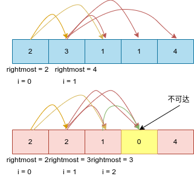

# Python剑指offer打卡-37

[toc]

## 跳跃游戏I

题目类型：贪心

题目难度：:star2::star2::star2:

- 问题描述

  ```
  问题描述：
      给定一个非负整数数组nums ，你最初位于数组的 第一个下标 。数组中的每个元素代
  表你在该位置可以跳跃的最大长度。判断你是否能够到达最后一个下标。
  
  解题方法：
  贪心枚举
  时间复杂度：O(N)
  空间复杂度：O(1)
  
  原题链接：https://leetcode-cn.com/problems/jump-game/
  ```

- 代码

  图解算法

  

  ```python
  class Solution:
      def canJump(self, nums: List[int]) -> bool:
  
          n, right_most = len(nums), 0
  
          # 贪心遍历
          for i in range(n):
              # 在可跳越范围内继续起跳
              if i <= right_most:
                  # 更新最远起跳位置
                  right_most = max(right_most, nums[i] + i)
                  # 是否可到达
                  if right_most >= n - 1:
                      return True
  
          return False
  ```

## 跳跃游戏II

题目类型：贪心

题目难度：:star2::star2::star2:

- 问题描述

  ```
  问题描述:
      给你一个非负整数数组nums ，你最初位于数组的第一个位置。数组中的每个元素代
  表你在该位置可以跳跃的最大长度。你的目标是使用最少的跳跃次数到达数组的最后一个
  位置。假设你总是可以到达数组的最后一个位置。
  
  解题方法：
  动态规划
  时间复杂度：O(N)
  空间复杂度：O(1)
  
  原题链接：https://leetcode-cn.com/problems/jump-game-ii/
  ```

- 代码

  ```python
  class Solution:
      def jump(self, nums: List[int]) -> int:
  
          n = len(nums)
          max_pos, end, step = 0, 0, 0
          for i in range(n - 1):
              if max_pos >= i:
                  # 寻找最大起跳点
                  max_pos = max(max_pos, nums[i] + i)
                  if end == i:
                      step += 1
                      end = max_pos
          return step
  ```

## 被围绕的区域

题目类型：DFS/BFS

题目难度：:star2::star2::star2::star2:

- 问题描述

  ```
  问题描述：
      给你一个 m x n 的矩阵 board ，由若干字符 'X' 和 'O' ，找到所有被 'X' 围绕的
  区域，并将这些区域里所有的 'O' 用 'X' 填充。
  
  解题方法：
  边界点后DFS/BFS的点不存在填充
  时间复杂度：O(M*N)
  空间复杂度：O(M*N)
  
  原题链接：https://leetcode-cn.com/problems/surrounded-regions/
  ```

- 代码

  DFS解法

  ```python
  class Solution:
      def solveOfBFS(self, board: List[List[str]]) -> None:
          """
          Do not return anything, modify board in-place instead.
          """
          m, n = len(board), len(board[0])
  
          def dfs(x, y):
  
              if not 0 <= x < m or not 0 <= y < n or board[x][y] != "O":
                  return
              board[x][y] = "A"
              dfs(x + 1, y)
              dfs(x, y + 1)
              dfs(x - 1, y)
              dfs(x, y - 1)
  
          # 遍历所有边界，寻找可能的入口
          # 行遍历
          for i in range(m):
              dfs(i, 0)
              dfs(i, n - 1)
          # 列遍历
          for j in range(n - 1):
              dfs(0, j)
              dfs(m - 1, j)
          # 修改表示
          for i in range(m):
              for j in range(n):
                  if board[i][j] == "A":
                      board[i][j] = "O"
                  elif board[i][j] == "O":
                      board[i][j] = "X"
  ```

  BFS解法

  ```python
   def solveOfBFS(self, board: List[List[str]]) -> None:
          """
          Do not return anything, modify board in-place instead.
          """
          m, n = len(board), len(board[0])
          def bfs(x, y):
  
              deque = [(x, y)]
              while deque:
                  [x, y] = deque.pop(0)
                  if 0 <= x < m and 0 <= y < n and board[x][y] == "O":
                      board[x][y] = "A"
                      deque += [(x + 1, y), (x, y + 1), (x - 1, y), (x, y - 1)]
  
          # 遍历所有边界，寻找可能的入口
          # 行遍历
          for i in range(m):
              bfs(i, 0)
              bfs(i, n -1)
          # 列遍历
          for j in range(n - 1):
              bfs(0, j)
              bfs(m - 1, j)
          # 修改表示
          for i in range(m):
              for j in range(n):
                  if board[i][j] == "A":
                      board[i][j] = "O"
                  elif board[i][j] == "O":
                      board[i][j] = "X"
  ```

## 计算右侧小于当前元素的个数

题目类型：二分法

题目难度：:star2::star2::star2::star2:

- 问题描述

  ```
  问题描述：
      给你一个整数数组 nums ，按要求返回一个新数组counts 。数组 counts 有该性质：
  counts[i] 的值是nums[i] 右侧小于nums[i] 的元素的数量。
  
  示例：
  输入：nums = [5,2,6,1]
  输出：[2,1,1,0]
  解释：
  5 的右侧有 2 个更小的元素 (2 和 1)
  2 的右侧仅有 1 个更小的元素 (1)
  6 的右侧有 1 个更小的元素 (1)
  1 的右侧有 0 个更小的元素
  
  解题方法：
  时间复杂度：O(Nlog(N))
  空间复杂度：O(N)
  
  原题链接：https://leetcode-cn.com/problems/count-of-smaller-numbers-after-self/
  ```

- 代码

  ```python
  class Solution:
      def countSmaller(self, nums):
          n = len(nums)
          counts = [0] * n
          sort_stack = []
  
          def binary_search(arr, target):
  
              low, high = 0, len(arr) - 1
              while low <= high:
                  mid = (low + high) // 2
                  if arr[mid] >= target:
                      low = mid + 1
                  else:
                      high = mid - 1
              return low
  
          for i in range(n - 1, -1, -1):
              x = nums[i]
              idx = binary_search(sort_stack, x)
              counts[i] = len(sort_stack) - idx
              sort_stack.insert(idx, x)
          return counts
  ```

## 买卖股票的最佳时机II

题目类型：贪心策略

题目难度：:star2::star2:

- 问题描述

  ```
  问题描述：
      给定一个数组 prices ，其中prices[i] 是一支给定股票第 i 天的价格。
  设计一个算法来计算你所能获取的最大利润。你可以尽可能地完成更多的交易（多
  次买卖一支股票）。
  注意：你不能同时参与多笔交易（你必须在再次购买前出售掉之前的股票）。
  
  解题方法：
  遍历，等价于每天都进行交易
  时间复杂度：O(N)
  空间复杂度：O(1)
  
  原题链接：https://leetcode-cn.com/problems/best-time-to-buy-and-sell-stock-ii/
  ```

- 代码

  ```python
  class Solution:
      def maxProfit(self, prices: List[int]) -> int:
  
          profit = 0
          for i in range(1, len(prices)):
              tmp = prices[i] - prices[i - 1]
              if tmp > 0:  # 统计正向收益
                  profit += tmp
  
          return profit
  ```

