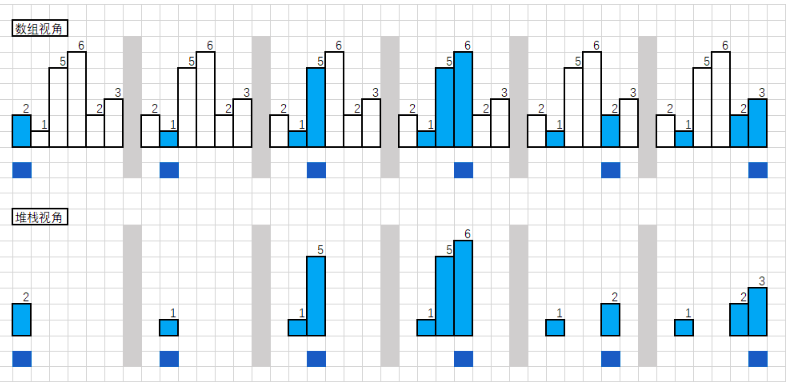
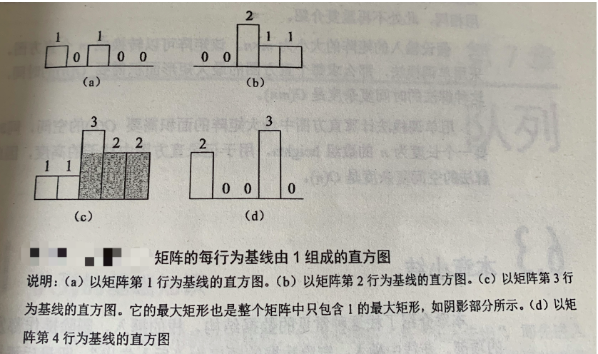
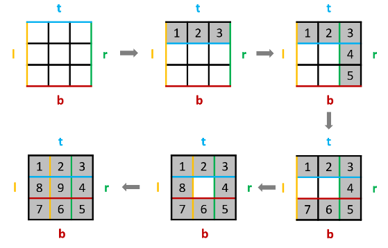

# Python剑指offer打卡-40

[toc]

## 矩阵中的最长递增路径

题目类型：DFS+记忆化

题目难度：:star2::star2::star2::star2:

- 问题描述

  ```
  问题描述：
      给定一个m x n 整数矩阵matrix ，找出其中最长递增路径的长度。
  对于每个单元格，你可以往上，下，左，右四个方向移动。 你 能在对角
  线方向上移动或移动到边界外（即不允许环绕）。
  
  解题方法：
  深度优先遍历+记忆化优化
  思路：朴素深度优先搜索的时间复杂度过高的原因是进行了大量的重复计算，同一个单
  元格会被访问多次，每次访问都要重新计算。由于同一个单元格对应的最长递增路径的
  长度是固定不变的，因此可以使用记忆化的方法进行优化。用矩阵 memo 作为缓存矩
  阵，已经计算过的单元格的结果存储到缓存矩阵中。
  
  时间复杂度：O(MN)
  空间复杂度：O(MN)
  
  原题链接：https://leetcode-cn.com/problems/longest-increasing-path-in-a-matrix/
  ```

- 代码

  ```python
  class Solution:
      def longestIncreasingPath(self, matrix: List[List[int]]) -> int:
  
          if not matrix: return 0
          m, n = len(matrix), len(matrix[0])
          ans = 0
          dis = [(0, 1), (1, 0), (-1, 0), (0, -1)]
          # 记忆化
          memo = [[0] * n for _ in range(m)]
          # 遍历所有可能的结点，寻找最长路径
          for i in range(m):
              for j in range(n):
                  ans = max(ans, self.dfs(matrix, i, j, dis, memo))
          return ans
  
      def dfs(self, matrix, i, j, dis, memo):
  
          if memo[i][j] != 0: return memo[i][j]
          longest_dis = 1
          for di, dj in dis:
              x, y = i + di, j + dj
              if 0 <= x < len(matrix) and 0 <= y < len(matrix[0]) and matrix[i][j] < matrix[x][y]:
                  longest_dis = max(longest_dis, self.dfs(matrix, x, y, dis, memo) + 1)
  
          # 记忆当前结点的最长路径值
          memo[i][j] = longest_dis
  
          return longest_dis
  ```

## 直方图最大矩形面积

题目类型：栈

题目难度：:star2::star2::star2:

- 问题描述

  ```
  问题描述：
      给定非负整数数组 heights，数组中的数字用来表示柱状图中各个柱子
  的高度。每个柱子彼此相邻，且宽度为 1 。求在该柱状图中，能够勾勒出来
  的矩形的最大面积。
  
  解题方法：
  单调栈计算
  时间复杂度：(N)
  空间复杂度：O(N)
  
  相似题型（柱状图中最大的矩形）：https://leetcode-cn.com/problems/largest-rectangle-in-histogram/
  原题链接：https://leetcode-cn.com/problems/0ynMMM/
  ```

- 代码

  图解算法

  示例：[2, 1, 5, 6, 2, 3]

  

  

  ```python
  class Solution:
      def largestRectangleArea(self, heights: List[int]) -> int:
  
          if not heights: return 0
          max_area = 0
          heights.append(0)
          # 使用单调栈，存储连续递增的高度，并增加哨兵
          stack = [-1]
          for right, num in enumerate(heights):
              while stack and heights[stack[-1]] > num:
                  cur_index = stack.pop()
                  max_area = max(max_area, heights[cur_index]*(right - stack[-1] - 1))
              stack.append(right)
  
          return max_area
  ```

## 最大矩形

题目类型：栈

题目难度：:star2::star2::star2:

- 问题描述

  ```
  问题描述：
      给定一个仅包含 0 和 1 、大小为 rows x cols 的二维二进制矩阵，找出只包
  含 1 的最大矩形，并返回其面积。
  
  解题方法：
  每一程构建直方图，通过使用直方图最大矩形面积来获取最大矩形操作
  单调栈
  时间复杂度：O(MM)
  空间复杂度：O(N)
  
  原题链接：https://leetcode-cn.com/problems/maximal-rectangle/
  ```

- 代码

  图解算法

  

  ```python
  class Solution:
      def maximalRectangle(self, matrix: List[List[str]]) -> int:
  
          if not matrix: return 0
          m, n = len(matrix), len(matrix[0])
          max_rect = 0
          heights = [0]*(n + 1)
          for i in range(m):
              for j in range(n):
                  if matrix[i][j] == "1":
                      heights[j] += 1
                  else:
                      heights[j] = 0
              # 单调栈计算最大矩形面积
              stack = [-1]
              for right, num in enumerate(heights):
                  while stack and heights[stack[-1]] > num:
                      index = stack.pop()
                      max_rect = max(max_rect, heights[index]*(right - stack[-1] -1))
                  stack.append(right)
  
          return max_rect
  ```

## 螺旋矩阵II

题目类型：贪心法

题目难度：:star2::star2::star2:

- 问题描述

  ```
  问题描述：
      给你一个正整数 n ，生成一个包含 1 到 n2 所有元素，且元素按顺时针顺序
  螺旋排列的 n x n 正方形矩阵 matrix 。
  
  解题方法：
  模拟螺旋矩阵的运行方式
  
  时间复杂度：O(MN)
  空间复杂度：O(MN)
  
  原题链接：https://leetcode-cn.com/problems/spiral-matrix-ii/
  ```

- 代码

  图解算法

  

  ```python
  class Solution:
      def generateMatrix(self, n: int) -> List[List[int]]:
  
          tar = n*n
          num = 1
          # 申请矩阵进行存储
          mat = [[0]*n for _ in range(n)]
          l, r, t, b = 0, n - 1, 0, n - 1
          while tar >= num:
              # 从左向右进行遍历
              for i in range(l, r + 1):
                  mat[t][i] = num
                  num += 1
              t += 1
              # 从上向下进行遍历
              for i in range(t, b + 1):
                  mat[i][r] = num
                  num += 1
              r -= 1
              # 从右向左进行遍历
              for i in range(r, l, -1):
                  mat[b][i] = num
                  num += 1
              b -= 1
              # 从下向上进行遍历
              for i in range(b, t, -1):
                  mat[i][l] = num
                  num += 1
              l += 1
  
          return mat
  ```

## 课程表I

题目类型：拓扑排序

题目难度：:star2::star2::star2:

- 问题描述

  ```
  问题描述：
      你这个学期必须选修 numCourses 门课程，记为0到numCourses - 1 。在选修某些课程
  之前需要一些先修课程。 先修课程按数组prerequisites 给出，其中prerequisites[i] =
  [ai, bi] ，表示如果要学习课程ai 则 必须 先学习课程 bi 。例如，先修课程对[0, 1] 表
  示：想要学习课程 0 ，你需要先完成课程 1 。请你判断是否可能完成所有课程的学习？如果可以，
  返回 true ；否则，返回 false 。
  
  解题方法：
  拓扑排序:DFS、BFS
  时间复杂度：O(M + N)
  空间复杂度：O(M + N)
  
  原题链接：https://leetcode-cn.com/problems/course-schedule/
  ```

- 代码

  ```python
  class Solution:
      def canFinish(self, numCourses: int, prerequisites: List[List[int]]) -> bool:
  
          # 标记入度
          indegrees = [0 for _ in range(numCourses)]
          # 标记邻接表
          adjacency = [[] for _ in range(numCourses)]
          deque = []
  
          # 记录结点的入度和邻接边
          for cur, pre in prerequisites:
              indegrees[cur] += 1
              adjacency[pre].append(cur)
          # 不需要先修的课程入队列
          for i in range(len(indegrees)):
              if not indegrees[i]:
                  deque.append(i)
          # BFS进行遍历
          while deque:
              pre = deque.pop(0)
              numCourses -= 1
              # 先修课程完成
              for cur in adjacency[pre]:
                  indegrees[cur] -= 1
                  if not indegrees[cur]: deque.append(cur)
  
          return not numCourses
  ```

## 