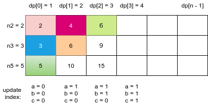
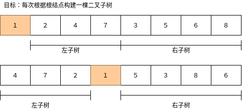

# Python 剑指offer打卡-5

[toc]

##　求第n个丑数

题目类型：数组

题目难度：:star2:

- 问题描述

  ```
  问题描述：
  　　把只包含质因子2、3和5的数称作丑数（Ugly Number）。例如6、8都是
  丑数，但14不是，因为它包含质因子7。习惯上我们把1当做是第一个丑数。求
  按从小到大的顺序的第N个丑数。（1也是丑数）
  
  说明：
  首先从丑数的定义我们知道，一个丑数的因子只有2,3,5，那么丑数p = 2 ^ x * 
  3 ^ y * 5 ^ z，换句话说一个丑数一定由另一个丑数乘以2或者乘以3或者乘以5
  得到，那么我们从1开始乘以2,3,5，就得到2,3,5三个丑数，在从这三个丑数出
  发乘以2,3,5就得到4，6,10,6，9,15,10,15,25九个丑数，我们发现这种方法会
  得到重复的丑数，而且我们题目要求第N个丑数，这样的方法得到的丑数也是
  无序
  nums2 = {1*2, 2*2, 3*2, 4*2, 5*2, 6*2, 8*2...}
  nums3 = {1*3, 2*3, 3*3, 4*3, 5*3, 6*3, 8*3...}
  nums5 = {1*5, 2*5, 3*5, 4*5, 5*5, 6*5, 8*5...}
  
  解题方法：
  丑数 = 某较小丑数 × 某因子
  
  注意：
  牛客网中index可能为0, 因此可在代码中添加 if index == 0: return 0 先行判断
  ```

- 代码（[解题思路](https://leetcode-cn.com/leetbook/read/illustration-of-algorithm/9hq0r6/)）

  图解

  

  ```python
  class Solution:
      
      def nthUglyNumber(self, n: int) -> int:
    
  
          dp, a, b, c = [1]*n, 0, 0, 0
          
          for i in range(1, n):
              n2, n3, n5 = dp[a]*2, dp[b]*3, dp[c]*5
              # 更新dp
              dp[i] = min(n2, n3, n5)
              if dp[i] == n2: a += 1
              if dp[i] == n3: b += 1
              if dp[i] == n5: c += 1
          
          return dp[-1]
  ```

## 只出现一次的数字

题目类型：数组、位运算

题目难度：:star2:

- 问题描述

  ```
  问题描述：
  	给定一个非空整数数组，除了某个元素只出现一次以外，其余每个元素均出
  现两次。找出那个只出现了一次的元素
  
  解题思路：
  1. 交换律：a ^ b ^ c <=> a ^ c ^ b
  2. 任何数于0异或为任何数 0 ^ n => n
  3. 相同的数异或为0: n ^ n => 0
  
  实例：
  var a = [2,3,2,4,4]
  2 ^ 3 ^ 2 ^ 4 ^ 4等价于 2 ^ 2 ^ 4 ^ 4 ^ 3 => 0 ^ 0 ^3 => 3
  ```

- 代码（[解题思路](https://leetcode-cn.com/problems/single-number/comments/)）

  ```python
  class Solution:
      def singleNumber(self, nums) -> int:
          a = 0
          for num in nums:
              a = a ^ num
          return a
  ```

## 二叉树的镜像

题目类型：树

题目难度：:star2:

- 问题描述

  ```python
  问题描述：
  操作给定的二叉树，将其变换为源二叉树的镜像
  
  解决方案：
  镜面变换、左是右，右是左。
  
  源二叉树：
  方法：递归
  　　８
  　６　10
  5    7    9     11
  镜像二叉树：
         8
    10     6
  11  9    7  5
  ```
  
- 代码（[解题思路](https://leetcode-cn.com/problems/er-cha-shu-de-jing-xiang-lcof/solution/mian-shi-ti-27-er-cha-shu-de-jing-xiang-di-gui-fu-/)）

  ```python
  class Solution:
      def mirrorTree(self, root: TreeNode) -> TreeNode:
  
          if not root:
              return None
  
          root.left, root.right = root.right, root.left
          self.mirrorTree(root.left)
          self.mirrorTree(root.right)
  
          return root
  ```

## 重建二叉树（<font color = red>重点</font>）

题目类型：树

题目难度：:star2:

- 问题描述

  ```python
  问题描述：
  　　输入某二叉树的前序遍历和中序遍历的结果，请重建出该二叉树。假设
  输入的前序遍历和中序遍历的结果中都不含重复的数字。例如输入前序遍历
  序列{1,2,4,7,3,5,6,8}和中序遍历序列{4,7,2,1,5,3,8 ,6}，则重建二叉树并返
  回。
  
  解决方案:
  前序遍历的第一个结点为根结点
  递归
  ```

- 代码（[解题思路](https://leetcode-cn.com/problems/zhong-jian-er-cha-shu-lcof/solution/mian-shi-ti-07-zhong-jian-er-cha-shu-di-gui-fa-qin/)）

  图解
  
  
  
  ```python
  class TreeNode:
  
      def __init__(self, x):
          self.val = x
          self.left = None
          self.right = None
  
  
  class Solution:
      
      def reConstructBinaryTree1(self, pre, tin):
  
          if len(pre) == 0:
              return None
          else:
              # 根据前序遍历，找出根节点在中序遍历中的位置
              pos = tin.index(pre[0])
  
          root = TreeNode(pre[0])
          root.left = self.reConstructBinaryTree1(pre[1:pos + 1], tin[:pos])
          root.right = self.reConstructBinaryTree1(pre[pos + 1:], tin[pos + 1:])
  
          return root
  ```

## 树的子结构

题目类型：树

题目难度：:star2:

- 问题描述

  ```python
  问题描述：
  输入两棵二叉树A，B，判断B是不是A的子结构。（ps：我们约定空树不是任意一个树的子结构）
  
  解决方案：
  ①如果A,B有一个为空，return False
  ②如果A,B不为空，A.val == B.val, 且B为单节点，则return True;如果结点B不为单节点则需要比较
  A.left.val == B.left.val 和 A.right.val == B.right.val
  ③如果B.val != A.val 则遍历Ａ结点的子节点和B进行比较，找到相同结点后，转②，否则return False
  ```

- 代码（[解题思路](https://leetcode-cn.com/problems/shu-de-zi-jie-gou-lcof/solution/mian-shi-ti-26-shu-de-zi-jie-gou-xian-xu-bian-li-p/)）

  ```python
  class TreeNode:
  
      def __init__(self, val):
          self.val = val
          self.left = None
          self.right = None
  class Solution:
      def isSubstructure(self, A, B):
  
          # A,B 不都为空
          if not A or not B:
              return False
  
          # 先序遍历，寻找子结构
          return self.isInclude(A, B) or self.isSubstructure(A.left, B) or self.isSubstructure(A.right, B)
  
      def isInclude(self, A, B):
  
          # B优先遍历完，且为子结构
          if not B:
              return True
          #　A优先遍历完，且不存在子结构
          if not A or A.val != B.val:
              return False
          # 递归寻找匹配
          return self.isInclude(A.left, B.left) and self.isInclude(A.right, B.right)
  ```


  

  

  

