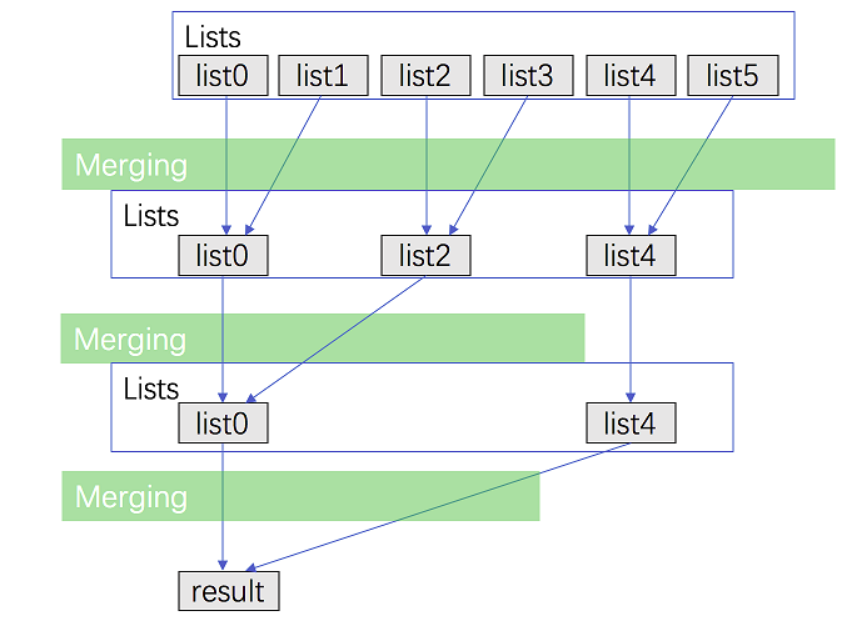
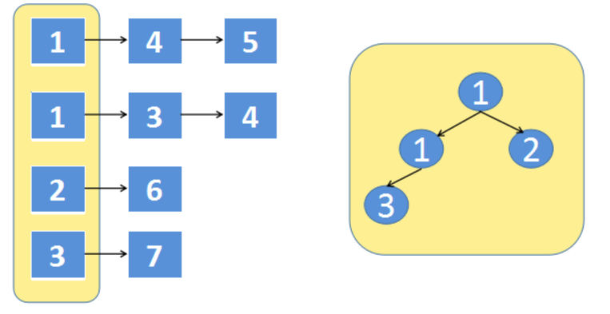

# 剑指Offer-合并k个有序链表

原题链接：https://leetcode-cn.com/problems/merge-k-sorted-lists/

## 问题描述

给你一个链表数组，每个链表都已经按升序排列。请你将所有链表合并到一个升序链表中，返回合并后的链表。

## 解题方法

### 方法一：顺序合并

**思想**：采用两两顺序合并原则

**时间复杂度**：假设每个链表的最长长度是 n。在第一次合并后，ans 的长度为 n；第二次合并后，ans 的长度为 $2\times n$，第 i次合并后，ans 的长度为$ i\times n$。第 ii 次合并的时间代价是 $O(n + (i - 1) \times n) = O(i \times n)$，那么总的时间代价为$ O(\sum_{i = 1}^{k} (i \times n)) = O(\frac{(1 + k)\cdot k}{2} \times n) = O(k^2 n))$，故渐进时间复杂度为 $O(k^2 n)$。
**空间复杂度**：没有用到与 k 和 n 规模相关的辅助空间，故渐进空间复杂度为 O(1)。

```python
class Solution:

    def mergeKLists(self, lists: List[Optional[ListNode]]) -> Optional[ListNode]:

        tmp = None
        for cur in lists:
            tmp = self.merge(tmp, cur)

        return tmp

    def merge(self, left, right):

        dummy = cur = ListNode(0)

        while left and right:
            if left.val < right.val:
                cur.next = left
                left = left.next
            else:
                cur.next = right
                right = right.next
            cur = cur.next

        cur.next = left if left else right

        return dummy.next
```
### 方法二：归并思想

**思想**：在顺序合并的基础上改进为两两合并 



**时间复杂度**：考虑递归「向上回升」的过程——第一轮合并$ \frac{k}{2} $组链表，每一组的时间代价是 $O(2n)$；第二轮合并$ \frac{k}{4}$组链表，每一组的时间代价是$ O(4n)$.....所以总的时间代价是$ O(\sum_{i = 1}^{\infty} \frac{k}{2^i} \times 2^i n) = O(kn \times \log k)$，故渐进时间复杂度为 $O(kn \times \log k)$。
**空间复杂度**：递归会使用到 $O(\log k)$ 空间代价的栈空间。

**时间复杂度**：O(NKlogK)
**空间复杂度**：O(logK)

```python
class Solution2:
    def mergeKLists(self, lists: List[Optional[ListNode]]) -> Optional[ListNode]:

        if not lists: return None
        if len(lists) == 1:
            return lists[0]

        mid = len(lists) // 2
        left = self.mergeKLists(lists[:mid])
        right = self.mergeKLists(lists[mid:])
        return self.merge(left, right)

    def merge(self, left, right):

        dummy = cur = ListNode(-1)

        while left and right:
            if left.val < right.val:
                cur.next = left
                left = left.next
            else:
                cur.next = right
                right = right.next
            cur = cur.next

        cur.next = left if left else right

        return dummy.next
```

### 方法三：构建最小堆

**思想**：建立优先队列（最大堆或者最小堆均可），全部元素接连入队(占用空间Ｏ（Ｎ）)；最后再不断弹出，构建链表。

**时间复杂度**：O(NlogK)
**空间复杂度**：O(K)

```python
class Solution0:
    def mergeKLists(self, lists: List[ListNode]) -> ListNode:

        if not List:
            return None
        if len(lists) == 1:
            return lists[0]

        dummy = cur = ListNode(-1)
        heap = []
        for node in lists:
            while node:
                heapq.heappush(heap, node.val)
                node = node.next
        # 构建有序链表
        while heap:
            cur.next = ListNode(heapq.heappop(heap))
            cur = cur.next
        return dummy.next
```

### 方法四：优先队列

思想：改进方法三种的空间复杂度，将其降低为O(K)，每次只需要比较每条链表的第一个结点，类似多个队列在一个窗口进行买票，注意需要在实现过程中，需要重载运算符。



时间复杂度：O(NlogK)
空间复杂度：O(Ｋ）

```python
class Solution3:

    def mergeKLists(self, lists: List[Optional[ListNode]]) -> Optional[ListNode]:
        # 重载运算符
        def __lt__(a: ListNode, b: ListNode):
            return a.val < b.val

        ListNode.__lt__ = __lt__

        if not lists:
            return None
        heap = []
        # 优化堆存储
        # 存储所有头结点
        for head in lists:
            if head:
                heapq.heappush(heap, (head.val, head))
        dummy = cur = ListNode(-1)
        # 从最小堆里面进行选择当前最小
        while heap:
            _, head = heapq.heappop(heap)
            cur.next = head
            cur = cur.next
            if head.next:
                heapq.heappush(heap, (head.next.val, head.next))

        return dummy.next

```

