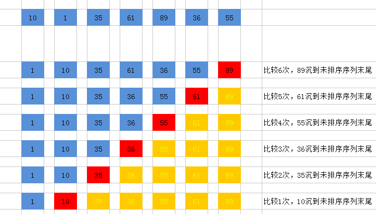
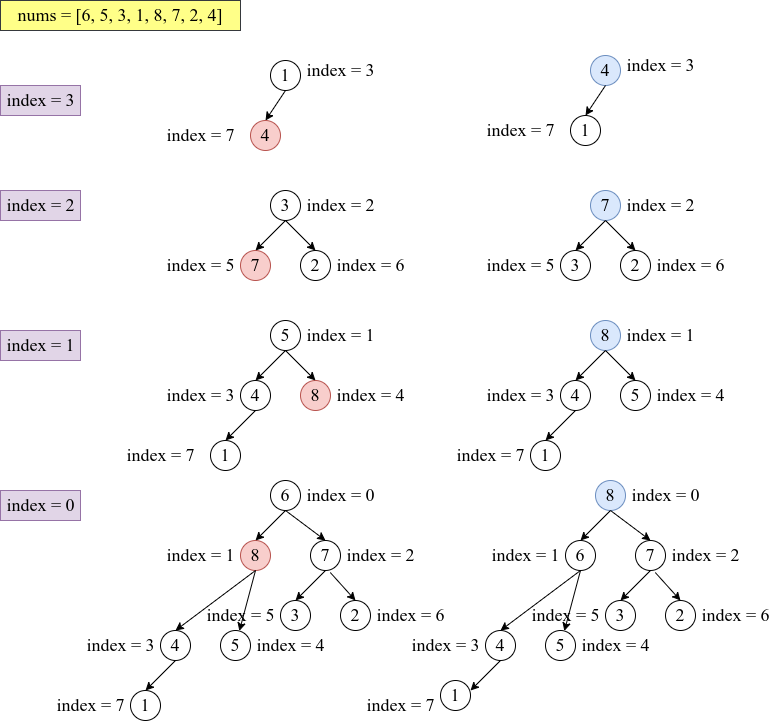
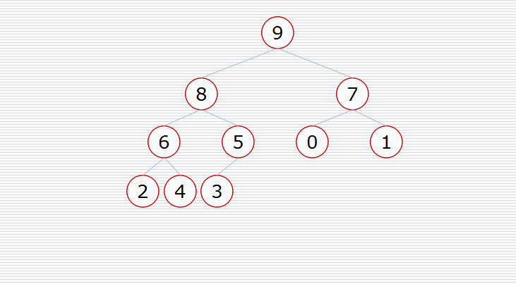
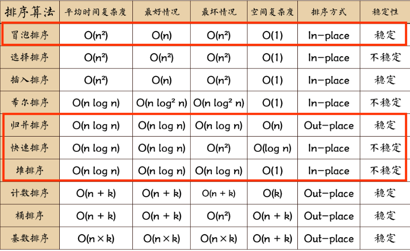

# 剑指Offer-常见排序算法专题

[toc]

## 快速排序

**算法思想**：

​		通过一趟排序将待排记录分隔成独立的两部分，其中一部分记录的关键字均比另一部分的关键字小，则可分别对这两部分记录继续进行排序，以达到整个序列有序。

**算法描述**：

- 从数列中挑出一个元素，称为 “基准”（pivot）；
- 重新排序数列，所有元素比基准值小的摆放在基准前面，所有元素比基准值大的摆在基准的后面（相同的数可以到任一边）。在这个分区退出之后，该基准就处于数列的中间位置。这个称为分区（partition）操作；
- 递归地（recursive）把小于基准值元素的子数列和大于基准值元素的子数列排序。

**快速排序图解**


**实例图解**：


**动图演示**：


**代码1**：==简单快速排序== 

时间复杂度：O(nlogn)

最坏时间复杂度：O(n^2)

空间复杂度：O(logn)

```python
class Solution:
    def sortArray(self, nums: List[int]) -> List[int]:

        def quick_sort(nums, start, end):
            """快速排序"""
            if start >= end:
                return 
            # 寻找基准点
            low, high = start, end
            pivot = nums[low]
            while low < high:
                while low < high and nums[high] >= pivot:
                    high -= 1
                nums[low] = nums[high]
                while low < high and nums[low] < pivot:
                    low += 1
                nums[high] = nums[low]
            nums[low] = pivot
            # 左右区间遍历
            quick_sort(nums, start, low - 1)
            quick_sort(nums, low + 1, end)
            
        quick_sort(nums, 0, len(nums) - 1)
        return nums
```

**代码2**：==优化的快速排序==

优化点主要在于保证基准点选择的随机性，消除待排序数组为有序的情况

时间复杂度：O(nlogn)

空间复杂度：O(logn)

```python
import random


class Solution:
    def sortArray(self, nums: List[int]) -> List[int]:

        def quickSort(nums, strat, end):
            if strat >= end:
                return 
            i, j = strat, end
            # 随机选择起始比较点
            index = random.randint(i, j)
            nums[i], nums[index] = nums[index], nums[i]
            pivot = nums[i]
            while i < j: 
                while i < j and nums[j] >= pivot:
                    j -= 1
                nums[i] = nums[j]
                while i < j and nums[i] < pivot:
                    i += 1
                nums[j] = nums[i]
            nums[i] = pivot
            quickSort(nums, strat, i - 1)
            quickSort(nums, i + 1, end)
        
        quickSort(nums, 0, len(nums) - 1)
        return nums
```


## 归并排序

**算法思想：**

​         归并排序方法就是把一组n个数的序列，折半分为两个序列，然后再将这两个序列再分，一直分下去，直到分为n个长度为1的序列。然后两两按大小归并。如此反复，直到最后形成包含n个数的一个数组。

**算法原理：**

1. 将一个序列从中间位置分成两个序列；

2. 在将这两个子序列按照第一步继续二分下去；

3. 直到所有子序列的长度都为1，也就是不可以再二分截止。这时候再两两合并成一个有序序列即可。


  **静态图演示：**

  

  **动态图演示：**

  

  **代码：**

时间复杂度：O(nlogn)

空间复杂度：O(n)

  ```python
class Solution:
    def sortArray(self, nums: List[int]) -> List[int]:

        if len(nums) <= 1:
            return nums
        mid = len(nums)//2
        left, right = nums[:mid], nums[mid:]

        return self.merge(self.sortArray(left), self.sortArray(right))
    
    def merge(self, left, right):

        i, j = 0, 0
        res = []
        while  i < len(left) and j < len(right):
            if left[i] < right[j]:
                res.append(left[i])
                i += 1
            else:
                res.append(right[j])
                j += 1
        res += left[i:]
        res += right[j:]

        return res
  ```
## 冒泡排序

**主要思想：**

冒泡排序时针对**相邻元素之间**的比较，可以将大的数慢慢“沉底”(数组尾部)

**算法演示：**



**代码：**

时间复杂度：O(n^2)

空间复杂度：O(1)

```python
class Solution:
    def BubbleSort(self, nums: List[int]) -> List[int]:

        n = len(nums)
        
        for c in range(n):
            for i in range(1, n - c):
                if nums[i - 1] > nums[i]:
                    nums[i], nums[i - 1] = nums[i - 1], nums[i]
        return nums
```

## 堆排序

[浅谈堆排序](https://www.jianshu.com/p/938789fde325)

算法思想：

​		堆排序是利用**堆**这种数据结构而设计的一种排序算法，堆排序是一种**选择排序，**它的最坏，最好，平均时间复杂度均为O(nlogn)，它也是不稳定排序。

算法描述：

1. 建堆，从底向上调整堆，使得父亲节点比孩子节点值大，构成大顶堆；
2. 交换堆顶和最后一个元素，重新调整堆

图解算法：



动态图演示：



代码：

时间复杂度：O(nlogn)

空间复杂度：O(1)

```python
class Solution:
    def sortArray(self, nums: List[int]) -> List[int]:

        def adjust_heap(nums, start, end):
            
            new_item = nums[start]
            pos = start
            left_pos = pos * 2 + 1
            while left_pos < end:
                right_pos = left_pos + 1
                if right_pos < end and nums[right_pos] >= nums[left_pos]:
                    left_pos = right_pos
                if new_item < nums[left_pos]:
                    nums[pos] = nums[left_pos]
                    pos = left_pos
                    left_pos = pos * 2 + 1
                else:
                    break
            nums[pos] = new_item
        
        n = len(nums)
        # 构建最大堆
        for i in reversed(range(n//2)):
            adjust_heap(nums, i, n)
        # 调整堆:首尾交换，元素下沉
        for i in range(n - 1, -1, -1):
            nums[i], nums[0] = nums[0], nums[i]
            adjust_heap(nums, 0, i)
        return nums
```

## 排序算法总结

### 时间复杂度和空间复杂度



### 排序算法的稳定性

​		排序算法稳定性假定在待排序的记录序列中，存在多个具有相同的关键字的记录，若经过排序，这些记录的相对次序保持不变，即在原序列中，r[i]=r[j]，且r[i]在r[j]之前，而在排序后的序列中，r[i]仍在r[j]之前，则称这种排序算法是稳定的；否则称为不稳定的。例如：

<font color=red>**快速排序**</font>：A = {==2==， 2， 1}，排序后A = {1，2，==2==}。

希尔排序：A = {1，2，5，==4==，4，7}，排序后（k = 2）；A = {1， 2， 4， ==4==， 5， 7} 。

<font color=red>**堆排序**</font>：A = {==2==，2，1}，排序后A = {1，2， ==2==}。

直接选择排序： A = {==4==， 4， 2， 5},排序后 A = {2，4，==4==， 5}。

以上举例都不满足稳定性。


