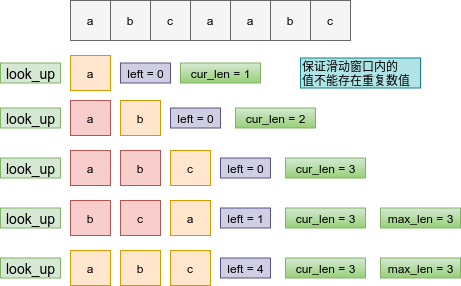

# 剑指Offer-最长\最大 *** 题目总结

[toc]

## 最长连续序列（<font color=red>重点</font>）

题目类型：数组、动态规划

题目难度：:star2::star2::star2:

- 问题描述

  ```
  问题描述：
      给定一个未排序的整数数组 nums ，找出数字连续的最长序列（不要求序列元素在原
  数组中连续）的长度。请你设计并实现时间复杂度为O(n) 的算法解决此问题。
  
  解题方法：
  主要思路在于寻找连续子序列的起始点x,而起始点的上一位x - 1必然不存在数组中，即起点和
  终点必然不在数组中
  
  时间复杂度：O(N)
  空间复杂度：O(N)
  ```

- 代码

  ```python
  class Solution:
      def longestConsecutive(self, nums: List[int]) -> int:
          
          if not nums: return 0
          num_sets = set(nums)
          longest_streak = 1
  
          for num in num_sets:
              # 寻找前驱
              if num - 1 not in num_sets:
                  cur_num = num
                  cur_streak = 1
                  # 遍历后继
                  while cur_num + 1 in num_sets:
                      cur_num += 1
                      cur_streak += 1
                  # 标记最长长度
                  longest_streak = max(longest_streak, cur_streak)
              
          return longest_streak
  ```

## 最长递增子序列（<font color=red>重点</font>）

题目类型：数组、动态规划

题目难度：:star2::star2::star2:

  - 问题描述

    ```
    问题描述：
        　给你一个整数数组 nums ，找到其中最长严格递增子序列的长度。子序列是
    由数组派生而来的序列，删除（或不删除）数组中的元素而不改变其余元素的顺序。
    例如，[3,6,2,7] 是数组 [0,3,1,6,2,2,7] 的子序列。
    
    示例：
    输入：nums = [10,9,2,5,3,7,101,18]
    输出：4
    解释：最长递增子序列是 [2,3,7,101]，因此长度为 4 。
    
    解题方法：
    1. 动态规划四步走原则
    (1)转态定义：dp[i]表示到当前结点i所表示的子序列的长度
    (2)转态转移：dp[i] = max(dp[i], dp[j] + 1)，表示为i之前最大的递增子序列
    (3)初始值：dp = [1]*len(nums)
    (4)返回值：max(dp)
    时间复杂度：O(N^2)  两层循环
    空间复杂度：O(N)  dp状态的存储
    
    2. 二分法（新老干部交替）
    很具小巧思。新建数组 cell，用于保存最长上升子序列。
    对原序列进行遍历，将每位元素二分插入 cell 中。
    如果 cell 中元素都比它小，将它插到最后
    否则，用它覆盖掉比它大的元素中最小的那个。
    总之，思想就是让 cell 中存储比较小的元素。这样，cell 未必是真实的最长上升子序
    列，但长度是对的.
    时间复杂度：O(NlogN)
    空间复杂度：O(1)
    ```

  - 代码（[解题思路](https://leetcode-cn.com/problems/longest-increasing-subsequence/solution/zui-chang-shang-sheng-zi-xu-lie-dong-tai-gui-hua-2/)）

    动态规划

    算法图解：

    

    ```python
    class Solution:
        def lengthOfLIS(self, nums: List[int]) -> int:
            
            if not nums: return 0
            # 定义dp,并设置初始值
            dp = [1]*len(nums)
            # 遍历转态
            for i in range(len(nums)):
                for j in range(i):
                    if nums[j] < nums[i]:
                        # 更新状态(已有子序列的前提上进行更新)
                        dp[i] = max(dp[i], dp[j] + 1)
            # 返回值
            return max(dp)
    ```

    ==变形：输出最长递增子序列==

    ```python
    class Solution:
        def lengthOfLIS(self, nums: List[int]) -> int:
            
            if not nums: return 0
            # 初始化转态
            dp = [1] * len(nums)
            # 转态转移
            for i in range(len(nums)):
                for j in range(i):
                    if nums[i] > nums[j]:
                        dp[i] = max(dp[i], dp[j] + 1)
            # 打印出序列元素
            
            max_index = dp.index(max(dp))
            res = [nums[max_index]]
            for i in range(max_index, -1, -1):
                if dp[i] + 1 == dp[max_index] and nums[i] < nums[max_index]:
                    res.append(nums[i])
                    max_index = i
    
            return res[::-1]
    ```
    
    二分法优化
    
    原理：

    nums  = [2, 3, 4, 5, 1, 6, 2]

    1.插入2，[2]

    2.插入3，[2,3]

    3.插入4,   [2,3,4] 

    4.插入5，[2,3,4,5]

    5.插入1，[1,3,4,5] 

    6,插入6， [1,3,4,5,6]

    7.插入2， [1,2, 4,5,6]
    
    ```python
    class Solution:
        def lengthOfLIS(self, nums: List[int]) -> int:
            size = len(nums)
            if size<2:
                return size
            
            cell = [nums[0]]
            for num in nums[1:]:
                if num>cell[-1]:
                    cell.append(num)
                    continue
                
                l,r = 0,len(cell)-1
                while l<r:
                    mid = l + (r - l) // 2
                    if cell[mid]<num:
                        l = mid + 1
                    else:
                        r = mid
                cell[l] = num
            return len(cell)
    ```

## 无重复字符的最长子串（<font color = red>重点</font>）

题目类型：字符串

题目难度：:star2::star2::star2::star2:

  - 问题描述

    ```
    问题描述：
    	给定一个字符串，请你找出其中不含有重复字符的最长子串的长度。
    
    解题方法：
    滑动窗口
    两种情况下滑动窗口的移动：
    （1）[abcdef]a  ----> [bcdefa]
    （2）[bdefa]a  ----> [a]
    时间复杂度：O(N)
    空间复杂度：O(N) 使用集合临时存储了最长字符串，极端情况下需要存储N
    ```

  - 代码（[解题思路](https://leetcode-cn.com/problems/longest-substring-without-repeating-characters/solution/hua-dong-chuang-kou-by-powcai/)）

    图解:窗口内无重复数值

    

    

    ```python
    class Solution:
        def lengthOfLongestSubstring(self, s: str) -> int:
            if not s: return 0
            # left 记录窗口左边界索引值
            left, max_len, cur_len = 0, 0, 0
            # 集合保证了无重复性
            look_up = set()
    
            for i in range(len(s)):
                cur_len += 1
                # 循环判断，直到左边界唯一
                while s[i] in look_up:
                    look_up.remove(s[left])
                    left += 1
                    cur_len -= 1
                # 记录字符串最长长度
                if cur_len > max_len: max_len = cur_len
                look_up.add(s[i])
    
            return max_len
    ```

## 连续子数组的最大和（<font color = red>重点</font>）

题目类型：数组、动态规划

题目难度：:star2::star2::star2:

- 题目说明  

  ```
  问题描述：
  	输入一个整型数组，数组中的一个或连续多个整数组成一个子数组。求所有子数组
  的和的最大值。要求时间复杂度为O(n)。
  
  解题方法：
  动态规划
  (1) 状态定义： 设动态规划列表 dp ，dp[i] 代表以元素 nums[i]结尾的连续子数组最大和。
  为何定义最大和 dp[i] 中必须包含元素 nums[i]：保证 dp[i]递推到dp[i+1] 的正确性；如
  果不包含 nums[i]，递推时则不满足题目的 连续子数组 要求。
  (2) 转移方程：若dp[i−1]≤0 ，说明 dp[i - 1]对 dp[i]产生负贡献，
  即 dp[i-1] + nums[i]不如 nums[i]本身大。
  当 dp[i - 1] > 0时：执行 dp[i] = dp[i-1] + nums[i]；
  当 dp[i−1]≤0 时：执行 dp[i] = nums[i]；
  (3) 初始状态： dp[0] = nums[0]，即以 nums[0]结尾的连续子数组最大和为 nums[0] 。
  (4) 返回值： 返回 dp 列表中的最大值，代表全局最大值。
  
  dp[i]的长度，时间复杂度O(n)
  直接使用nums数组进行存储，空间复杂度O(1)
  ```


- 代码（[解题思路](https://leetcode-cn.com/problems/lian-xu-zi-shu-zu-de-zui-da-he-lcof/solution/cong-bao-li-po-jie-dao-dong-tai-gui-hua-yfvkp/)）

  状态转移方程：
  $$
  dp[j]={ dp[j−1]+nums[j],dp[j−1]>0   \\
  dp[j]=nums[j],   dp[j−1]≤0}\\
  $$
  
  
  
  情况描述：
  
  
  
  ```python
  class Solution:
      def maxSubArray(self, nums: List[int]) -> int:
  
          for i in range(1, len(nums)):
              nums[i] += max(nums[i-1], 0)
          
          return max(nums)
  ```

## 最长回文串

题目类型：回文串

题目难度：:star2:

- 问题描述

  ```
  问题描述：
      给定一个包含大写字母和小写字母的字符串，找到通过这些字母构造成的最长的回文串。
  在构造过程中，请注意区分大小写。比如"Aa"不能当做一个回文字符串。
  注意:假设字符串的长度不会超过 1010。
  
  解题方法：
  哈希表
  ```

- 代码  

  算法图解

  

  ```python
  import collections
  
  
  class Solution1:
      """重新构建"""
      def longestPalindrome(self, s: str) -> int:
  
          count = collections.Counter(s)
          ans = 0
  
          for v in count.values():
              # 偶数个数全添加
              ans += v // 2 * 2
              # 偶数中间添加奇数
              if ans % 2 == 0 and v % 2 == 1:
                  ans += 1
  
          return ans
  ```

## 二叉树的最大路径和

题目类型：二叉树

题目难度：:star2:

- 问题描述

  ```
  问题描述：
      路径 被定义为一条从树中任意节点出发，沿父节点-子节点连接，达到任意节点的序列。同一个节点
  在一条路径序列中 至多出现一次 。该路径 至少包含一个 节点，且不一定经过根节点。路径和是路径中
  各节点值的总和。给你一个二叉树的根节点 root，返回其 最大路径和 。
  
  解题方法：
  DFS
  ```

- 代码（[解题思路](https://leetcode-cn.com/problems/binary-tree-maximum-path-sum/solution/er-cha-shu-zhong-de-zui-da-lu-jing-he-by-leetcode-/)）

  ```python
  class Solution:
  
      def __init__(self):
          self.max_gain = float("-inf")
  
      def maxPathSum(self, root: TreeNode) -> int:
          def dfs(root):
              if root is None:
                  return 0
              # 计算左右结点收益
              left_gain = max(dfs(root.left), 0)
              right_gain = max(dfs(root.right), 0)
              # 更新当前结点的收益
              cur_gain = root.val + left_gain + right_gain
              self.max_gain = max(cur_gain, self.max_gain)
              # 只返回左右子树中的任意一个，保证路径的唯一性
              return root.val + max(left_gain, right_gain)
  
          dfs(root)
  
          return self.max_gain
  ```

  相似题目：二叉树的直径

## 最长回文子串（<font color=red>重点</font>）

题目类型：字符串

题目难度：:star2::star2::star2::star2:

回文的意思是正着念和倒着念一样，如：==上海自来水来自海上==

- 问题描述

  ```
  问题描述：
  给你一个字符串 s，找到 s 中最长的回文子串。
  
  字符串的回文：
          对于一个子串而言，如果它是回文串，并且长度大于 2，那么将它首尾的
  两个字母去除之后，它仍然是个回文串。例如对于字符串“ababa”，如果我
  们已经知道“bab” 是回文串，那么 “ababa” 一定是回文串，这是因为它
  的首尾两个字母都是a”。
  
  
  解题方法：
  动态规划
  (1)状态定义：d[i][j]表示s[i:j]为回文子串；
  (2)状态转移：d[i][j] = dp[i + 1][j - 1]，子问题是否为回文子串；
  (3)初始状态：dp[i][i] = True，表示只有一个字符时为回文子串；
  (4)返回值：最长的回文子串长度。
  时间复杂度O(n^2)
  空间复杂度O(n^2)
  ```

- 代码（[解题思路](https://leetcode-cn.com/problems/longest-palindromic-substring/solution/zui-chang-hui-wen-zi-chuan-by-leetcode-solution/)）

  图解：

  

  ```python
  class Solution:
      def longestPalindrome(self, s: str) -> str:
          
          n = len(s)
          # 当s只有一个字符和无字符时
          if n < 2:
              return s
          # 转态定义
          dp = [[False]*n for _ in range(n)]
          # 初始状态
          for i in range(n):
              dp[i][i] = True
          max_len, begin = 1, 0
          # 遍历状态
          for L in range(2, n + 1):
              # 左右边界
              for i in range(n):
                  j = i + L - 1
                  if j >= n:
                      break
                  if s[i] != s[j]:
                      dp[i][j] = False
                  else:
                      if j - i < 3:
                          dp[i][j] = True
                      else:
                          dp[i][j] = dp[i + 1][j - 1]
                  # 更新最长回文子串长度起始值
                  if dp[i][j] and j - i + 1 > max_len:
                      max_len = j - i + 1
                      begin = i
          
          return s[begin: begin + max_len]
  ```
