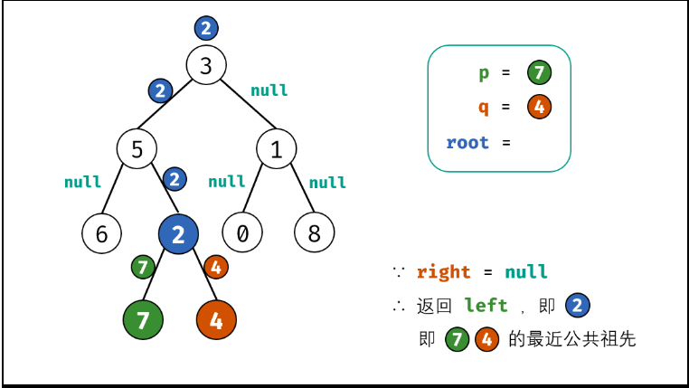
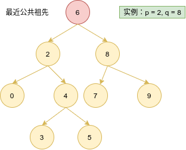

# Python剑指offer打卡13

[toc]

## 二叉树的最近公共祖先（<font color = red>重点</font>）

题目类型：二叉树

题目难度：:star2::star2::star2:

==注意==：leetcode和牛客网对于本题的输入输出参数的要求。

- 问题描述

  ```python
  问题描述：
  	给定一个二叉树, 找到该树中两个指定节点的最近公共祖先。
  
  知识点：
          最近公共祖先的定义： 设节点 root为节点p,q 的某公共祖先，若其左子节点
  root.left和右子节点root.right 都不是p,q 的公共祖先，则称 root 是 “最近的公
  共祖先” 。
  
  解题方法：
  回朔法（后序遍历）
  时间复杂度：O(N)
  空间复杂度：O(N)
  ```

- 代码（[解题思路](https://leetcode-cn.com/problems/er-cha-shu-de-zui-jin-gong-gong-zu-xian-lcof/solution/mian-shi-ti-68-ii-er-cha-shu-de-zui-jin-gong-gon-7/)）

  

  ```python
  class Solution:
      def lowestCommonAncestor(self, root: TreeNode, p: TreeNode, q: TreeNode) -> TreeNode:
          
          # 回朔终点
          if not root or root == p or root == q:
              return root
  
          left = self.lowestCommonAncestor(root.left, p, q)
          right = self.lowestCommonAncestor(root.right, p, q)
          
          # 三种情况
          if not left: return right
          if not right: return left
  
          return root
  ```
  
- 牛客网
  
  ```python
  问题描述：
  	给定一棵二叉树以及这棵树上的两个节点 o1 和 o2，请找到 o1 和 o2 的最近公共祖先节点。 
  主要区别在于结点的输入值从TreeNode类型变为int型
  参数说明：
  # @param root TreeNode类 
  # @param o1 int整型 
  # @param o2 int整型 
  # @return int整型
  ```
  
  ```python
  def lowestCommonAncestor(self , root , o1 , o2 ):
          # write code here
          def dfs(root, o1, o2):
              
              if not root or root.val == o1 or root.val == o2:
                  return root
              
              # 后序遍历
              left = dfs(root.left, o1, o2)
              right = dfs(root.right, o1, o2)
              
              # 如果left、right有一个为空，那么就返回不为空的哪一个
              if not left: return right
              if not right: return left
              #  如果left、right都不为空，那么代表o1、o2在root的两侧，所以root为他们的公共祖先
              
              return root
          
          return dfs(root, o1, o2).val
  ```

## 二叉搜索树的最近公共祖先

题目类型：二叉树

题目难度：:star2:

==注意==：区别与上一题，此处为二叉搜索树，遵循<font color ="blue">"左小右大"</font>。

- 问题描述

  ```
  问题描述：
  给定一个二叉搜索树, 找到该树中两个指定节点的最近公共祖先。
  
  解题方法：
  遍历
  三种情况：
  (1)两个指定节点在左右子数中；
  (2)两个节点在左子树中；
  (3)两个节点在右子树中。
  
  返回条件:及不大于,也不小于
  时间复杂度：O(N)
  空间复杂度：O(1)
  ```

- 代码（[解题思路](https://leetcode-cn.com/problems/er-cha-sou-suo-shu-de-zui-jin-gong-gong-zu-xian-lcof/solution/mian-shi-ti-68-i-er-cha-sou-suo-shu-de-zui-jin-g-7/)）

  图解
  
  
  
  ```python
  class Solution:
      def lowestCommonAncestor(self, root: 'TreeNode', p: 'TreeNode', q: 'TreeNode') -> 'TreeNode':
  
          if p.val > q.val:
              p, q = q, p
          
          while root:
              # 右子树（小于最小的）
              if root.val < p.val:
                  root = root.right
              # 左子树（大于最大的）
              elif root.val > q.val:
                  root = root.left
              else:
                  break
  
          return root
  ```

## 礼物的最大值（<font color = red>重点</font>）

题目类型：动态规划

题目难度：:star2::star2:

此题有最大值和最小值两种类型，并且要注意==每种题型每次所走的路径方向==。

### 最大值（leetcode）

- 问题描述

  ```
  问题描述：
  	在一个 m*n 的棋盘的每一格都放有一个礼物，每个礼物都有一定的价值（价值
  大于 0）。你可以从棋盘的左上角开始拿格子里的礼物，并每次向右或者向下移动一
  格、直到到达棋盘的右下角。给定一个棋盘及其上面的礼物的价值，请计算你最多能
  拿到多少价值的礼物？
  
  实例：
  [[1,3,1],
    [1,5,1],
    [4,2,1]]
  输出: 12
  解释: 路径 1→3→5→2→1 可以拿到最多价值的礼物
  
  解题方法：
  动态规划
  转态定义：dp[i]][j]表示当前位置礼物的最大值；
  转态转移：dp[i][j] += max(dp[i - 1][j], dp[i][j - 1])；
  初始值：dp[0][j] += dp[0][j - 1], dp[i][0] += dp[i - 1][0], 第一行和第一列的值只能从左和上
  方过度过来；
  返回值：dp[-1][-1]。
  
  复杂度:
  时间复杂度：O(M*N)
  空间复杂度：O(1)
  
  注意：
  (1)入口为左上角,出口为右下角
  (2)每次向下或向右移动一格
  ```

- 代码（[解题思路](https://leetcode-cn.com/leetbook/read/illustration-of-algorithm/5vr32s/)）

  
  
  ```python
  class Solution:
      def maxValue(self, grid: List[List[int]]) -> int:
  
          m, n = len(grid), len(grid[0])
  
          # 起始转态(第一行)
          for j in range(1, n):
              grid[0][j] += grid[0][j - 1]
          
          # 起始状态（第一列）
          for i in range(1, m):
              grid[i][0] += grid[i-1][0]
          
          # 转移方程(向左 向上)
          for i in range(1, m):
              for j in range(1, n):
                  grid[i][j] += max(grid[i - 1][j], grid[i][j - 1])
                  
          # 返回值
          return grid[-1][-1]
  ```

### 最小值：牛妹的的礼物（牛客网）

- 问题描述

  ```
  问题描述：
  	众所周知，牛妹有很多很多粉丝，粉丝送了很多很多礼物给牛妹，牛妹的礼物摆满了地板。
  地板是N×M的格子，每个格子有且只有一个礼物，牛妹已知每个礼物的体积。地板的坐标是左
  上角(1,1)  右下角（N, M）。牛妹只想要从屋子左上角走到右下角，每次走一步，每步只能向下
  走一步或者向右走一步或者向右下走一步每次走过一个格子，拿起（并且必须拿上）这个格子上
  的礼物。牛妹想知道，她能走到最后拿起的所有礼物体积最小和是多少？
  
  解题方法：
  转态定义：dp[i]][j]表示当前位置礼物的最小值；
  初始值：dp[0][j] += dp[0][j - 1], dp[i][0] += dp[i - 1][0]；
  转态转移：dp[i][j] = min(dp[i-1][j-1],，dp[i][j-1]，dp[i-1][j])) + presentVolumn[i][j]；
  返回值：dp[-1][-1]。
  
  复杂度:
  时间复杂度O(M*N)
  空间复杂度O(1)
  
  注意：
  (1)入口为左上角,出口为右下角
  (2)每次向下或向右或向右下角移动一格
  ```

- 代码

  ```python
  class Solution:
      def selectPresent(self , presentVolumn ):
   
          m, n = len(presentVolumn), len(presentVolumn[0])       
          # 初始化第一行
          for j in range(1, n):
              presentVolumn[0][j] += presentVolumn[0][j - 1]
          # 初始化第一列
          for i in range(1, m):
              presentVolumn[i][0] += presentVolumn[i - 1][0]
              
          # 遍历所有节点(上，左，左上)
          for i in range(1, m):
              for j in range(1, n):
                  presentVolumn[i][j] += min(presentVolumn[i-1][j], presentVolumn[i][j-1], presentVolumn[i-1][j-1])
          
          return presentVolumn[-1][-1]
  ```

## 把数字翻译成字符串

题目类型：字符串、动态规划

题目难度：:star2::star2:

### leetcode

==说明==：0 -> "a", 并且输入为数字。

- 问题描述

  ```
  问题描述：
  	给定一个数字，我们按照如下规则把它翻译为字符串：0 翻译成 “a” ，
  1 翻译成 “b”，……，11 翻译成 “l”，……，25翻译成 “z”。一个数字
  可能有多个翻译。请编程实现一个函数，用来计算一个数字有多少种不同的
  翻译方法。
  
  实例：
  输入: 12258
  输出: 5
  解释: 12258有5种不同的翻译，分别是"bccfi", "bwfi", "bczi", "mcfi"和"mzi"
  
  解题方法：
  动态规划
  ```

- 代码（[解题思路](https://leetcode-cn.com/leetbook/read/illustration-of-algorithm/99dnh6/)）

  转态转移方程
  $$
  d p[i]=\left\{\begin{array}{ll}
  d p[i-1]+d p[i-2] &,(10 _{x i-1}+x i) \in[10,25] \\
  d p[i-1] & ,\left(10 x_{i-1}+x_{i}\right) \in[0,10) \cup(25,99]
  \end{array}\right.
  $$

  ```python
  class Solution:
      def translateNum(self, num: int) -> int:
          
          # 初始化
          strs = str(num)
          # dp[i-1], dp[i-2]
          a, b = 1, 1
          for i in range(2, len(strs) + 1):
              a, b = (a + b if "10" <= strs[i - 2:i] <= "25" else a), a
  
          return a
  ```

### 牛客网

==说明==：输入为0时，不能翻译；1 -> "a", 且输入为字符。

- 问题描述

  ```
  问题描述：
  有一种将字母编码成数字的方式：'a'->1, 'b->2', ... , 'z->26'。
  现在给一串数字，返回有多少种可能的译码结果
  
  实例:
  输入："0"
  输出: 0
  
  输入："100"
  输出：0
  
  输入："1001"
  输出：0
  
  输入："10"
  输出：0
  
  输入："12"
  输出：2
  ```
  
- 代码

  ```python
  class Solution:
      def solve(self , nums ):
          # write code here
          if nums[0] == "0" and  len(nums) == 1:
              return 0
          
          a, b = 1, 1   
          for i in range(2,  len(nums) + 1):
              if nums[i - 1] == "0":
                  if nums[i - 2] == "0":
                      return 0
              else:
                  a, b = (a + b if "10" <= nums[i-2:i] <= "26" else a), a
          return a
  ```

## 股票的最大利润（<font color = red>重点</font>）

题目类型：数组、动态规划

题目难度：:star2::star2:

- 问题描述

  ```
  问题描述：
  	假设把某股票的价格按照时间先后顺序存储在数组中，请问买卖该股票一次
  可能获得的最大利润是多少？
  
  示例：
  输入: [7,1,5,3,6,4]
  输出: 5
  解释: 在第 2 天（股票价格 = 1）的时候买入，在第 5 天（股票价格 = 6）的时候
  卖出，最大利润 = 6 - 1 = 5 。
  注意利润不能是 7-1 = 6, 因为卖出价格需要大于买入价格。
  
  解题方法：
  (1) 暴力法
  时间复杂度:O(N^2)
  空间复杂度:O(1)
  (2) 动态规划
  定义状态：dp[i]表示到当天最大的收益率
  初始转态：dp[0] = 0 表示第一天的收益为0
  状态转移：dp[i] = max(dp[i - 1],  price - min_cost)
  时间复杂度:O(N)
  空间复杂度:O(N)
  (3) 一次遍历
  时间复杂度:O(N)
  空间复杂度:O(1)
  ```

- 代码（[解题思路](https://leetcode-cn.com/leetbook/read/illustration-of-algorithm/58vmds/)）

  暴力法
  
  ```python
  class Solution:
      def maxProfit(self, prices: List[int]) -> int:
          """暴力法"""
  
          profit = 0
  
          for i in range(len(prices)):
              for j in range(i, len(prices)):
                  profit = max(profit, prices[j] - prices[i])
                  z;.
          return profit
  ```
  
  动态规划
  
  ```python
  class Solution:
      def maxProfit(self, prices: List[int]) -> int:
  
          n = len(prices)
          if n == 0: return 0
          # 定义状态，并赋初值
          # dp[0]表示当天的收益比
          dp = [0]*n
          min_cost = prices[0]
          # 状态转移
          for i in range(1, n):
              min_cost = min(min_cost, prices[i])
              dp[i] = max(dp[i - 1], prices[i] - min_cost)
  
          # 返回值
          return dp[-1]
  ```
  
  一次遍历
  
  ```python
  class Solution:
      def maxProfit(self, prices: List[int]) -> int:
  
          cost, profit = float("+inf"), 0
          for price in prices:
              # 记录最低值
              cost = min(cost, price)
              # 利润最大化
              profit = max(profit, price - cost)
          
          return profit
  ```
  
  

