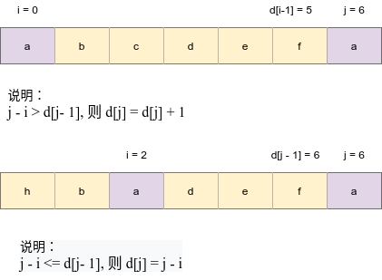

# Python剑指offer打卡-14

[toc]

## 最长不含重复字符的子字符串

### leetcode

题目类型：字符串

题目难度：:star2::star2:

注意：输入为字符串

- 问题描述

  ```
  问题描述：
  请从字符串中找出一个最长的不包含重复字符的子字符串，计算该最长子字符串的长度。
  
  实例：
  输入: "abcabcbb"
  输出: 3 
  解释: 因为无重复字符的最长子串是 "abc"，所以其长度为 3。
  
  注意：
  最长不含重复子串的长度
  ```

- 代码（[解题思路](https://leetcode-cn.com/leetbook/read/illustration-of-algorithm/5dz9di/)）

  转态转移图示：
  
  
  
  ```python
  class Solution:
      def maxLength(self , arr ):
          # write code here
          if not arr: return 0
          res, tmp = 0, 0
          dic = {}
          for j in range(len(arr)):
              # 获取重复值的索引
              i = dic.get(arr[j], -1)
              # 更新索引
              dic[arr[j]] = j
              # 转态转移
              tmp = tmp + 1 if j - i > tmp else j - i
              # 记录长度值
              res = max(tmp, res)
              
          return res
  ```

### 牛客网（最长无重复子串）

题目类型：字符串

题目难度：:star2::star2:

说明：输入为int型的list

- 问题描述

  ```
  问题描述：
  给定一个数组arr，返回arr的最长无的重复子串的长度(无重复指的是所有数字都不相同)。
  
  实例：
  输入：
  [2, 3, 4, 5]
  输出：
  ４
  ```

- 代码

  ```python
  class Solution:
      def maxLength(self , arr ):
          # write code here
          dic = {}
          res = tmp = 0
          for j in range(len(arr)):
              i = dic.get(str(arr[j]), -1)  # 获取i索引，最近重复字符，默认-1填充
              dic[str(arr[j])] = j  # 更新索引
              tmp = tmp + 1 if tmp < j - i else j - i
              res = max(res, tmp)
              
          return res
  ```

## n个骰子的点数

题目类型：动态规划

题目难度：:star2::star2:

- 问题描述

  ```
  问题描述:
  　　把n个骰子扔在地上，所有骰子朝上一面的点数之和为s。输入n，打印
  出s的所有可能的值出现的概率。你需要用一个浮点数数组返回答案，其中
  第 i 个元素代表这 n 个骰子所能掷出的点数集合中第 i小的那个的概率。
  
  实例：
  输入: 1(表示骰子个个数)
  输出: [0.16667,0.16667,0.16667,0.16667,0.16667,0.16667]
  
  解题方法：
  （1）动态规划
  转态定义：dp[i]表示i个骰子和为s长度。
  转移方程：f(n - 1, x) = f(n, x + 1)...f(n, x+6),dp[i - 1]的骰子对d[i + k]的
  的贡献度。
  初始值：dp[0] = [1.0/6.0]*6
  返回值：dp[n]
  
  注意：
  输出结果（概率值）从小到大排序
  ```

- 代码（[解题思路](https://leetcode-cn.com/problems/nge-tou-zi-de-dian-shu-lcof/solution/jian-zhi-offer-60-n-ge-tou-zi-de-dian-sh-z36d/)）

  ```python
  class Solution:
      
      def dicesProbability(self, n: int) -> List[float]:
          
          # 初始化骰子
          dp = [1.0 / 6.0] * 6
          for i in range(2, n + 1):
              # 骰子和个数
              tmp = [0] * (5 * i + 1)
              for j in range(len(dp)):
                  for k in range(6):
                      tmp[j + k] += dp[j]/6
  
              dp = tmp
  
          return dp
  ```

## 打印从1到最大的n位数

题目类型：数组

题目难度：:star2::star2::star2:

- 问题描述

  ```
  问题描述：
  输入数字 n，按顺序打印出从 1 到最大的 n 位十进制数。比如输入 3，则打印出 1、2、3
  一直到最大的 3 位数 999。
  
  实例:
  输入: n = 1
  输出: [1,2,3,4,5,6,7,8,9
  
  解题方法：
  1.遍历：end = 10**n - 1
  2.大数定理
  9的个数：
  n 表示位数, n - i表示起始位
  n - (n - 1) = 1, n - (n - 2) = 2.....
  ```

- 代码（[解题思路](https://leetcode-cn.com/problems/da-yin-cong-1dao-zui-da-de-nwei-shu-lcof/solution/mian-shi-ti-17-da-yin-cong-1-dao-zui-da-de-n-wei-2/)）

  ```python
  class Solution:
      
      # 方法一:遍历
      def printNumbers(self, n: int):
          
          return list(range(1, 10 ** n))
      #　大数定理
      def printNumbers(self, n: int) -> List[int]:
  
          def dfs(x):
              
              # 出口
              if x == n:
                  # 去除高位非零
                  s = "".join(nums[self.start:])
                  # 从０开始
                  if s != "0": res.append(int(s))
                  # 逢九进位
                  if n - self.start == self.nine:
                      self.start -= 1
                  return
  
              # 访问下一个位置
              for i in range(10):
                  if i == 9: self.nine += 1
                  nums[x] = str(i)
                  dfs(x + 1)  # 固定下一位置
              # 归置,只统计每一位9的数量
              self.nine -= 1
  
          res, nums = [], ["0"]*n
          self.start = n - 1
          self.nine = 0
          dfs(0)
  
          return res
  ```

## 0~n-1中缺失的数字

题目类型：数组

题目难度：:star2::star2::star2:

==注意==：leetcode和牛客网题目条件中数组长度不一致，leetcode：[0, n-1], 牛客网：[0, n]

### leetcode

- 问题描述

  ```python
  问题描述：
  	一个长度为n-1的递增排序数组中的所有数字都是唯一的，并且每个
  数字都在范围0～n-1之内。在范围0～n-1内的n个数字中有且只有一个数
  字不在该数组中，请找出这个数字。
  
  解题方法：
  排序数组中的搜索问题，首先想到 二分法
  step 1：
  i = 0  j = 3  m = 1
  index 0 1 2 3
  array  0 1  3 4
  
  step 2：
  num[m] = m, i = m + 1 
  i = 2  j = 3  m = 2
  index 0 1 2 3
  array  0 1 | 3 4
  
  step 3：
  num[m] != m, j = m  - 1
  i = 2  j = 2  m = 2
  index 0 1 2 3
  array  0 1 | 3 | 4
  
  step 4：
  num[m] != m, j = m  - 1
  且 j > i 跳出，return i
  i = 2  j = 1  m = 2
  index 0 1 2 3
  array  0 1 | 3 | 4
  
  时间复杂度：O(logN)
  空间复杂度：O(1)
  ```

- 代码（[解题思路](https://leetcode-cn.com/problems/que-shi-de-shu-zi-lcof/solution/mian-shi-ti-53-ii-0n-1zhong-que-shi-de-shu-zi-er-f/)）

  ```python
  class Solution:
      def missingNumber(self, nums: List[int]) -> int:
          """二分法"""
  
          i, j = 0, len(nums) - 1
          while i <= j:
              m = (i + j) // 2
              if nums[m] == m:
                  i = m + 1
              else:
                  j = m - 1
  
          return i
  ```

### 牛客网（缺失数字）

- 问题描述

  ```python
  问题描述：
  从0,1,2,...,n这n+1个数中选择n个数，找出这n个数中缺失的那个数，要求O(n)尽可能小。
  
  实例：
  n = 9
  输入：[0,1,2,3,4,5,6,7,8]
  输出：9
  
  step 1：
  i = 0  j = 3  m = 1
  index 0 1 2 3
  array  0 1  2 3
  
  step 2：
  num[m] = m, i = m + 1 
  i = 2  j = 3  m = 2
  index 0 1 2 3
  array  0 1 | 2 3
  
  step 2：
  num[m] = m, i = m + 1 
  i = 3  j = 3  m = 3
  index 0 1 2 3
  array  0 1 | 2 | 3
  
  step 4：
  num[m] = m, i = m + 1 
  i =  4  j = 3  m = 3
  且 j > i 跳出，return i
  index 0 1 2 3
  array  0 1 | 2 | 3
  
  二分法时间复杂度为:O(logn)<O(n)
  ```

- 代码

  ```python
  class Solution:
      def solve(self , a ):
          # write code here
          i, j = 0, len(a) - 1
          while i <= j:
              m = (i + j) // 2
              if a[m] == m: i = m + 1
              else: j = m - 1
          return i
  ```

## 删除链表的节点

题目类型：链表

题目难度：:star2::star2::star2:

- 问题描述

  ```
  问题描述：
  	给定单向链表的头指针和一个要删除的节点的值，定义一个函数删除该节点。
  返回删除后的链表的头节点。
  
  时间复杂度：O(N)
  空间复杂度：O(1)
  ```

- 代码

  ```python 
  class Solution:
      
      def deleteNode(self, head: ListNode, val: int) -> ListNode:
  
          # 头结点满足
          if head.val == val: return head.next
  
          # 遍历寻找指定结点
          pre, cur = head, head.next
          while cur and cur.val != val:
              pre = cur
              cur = cur.next
          if cur:
              pre.next = cur.next
  
          return head
  ```

  

