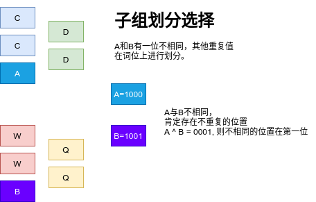
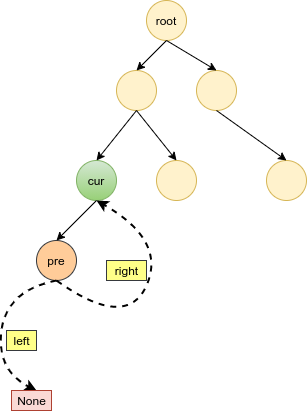

# Python剑指offer打卡-15

[toc]

## 剪绳子

### 剪绳子I

- 问题描述

  ```
  问题描述：
      　给你一根长度为 n 的绳子，请把绳子剪成整数长度的 m段（m、n都是
  整数，n>1并且m>1），每段绳子的长度记为 k[0],k[1]...k[m - 1] 。请问 k
  0]*k[1]*...*k[m - 1] 可能的最大乘积是多少？例如，当绳子的长度是8时，我
  们把它剪成长度分别为2、3、3的三段，此时得到的最大乘积是18。
  
  解题方法：
  当每段长度为3时，能获得分段长度之积最大。
  当n == 3时：不同的切法 --> 2, 1(return n - 1)  = 2 or 1, 1, 1 = 1
   n = a*3 + b
   当b == 0时：return 3**a
   当b == 1时, 存在3、3、3......3、1：return 3**(a - 1)*4
   当b == 2时：return 3**(a)*2
  ```

- 代码（[解题方法](https://leetcode-cn.com/problems/jian-sheng-zi-lcof/solution/mian-shi-ti-14-i-jian-sheng-zi-tan-xin-si-xiang-by/)）

  ```python
  import math
  
  
  class Solution:
  
      def cuttingRope1(self, n: int) -> int:
  
          if n <= 3: return n - 1
          a, b = n // 3, n % 3
          if b == 0: return int(math.pow(3, a))
          if b == 1: return int(math.pow(3, a - 1) * 4)
          return int(math.pow(3, a) * 2)
  ```

### 剪绳子II（不同点在于大数越界问题）

- 问题描述

  ```
  问题描述：
     　 给你一根长度为 n 的绳子，请把绳子剪成整数长度的 m段（m、n都是整数，
  n>1并且m>1），每段绳子的长度记为 k[0],k[1]...k[m - 1] 。请问 k[0]*k[1]*...*k
  [m - 1] 可能的最大乘积是多少？例如，当绳子的长度是8时，我们把它剪成长度分
  别为2、3、3的三段，此时得到的最大乘积是18。答案需要取模 1e9+7（1000000007）
  ，如计算初始结果为：1000000008，请返回 1。
  解题方法：
  在已有基础上考虑越界问题。
  ```

- 代码

  ```python
  class Solution:
  
      def cuttingRope2(self, n: int) -> int:
  
          if n <= 3: return n - 1
          a, b, p = n // 3, n % 3, 1000000007
          if b == 0: return 3 ** a % p
          if b == 1: return 3 ** (a - 1) * 4 % p
          return 3 ** a * 2 % p
  ```


## 二进制中1的个数

- 问题描述

  ```
  问题描述：
  	请实现一个函数，输入一个整数（以二进制串形式），输出该数二进制表示
  中 1 的个数。例如，把 9表示成二进制是 1001，有 2 位是 1。因此，如果输入 9，
  则该函数输出 2。
  
  解题方法：
  （１）逐位相与
  （２）n & n - 1（时间复杂度和一个的个数相同O(M)）
  ```

- 代码

  方法2图解：

  

  ```python
  class Solution:
  
      def hammingweight1(self, n: int) -> int:
          """逐位相与"""
  
          res = 0
          while n:
              res += n&1
              n >>= 1
  
          return res
      
      def hammingweight2(self, n: int) -> int:
          """n & n-1"""
  
          res = 0
          while n:
              n = n & (n - 1)
              res += 1
          return res
  ```


## 不用加减乘除做加法

- **知识点**

  二进制按位与(&) 按位或(|)  异或运算(^)

  1.参加运算的两个数据，按照二进制进行==按位与的运算。==
  运算规则：0&0=0;   0&1=0;    1&0=0;     1&1=1;
  	即：==两位同时为“1”，结果才为“1”，否则为0==。
  例如：3&5  即 0000 0011 & 0000 0101 = 0000 0001   因此，3&5的值得1。
  3&5的与运算是先转换为二进制之后再进行规则比较得出最后的结果，为1.

  2.参加运算的两个对象，按二进制位进行==“或”运算。==
  运算规则：0|0=0；   0|1=1；   1|0=1；    1|1=1；
  	即 ：==参加运算的两个对象只要有一个为1，其值为1==。
  例如:3|5　即 0000 0011 | 0000 0101 = 0000 0111   因此，3|5的值得7。

  3.参加运算的两个数据，按二进制位进行==“异或”运算。==
  运算规则：0^0=0；   0^1=1；   1^0=1；   1^1=0；
  	即：==参加运算的两个对象，如果两个相应位为“异”（值不同），则该位结果为1，否则为 0==。
  
  “异或运算”的特殊作用：
  （1）使特定位翻转 找一个数，对应X要翻转的各位，该数的对应位为1，其余位为零，此数与X对应位异或即可。
例：X=10101110，使X低4位翻转，用X ^ 0000 1111 = 1010 0001即可得到。

- 问题描述

  ```
  问题描述：
  写一个函数，求两个整数之和，要求在函数体内不得使用 “+”、“-”、“*”、“/”
  四则运算符号。
  
  
  解题方法：
  位运算
  n = a^b  # 异或
  c = (a & b) << 1  #　与并左移进位
  s = n + c
  
  注意：
  负数的处理
  ```

- 代码

  ```python
  class Solution:
  
      def  aad(self, a: int, b: int) -> int:
  
          x = 0xffffffff
          a, b = a & x, b & x  # 截断高位
  
          while b:
              a, b = (a^b), (a & b) << 1 & x
  
          return a if a <= 0x7fffffff else ~(a^x)  # 负数高位(32)取反,低位保持不变
  ```

## 数组中数字出现的次数

题目类型：数组、位运算

题目难度：:star2::star2::star2::star2:

### 数组中数字出现的次数 I

- 问题描述

  ```
  问题描述：
  	一个整型数组 nums 里除两个数字之外，其他数字都出现了两次。请写程序找出这
  两个只出现一次的数字。要求时间复杂度是O(n)，空间复杂度是O(1)。
  
  实例：
  输入：nums = [4,1,4,6]
  输出：[1,6] 或 [6,1]
  
  解题方法：
  位运算（异或运算）
  1001 ^ 0111 = 1110
  时间复杂度：O(N)
  空间复杂度：O(1)
  ```

- 代码（[解题思路](https://leetcode-cn.com/problems/shu-zu-zhong-shu-zi-chu-xian-de-ci-shu-lcof/solution/jian-zhi-offer-56-i-shu-zu-zhong-shu-zi-tykom/)）

  
  
  ```python
  class Solution(object):
      def singleNumbers(self, nums):
          """
          :type nums: List[int]
          :rtype: List[int]
          """
  
          x, y, n, m = 0, 0, 0, 1
          for num in nums:
              n ^= num  # x ^ y
          
          # 首个为1的位置
          while n & m == 0:
              m <<= 1
  
          # 各子组寻找不同值
          for num in nums:
              if num & m: x ^= num
              else: y ^= num
  
          return x, y 
  ```


### 数组中数字出现的次数 II

- 问题描述

  ```
  问题描述：
  在一个数组 nums 中除一个数字只出现一次之外，其他数字都出现了三次。请找出那个只出现一次的数字。
  ```

- 代码

  ```python
  class Solution:
      def singleNumber(self, nums: List[int]) -> int:
  
          res = 0
          for i in range(32):
              cnt = 0
              cnt = sum([((num >> i) &1) for num in nums])
              if cnt % 3:
                  if i == 31:
                      res -= 1 << i
                  else:
                      res |= 1 << i
          return res
  ```

## 二叉树展开为链表

题目类型：链表、二叉树

题目难度：:star2:

- 问题描述

  ```
  问题描述：
  	给你二叉树的根结点 root ，请你将它展开为一个单链表：展开后的单链
  表应该同样使用 TreeNode ，其中 right 子指针指向链表中下一个结点，而左
  子指针始终为 null 。展开后的单链表应该与二叉树 先序遍历 顺序相同。
  
  实例：
  输入：root = [1,2,5,3,4,null,6]
  输出：[1,null,2,null,3,null,4,null,5,null,6]
  ```

- 代码

  图解算法（注意图中left和right指针指向）:
  
  
  
  ```python
  class Solution:
      
      def flatten(self, root: TreeNode) -> None:
          """
          Do not return anything, modify root in-place instead.
          """
          preorderlist = list()
  
          def pre_order(root):
              if root:
                  preorderlist.append(root)
                  pre_order(root.left)
                  pre_order(root.right)
  
          # 构建链表
          pre_order(root)
          for i in range(1, len(preorderlist)):
              pre, cur = preorderlist[i - 1], preorderlist[i]
              pre.left = None
              pre.right = cur
  ```
  
  
  
  