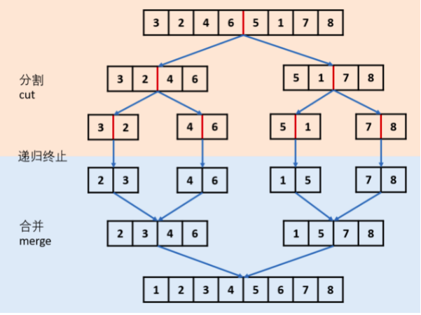

# Python剑指offer打卡-19

[toc]

## 汉明距离

题目类型：位运算

- 问题描述

  ```
  问题描述：
          两个整数之间的 汉明距离 指的是这两个数字对应二进制位不同的位置的数
  目。给你两个整数 x 和 y，计算并返回它们之间的汉明距离。
  
  解题方法：
  两步走原则：
  （1）通过异或操作统计bit1的不相同位（异或操作取不同）
  （2）通过与操作：x & (x - 1) ，统计bit = 1的出现次数(转换为比特位计数)
  时间复杂度：(logC)，其中 C 是元素的数据范围，在本题中logC=log2^31 = 31
  空间复杂度：O(1)。
  
  知识点：
  与：遇0得0
  运算规则：0&0=0; 0&1=0; 1&0=0; 1&1=1;
  或：遇1得1
  运算规则：0|0=0； 0|1=1； 1|0=1； 1|1=1；
  异或：相同为0，不同为1
  运算规则：0^0=0； 0^1=1； 1^0=1； 1^1=0
  ```

- 代码

  ```python
  class Solution:
  
      def hammingDistance(self, x: int, y: int) -> int:
          """计算两个数值之间的汉明距离"""
  
          res, cnt = x ^ y, 0
          while res:
              res &= (res - 1)
              cnt += 1
  
          return cnt
  ```


## 全排列（<font color = red>重点</font>）

题目类型：回朔法

- 问题描述

  ```
  问题描述：
          给定一个不含重复数字的数组 nums ，返回其 所有可能的全排列 。你可以
  按任意顺序返回答案。
  
  示例：
  输入：nums = [1,2,3]
  输出：[[1,2,3],[1,3,2],[2,1,3],[2,3,1],[3,1,2],[3,2,1]]
  
  注意:
  1. 不存在有重复排列:[1, 2, 2] [1, 2, 2]， 因此不用考虑消除重复数组
  2. 数组的拷贝和引用：res.append(nums[:]), res.append(nums)
  ```

- 代码

  ```python
  class Solution:
  
      def permute(self, nums):
          """数组的全排列"""
  
          res = []
  
          def dfs(x):
              # 回朔满足
              if x == len(nums) - 1:
                  res.append(nums[:])
                  return
              for i in range(x, len(nums)):
                  # 交换位置
                  nums[i], nums[x] = nums[x], nums[i]
                  dfs(x + 1)
                  nums[i], nums[x] = nums[x], nums[i]
  
          dfs(0)
          return res
  ```

## 排序链表

题目类型：排序

- 问题描述

  ```
  问题描述：
          给你链表的头结点head，请将其按 升序 排列并返回 排序后的链表 。
  进阶：你可以在O(nlogn) 时间复杂度和常数级空间复杂度下，对链表进
  行排序吗？
  
  示例：
  输入：head = [4,2,1,3]
  输出：[1,2,3,4]
  
  解题方法：
  归并排序
  时间复杂度：O(nlogn)
  空间复杂度：O(n)  # 合并时，需要通过临时结点节点存储合并数值
  ```

- 代码（[解题思路](https://leetcode-cn.com/problems/sort-list/solution/148-gui-bing-pai-xu-lian-biao-jian-dan-d-0lyw/)）

  快慢指针寻找中点图解：

  

  

  ```python
  class Solution:
      def sortList(self, head: ListNode) -> ListNode:
          """合并排序"""
          
          # 只有一个节点时，各子部分有序
          if not head or not head.next:
              return head
          # 查找二分有的右节点
          slow, fast = head, head.next
          while fast and fast.next:
              slow = slow.next
              fast = fast.next.next
          head2 = slow.next
          slow.next = None
          
          return self.merge(self.sortList(head), self.sortList(head2))
  
      def merge(self, head1, head2):
          
          # 创建临时借点
          dummy = pre = ListNode(0)
          while head1 and head2:
              if head1.val <= head2.val:
                  pre.next = head1
                  head1 = head1.next
              else:
                  pre.next = head2
                  head2 = head2.next
              pre = pre.next
          # 添加剩余节点
          pre.next = head1 if head1 else head2
  
          return dummy.next
  ```

  ---

- **知识点**（==归并排序==）

  主要思想：

  ​         归并排序方法就是把一组n个数的序列，折半分为两个序列，然后再将这两个序列再分，一直分下去，直到分为n个长度为1的序列。然后两两按大小归并。如此反复，直到最后形成包含n个数的一个数组。

  时间复杂度计算：

  **归并排序总时间=分解时间+子序列排好序时间+合并时间**

  **无论每个序列有多少数都是折中分解，所以分解时间是个常数，可以忽略不计。**

  **则：归并排序总时间=子序列排好序时间+合并时间**

  ​		把这个规模为 n 的问题分成两个规模分别为 n/2 的子问题，每个子问题的时间复杂度就是 T(n/2)，那么两个子问题的复杂度就是 2×T(n/2)。 当两个子问题都得到了解决，即两个子数组都排好了序，需要将它们合并，一共有 n 个元素，每次都要进行最多 n-1 次的比较，所以合并的复杂度是 O(n)。由此我们得到了递归复杂度公式：T(n) = 2×T(n/2) + O(n)。 对于公式求解，不断地把一个规模为 n 的问题分解成规模为 n/2 的问题，一直分解到规模大小为 1。如果 n 等于 2，只需要分一次；如果 n 等于 4，需要分 2 次。这里的次数是按照规模大小的变化分类的。 以此类推，对于规模为 n 的问题，**一共要进行 log(n) 层的大小切分**。**在每一层里，我们都要进行合并，所涉及到的元素其实就是数组里的所有元素，因此，每一层的合并复杂度都是 O(n)，所以整体的复杂度就是 O(nlogn)**。

  原理：

  1. 将一个序列从中间位置分成两个序列；

  2. 在将这两个子序列按照第一步继续二分下去；

  3. 直到所有子序列的长度都为1，也就是不可以再二分截止。这时候再两两合并成一个有序序列即可。
  
  
  静态图演示：
  
  
  
  动图演示：
  
  
  
  
  
  归并排序代码：
  
  ```python
  def mergeSort(arr):
  
      if len(arr)  <= 1:
          return arr
  
      middle = (len(arr)) // 2
      left, right = arr[:middle], arr[middle:]
  
      return merge(mergeSort(left), mergeSort(right))
  
  
  def merge(left, right):
      """
      有序合并
      :param left:左有序
      :param right: 右有序
      :return: 有序合并
      """
      result = []
      while left and right:
          # 比较插入
          if left[0] < right[0]:
              result.append(left.pop(0))
          else:
              result.append(right.pop(0))
  
      # 填补剩余部分
      while left:
          result.append(left.pop(0))
      while right:
          result.append(right.pop(0))
  
      return result
  ```

##  打家劫舍I

题目类型：动态规划

- 问题描述

  ```
  问题描述：
          你是一个专业的小偷，计划偷窃沿街的房屋。每间房内都藏有一定的现金，影响
  你偷窃的唯一制约因素就是相邻的房屋装有相互连通的防盗系统，如果两间相邻的房
  屋在同一晚上被小偷闯入，系统会自动报警。给定一个代表每个房屋存放金额的非负
  整数数组，计算你 不触动警报装置的情况下 ，一夜之内能够偷窃到的最高金额。
  
  示例：
  输入：[1,2,3,1]
  输出：4
  解释：偷窃 1 号房屋 (金额 = 1) ，然后偷窃 3 号房屋 (金额 = 3)。
  偷窃到的最高金额 = 1 + 3 = 4 。
  
  解题方法：
  动态规划（切入点：偷与不偷）
  1. 状态定义：用 dp[i] 表示前 i 间房屋能偷窃到的最高总金额
  2. 转移方程：dp[i] = max(dp[i - 2] + nums[i], dp[i - 1])
  3. 初始值：dp[0], dp[1] = nums[0], max(nums[0], nums[1])
  4. 返回值： dp[n] 一晚上偷窃到最高金额
  
  时间复杂复: O(n) 遍历数组n
  空间复杂度：O(1) 滚动数组， 不需要额外的存储空间
  ```

- 代码（[解题思路](https://leetcode-cn.com/problems/house-robber/solution/da-jia-jie-she-by-leetcode-solution/)）

  ```python
  class Solution:
  
      def rob(self, nums):
          """动态规划"""
  
          if not nums:
              return 0
          if len(nums) == 1:
              return nums[0]
          first, second = nums[0], max(nums[0], nums[1])
          for i in range(2, len(nums)):
              first, second = second, max(nums[i] + first, second)
  
          return second
  ```

## 打家劫舍II

题目类型：动态规划

- 问题描述

  ```
  问题描述：
  	你是一个专业的小偷，计划偷窃沿街的房屋，每间房内都藏有一定的现金。这
  个地方所有的房屋都 围成一圈 ，这意味着第一个房屋和最后一个房屋是紧挨着的。
  同时，相邻的房屋装有相互连通的防盗系统，如果两间相邻的房屋在同一晚上被小
  偷闯入，系统会自动报警 。
  	给定一个代表每个房屋存放金额的非负整数数组，计算你 在不触动警报装置的
  情况下 ，今晚能够偷窃到的最高金额。
  
  示例：
  输入：nums = [2,3,2]
  输出：3
  解释：你不能先偷窃 1 号房屋（金额 = 2），然后偷窃 3 号房屋（金额 = 2）, 因为他们
  是相邻的。
  
  解题方法（取头不取尾）：
  	核心原则就是：第一个和最后一个不能同时抢。 所以：要么不抢第一个，要么
  不抢最后一个。 注意，不抢第一个的时候，最后一个可抢可不抢；另一种情况同理 
  取两种情况中的最大值。因此，可以把环拆成两个队列，一个是从0到n-1，另一个
  是从1到n，然后返回两个结果最大的。
  时间复杂度：O(n)
  空间复杂度：O(1)
  
  注意：
  此处的房屋构成一个环。
  ```
  
- 代码

  ```python
  class Solution:
  
      def rob(self, nums):
  
          def robRange(start: int, end: int) -> int:
  
              first, second = nums[start], max(nums[start], nums[start + 1])
              for i in range(start + 2, end):
                  first, second = second, max(nums[i] + first, second)
  
              return second
  
          if len(nums) == 1:
              return nums[0]
          if len(nums) == 2:
              return max(nums[0], nums[1])
  
          # 头尾不能同时偷取
          # index : --> 0~n-2 1~n-1
          return max(robRange(0, len(nums) - 1), robRange(1, len(nums))
  ```
