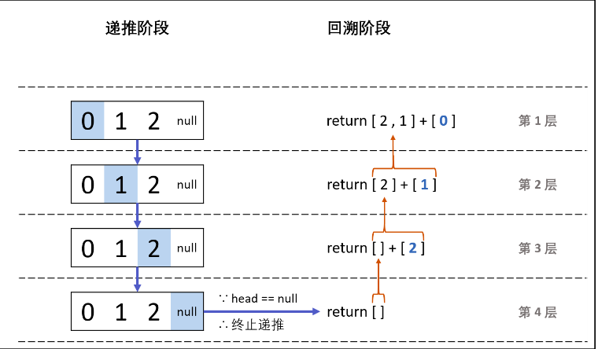

# 剑指offer打卡-2

[toc]

## 旋转数组中的最小数字

- 问题描述

  ```python
  问题描述：
  	把一个数组最开始的若干个元素搬到数组的末尾，我们称之为数组的旋转。输
  入一个非减排序的数组的一个旋转，输旋转数组的最小元素。例如数组{3,4,5,1,2}为
  {1,2,3,4,5}的一个旋转，该数组的最小值为1。 NOTE：给出的所有元素都大于0，若
  数组大小为0，请返回0
  
  解决方案:
  1. 暴力搜索
  2. 分治法
         分治法是不断的缩小范围,从而找到符合条件的解
         二分法的分析我们知道,数组可以分为前后两个递增数组,下面的分析也都利用递增的特性
  (1) 当numbers[mid] > numbers[high]时,说明最小值在mid的右边,缩小范围low = mid + 1；
  (2) 当numbers[mid] == numbers[high]时,我们不知道最小值的范围,但是可以肯定的是去除
  numbers[high]是没有影响的,缩小范围high -= 1；
  (3) 当numbers[mid] < numbers[high]时,我们知道最小值的不是numbers[mid]就是在mid
  的左边,缩小范围high = mid。
  
  时间复杂度：O(logN)
  空间复杂度：O(1)
  
  测试用例： 51234, 34512, 22222
  ```

- 代码（[解题思路](https://leetcode-cn.com/problems/xuan-zhuan-shu-zu-de-zui-xiao-shu-zi-lcof/solution/pythonti-jie-er-fen-fa-shuang-100he-zhi-jie-cha-zh/)）

  ```python
  class Solution:
  
  	def minArray(self, numbers):
  		"""旋转数组最小值"""
  
  		# 二分法
  		# 三种情况
  		# 51234, 34512, 22222
                  if not numbers:
                      return None
                  low = 0
                  high = len(numbers) - 1
                  while low < high:
                      mid = (low + high) >> 1
                      if numbers[mid] > numbers[high]:
                          low = mid + 1
                      elif numbers[mid] == numbers[high]:
                          high -= 1
                      else:
                          high = mid
                  return numbers[low]
  ```

## 调整顺序使得奇数位于前面

题目类型：数组、双指针

题目难度：:star2:

- 问题描述：

    ```python
           输入一个整数数组，实现一个函数来调整该数组中数字的顺序，使得所有的奇
   数位于数组的前半部分，所有的偶数位于数组的后半部分，并保证奇数和奇数，偶
   数和偶数之间的相对位置不变。
    
   解决方案：
   快慢指针
   fast：快指针实现遍历，标志奇数位置
   slow：慢指针实现对偶数位置进行表示
   时间复杂度：O(N)
   空间复杂度：O(1)
   ```
   
- 代码（[解题思路](https://leetcode-cn.com/problems/diao-zheng-shu-zu-shun-xu-shi-qi-shu-wei-yu-ou-shu-qian-mian-lcof/solution/jian-zhi-offer-21-diao-zheng-shu-zu-shun-77jc/)）

  图解算法：
  
  
  
  ```python
  class Solution:
      def exchange(self, nums: List[int]) -> List[int]:
  
          slow, fast = 0, 0
          while fast < len(nums):
              if nums[fast] % 2 == 1:
                  nums[slow], nums[fast] = nums[fast], nums[slow]
                  # 标志偶数位值
                  slow += 1
              # 标志奇数位置，并实现遍历
              fast += 1
          
          return nums
  ```

## 包含min函数的栈

题目类型：栈和队列

题目难度：:star2:

- 问题描述

  ```python
  问题描述：
  	定义栈的数据结构，请在该类型中实现一个能够得到栈中所含最小元素的min
  函数（时间复杂度应为O(1) )
  解决方案：
  1.构建一个和原栈相同的大小的保存最小值的序列
  2.合理利用存储
  list : 6 7 5 8 4
  min  : 6   5   4
  ```

- 代码

  ```python
  class Stack:
      
      def __init__(self):
          self.stack = []
          self.min_value = []
  
      def push(self, val):
  
          self.stack.append(val)
  
          if self.min_value:
              # 储存最小值
              if self.min_value[-1] >= val:
                  self.min_value.append(val)
          else:
              # 初始值
              self.min_value.append(val)
  
      def pop(self):
          if not self.stack:
              return None
          else:
              # 保证有效数组的最小值
              if self.stack[-1] == self.min_value[-1]:
                  self.min_value.pop()
  
              return self.stack.pop()
  
      def top(self):
  
          if not self.stack:
              return None
          else:
              return self.stack[-1]
  
      def min(self):
          """抛出最小值，栈顶元素永远储存最小值"""
  
          if not self.stack:
              return None
          else:
              return self.min_value[-1]
  ```

## 判断一个序列是否为该栈的弹出序列

题目类型：栈和队列

题目难度：:star2:

- 问题描述

  ```python
  问题描述：
      输入两个整数序列，第一个序列表示栈的压入顺序，请判断第二个序列是否可能为该栈的弹出顺序。假设压入栈的所有数字均不相等
  。例如序列1,2,3,4,5是某栈的压入顺序，序列4,5,3,2,1是该压栈序列对应的一个弹出序列，但4,3,5,1,2就不可能是该压栈序列的
  弹出序列。（注意：这两个序列的长度是相等的）
  
  解决方案：
  使用栈来作为临时的变换
  Eg:
  1 2 3 4 5
  4 5 3 2 1(可行)
  4 5 3 1 2(元素1不可行, 不满足栈的性质)
  ```

- 实例：压入顺序：1, 2, 3, 4, 5　出栈顺序：4, 5, 3, 2, 1？

  <table><tbody><tr><td> <p><span style="font-size:14px">步骤 &nbsp; &nbsp; &nbsp; &nbsp;&nbsp;</span></p> </td><td> <p><span style="font-size:14px">操作 &nbsp; &nbsp; &nbsp; &nbsp; &nbsp; &nbsp; &nbsp; &nbsp;</span></p> </td><td> <p><span style="font-size:14px">&nbsp;栈中元素 &nbsp; &nbsp; &nbsp; &nbsp; &nbsp; &nbsp;&nbsp;</span></p> </td><td> <p><span style="font-size:14px">弹出数字&nbsp;&nbsp;第一个为<span style="font-family:Arial">4</span><span style="font-family:宋体">，先找到</span><span style="font-family:Arial">4</span></span></p> </td></tr><tr><td> <p><span style="font-size:14px">1</span></p> </td><td> <p><span style="font-size:14px">1&nbsp;<span style="font-family:宋体">入栈</span></span></p> </td><td> <p><span style="font-size:14px">&nbsp;1</span></p> </td><td> <p><span style="font-size:14px">&nbsp;</span></p> </td></tr><tr><td> <p><span style="font-size:14px">2</span></p> </td><td> <p><span style="font-size:14px">2<span style="font-family:宋体">入栈</span></span></p> </td><td> <p><span style="font-size:14px">&nbsp;1&nbsp;2</span></p> </td><td> <p><span style="font-size:14px">&nbsp;</span></p> </td></tr><tr><td> <p><span style="font-size:14px">3</span></p> </td><td> <p><span style="font-size:14px">3<span style="font-family:宋体">入栈</span></span></p> </td><td> <p><span style="font-size:14px">1&nbsp;2&nbsp;3</span></p> </td><td> <p><span style="font-size:14px">&nbsp;</span></p> </td></tr><tr><td> <p><span style="font-size:14px">4</span></p> </td><td> <p><span style="font-size:14px">4<span style="font-family:宋体">入栈</span></span></p> </td><td> <p><span style="font-size:14px">1&nbsp;2&nbsp;3&nbsp;4</span></p> </td><td> <p><span style="font-size:14px">此时栈顶元素等于出栈顺序的第一个，找到了，下一步就是要出栈该元素</span></p> </td></tr><tr><td> <p><span style="font-size:14px">5</span></p> </td><td> <p><span style="font-size:14px">4&nbsp;<span style="font-family:宋体">出栈</span></span></p> </td><td> <p><span style="font-size:14px">1&nbsp;2&nbsp;3</span></p> </td><td> <p><span style="font-size:14px">4&nbsp;<span style="font-family:宋体">出栈顺序往后移动，指向</span><span style="font-family:Arial">5&nbsp;</span></span></p> </td></tr><tr><td> <p><span style="font-size:14px">6</span></p> </td><td> <p><span style="font-size:14px">5<span style="font-family:宋体">入栈</span></span></p> </td><td> <p><span style="font-size:14px">1&nbsp;2&nbsp;3&nbsp;5</span></p> </td><td> <p><span style="font-size:14px">此时栈顶元素等于出栈顺序的第一个，找到了，下一步就是要出栈该元素</span></p> </td></tr><tr><td> <p><span style="font-size:14px">7</span></p> </td><td> <p><span style="font-size:14px">5<span style="font-family:宋体">出栈</span></span></p> </td><td> <p><span style="font-size:14px">1&nbsp;2&nbsp;3</span></p> </td><td> <p><span style="font-size:14px">4&nbsp;5&nbsp;<span style="font-family:宋体">出栈往后移动&nbsp;&nbsp;指向</span><span style="font-family:Arial">3</span></span></p> </td></tr><tr><td> <p><span style="font-size:14px">8</span></p> </td><td> <p><span style="font-size:14px">3<span style="font-family:宋体">出栈</span></span></p> </td><td> <p><span style="font-size:14px">1&nbsp;2&nbsp;</span></p> </td><td> <p><span style="font-size:14px">4&nbsp;5&nbsp;3<span style="font-family:宋体">因为栈顶元素等于&nbsp;出栈元素</span></span></p> </td></tr><tr><td> <p><span style="font-size:14px">9</span></p> </td><td> <p><span style="font-size:14px">2<span style="font-family:宋体">出栈</span></span></p> </td><td> <p><span style="font-size:14px">1</span></p> </td><td> <p><span style="font-size:14px">4&nbsp;5&nbsp;3&nbsp;2<span style="font-family:宋体">因为栈顶元素等于&nbsp;出栈元素</span></span></p> </td></tr><tr><td> <p><span style="font-size:14px">10</span></p> </td><td> <p><span style="font-size:14px">1<span style="font-family:宋体">出栈</span></span></p> </td><td> <p><span style="font-size:14px">&nbsp;</span></p> </td><td> <p><span style="font-size:14px">4&nbsp;5&nbsp;3&nbsp;2&nbsp;1<span style="font-family:宋体">出完了&nbsp;&nbsp;如果占为空&nbsp;且出栈序列中没有了其他就表示为</span><span style="font-family:Arial">true</span></span></p> </td></tr></tbody></table>

- 代码（[解题思路](https://leetcode-cn.com/problems/zhan-de-ya-ru-dan-chu-xu-lie-lcof/solution/mian-shi-ti-31-zhan-de-ya-ru-dan-chu-xu-lie-mo-n-2/)）

  ```python
  class Solution:
  
      def find_seq_exist(self, push_value, pop_values):
          """判断序列"""
  
          if not push_value or len(pop_values) == len(push_value):
              return None
  
          stack = []
          index = 0
          for item in push_value:
              stack.append(item)
              while stack and stack[-1] == pop_values[index]:
                  stack.pop()
                  index += 1
  
          return True if stack == [] else False
  ```

## 从尾到头打印链表

题目类型：链表

题目难度：:star2:

- 问题描述

  ```python
  问题描述：
  输入一个链表，按链表从尾到头的顺序返回一个ArrayList
  
  解决方案：
  1. 使用列表存储结点，并翻转
  2. 栈（先进后出）
  3. 递归（递归本身就是一种栈：先进后出）
  fun(node.next) + [node.val]
  [] + [8] + [7] + [5]
  [8, 7, 5]
  时间复杂度 O(N)： 遍历链表，递归 NN 次。
  空间复杂度 O(N)： 系统递归需要使用 O(N)O(N) 的栈空间。
  ```

- 代码（[解题思路](https://leetcode-cn.com/problems/cong-wei-dao-tou-da-yin-lian-biao-lcof/solution/mian-shi-ti-06-cong-wei-dao-tou-da-yin-lian-biao-d/)）

  
  
  ```python
  # 版本一
  class Solution:
  
      @staticmethod
      def PrintListFromTailToHead(listNode):
          if not listNode:
              return []
  
          result = []
          while listNode:
              result.append(listNode.val)
              listNode = listNode.next
  
          result.reverse()
  
          return result
  
  
  # 版本二
  class Solution1:
  
      @staticmethod
      def PrintListFromTailToHead(listNode):
  
          if not listNode:
              return []
  
          stack = []  # 栈
          result = []
  
          while listNode:
              stack.append(listNode.val)
              listNode = listNode.next
          while stack:
              result.append(stack.pop())
  
          return result
  
  
  # 版本三(递归:递归就是一栈，先进后出)
  class Sulution2:
  
      def reversePrint(self, head: ListNode) -> List[int]:
  
          if not head:
              return []
          
          return self.reversePrint(head.next) + [head.val]
  ```
  

## 参考

[数据结构与算法题目](https://blog.csdn.net/storyfull/category_9475477_2.html)

[剑指offer（python）](https://blog.csdn.net/ggdhs/category_8914921.html)

[旋转数组的通用解决办法](https://zhuanlan.zhihu.com/p/136849860)