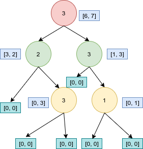
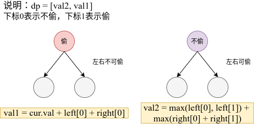
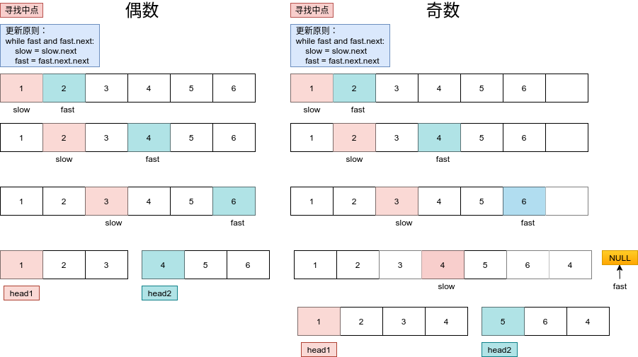
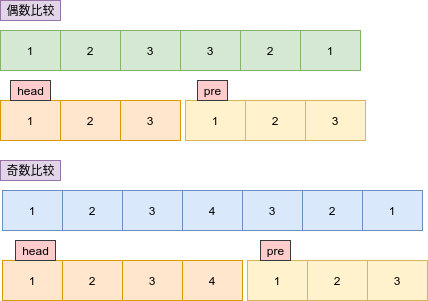
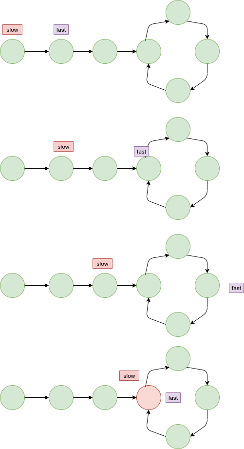

# Python剑指offer打卡-20

[toc]

## 打家劫舍III

题目类型：树、动态规划

- 问题描述

  ```
  问题描述:
      在上次打劫完一条街道之后和一圈房屋后，小偷又发现了一个新的可行窃的地区。这个地区
  只有一个入口，我们称之为“根”。 除了“根”之外，每栋房子有且只有一个“父“房子与之相连。
  一番侦察之后，聪明的小偷意识到“这个地方的所有房屋的排列类似于一棵二叉树”。 如果两个
  直接相连的房子在同一天晚上被打劫，房屋将自动报警。计算在不触动警报的情况下，小偷一晚
  能够盗取的最高金额。
  
  示例：
  输入: [3,2,3,null,3,null,1]
  
       3
      / \
     2   3
      \   \ 
       3   1
  
  输出: 7 
  解释: 小偷一晚能够盗取的最高金额 = 3 + 3 + 1 = 7.
  
  解题方法：
  树型动态规划(后序遍历基础)
  1. 转态定义： dp = [val2, val1] 下标0表示为不偷， 下标1表示为偷
  2. 状态转移： 如果当前节点能被偷，则有val1 = cur.val + left[0] + right[0]
  否则如果当前节点不能偷，则有val2 = max(left[0], left[1]) + max(right[0], right[1])
  3. 初始状态： dp = [0, 0]
  4. 返回值: max(dp[0], dp[1])
  时间复杂度：O(n)
  空间复杂度：O()
  ```

  **实例->输入: [3,2,3,null,3,null,1] 输出->7**

  

- 代码（[解题方法](https://leetcode-cn.com/problems/house-robber-iii/solution/337-da-jia-jie-she-iiidong-tai-gui-hua-x-8t1e/)）

  

  ```python
  class Solution:
      def rob(self, root: TreeNode) -> int:
  
          def dfs(cur):
              if cur is None:
                  # 初始状态
                  return [0, 0]
              # 后序遍历
              left = dfs(cur.left)
              right = dfs(cur.right)
              # 状态转移
              # 不偷
              val2 = max(left[0], left[1]) + max(right[0], right[1])
              # 偷
              val1 = cur.val + left[0] + right[0]
              # 返回值
              return [val2, val1]
          
          res = dfs(root)
          return max(res[0], res[1])
  ```

## 回文链表

题目类型：链表、回文数

题目难度：:star2::star2::star2::star2:

- 问题描述

  ```
  问题描述：
  请判断一个链表是否为回文链表。
  进阶：
  你能否用 O(n) 时间复杂度和 O(1) 空间复杂度解决此题？
  
  解题方法：
  （1）遍历（判断正向和反向结果是否一致）
  使用有个临时数组对遍历节点数值进行存储，并比较
  时间复杂度：O(n)  遍历所有节点
  空间复杂度：O(n)  临时数组
  （2）快慢指针
  两种情况：
   奇数：1 2 3 4 5  ||  4 3 2 1-->pre
   偶数：1 2 3 4  || 4 3 2 1-->pre
   用快慢指针寻找链表的中心位置，将链表进行分割l1和l2,并且已证明
  l1链表的长度始终大于等于l2链表的长度，因此将 l2 链表进行翻转与 l1
  链表进行比较。
  时间复杂度：O(n)  遍历所有节点
  空间复杂度：O(1) 没有使用额外空间
  
  注意：
  此题与链表翻转和排序链表知识点相同, 此外，只有一个节点时，链表是回文的。
  ```
  
- 图解快慢指针取中点

  

- 链表翻转之后比较图解

  

- 代码（[解题思路](https://leetcode-cn.com/problems/palindrome-linked-list/solution/kuai-man-zhi-zhen-lian-biao-ni-xu-by-airesearcherj/)）

  ```python
  class Solution:
  
      def isPalindrom1(self, head):
          # 临时数组进行存储
          vars = []
          cur = head
          while cur:
              vars.append(cur.val)
              cur = cur.next
  
          return vars == vars[::-1]
  
      def isPalindrom2(self, head):
      
          if not head or not head.next:
              return True
          # 快慢指针
          slow, fast = head, head.next
          while fast and fast.next:
              fast = fast.next.next
              slow = slow.next
          cur = slow.next
          slow.next = None
          pre = None
          # 链表翻转
          while cur:
              tmp = cur.next
              cur.next = pre
              pre = cur
              cur = tmp
          # 比较回文
          while pre:
              if head.val != pre.val:
                  return False
              head = head.next
              pre = pre.next
  
          return True
  ```

## 环形链表

题目类型：链表

题目难度：:star2::star2:

### 存在环

- 问题描述

  ```
  给定一个链表，判断链表中是否有环。
  
         如果链表中有某个节点，可以通过连续跟踪 next 指针再次到达，则链表中存在
  环。 为了表示给定链表中的环，我们使用整数 pos 来表示链表尾连接到链表中的位
  置（索引从 0 开始）。 如果 pos 是 -1，则在该链表中没有环。注意：pos 不作为参
  数进行传递，仅仅是为了标识链表的实际情况。如果链表中存在环，则返回 true。 
  否则，返回 false 。
  进阶：
  你能用 O(1)（即，常量）内存解决此问题吗？
  变体：环形链表II
  
  解题方法：
  (1)哈希表
  时间复杂度：O(n)　
  空间复杂度：O(n)
  
  (2)快慢指针
  时间复杂度：O(n)　
  空间复杂度：O(1)
  ```
  
- 代码（[解题思路](https://leetcode-cn.com/problems/linked-list-cycle-ii/solution/142-huan-xing-lian-biao-ii-jian-hua-gong-shi-jia-2/)）

  图解快慢指针相遇(存在环)

  

  ```python
  class ListNode:
      def __init__(self, x):
          self.val = x
          self.next = None
  
  
  class Solution:
  
      def hasCycle1(self, head):
  
          seen = set()
          while head:
              if head in seen:
                  return True
              seen.add(head)
              head = head.next
  
          return False
  
      def hasCycle2(self, head: ListNode) -> bool:
  
          if not head or not head.next:
              return False
  
          slow, fast = head, head.next
          while fast and fast.next:
              fast = fast.next.next
              slow = slow.next
              if slow == fast:
                  return True
  
          return False
  ```

### 环的入口结点

- 问题描述

  ```
  问题描述：
          给定一个链表，返回链表开始入环的第一个节点。如果链表无环，则返回null。
  为了表示给定链表中的环，我们使用整数 pos 来表示链表尾连接到链表中的位置（
  索引从 0 开始）。 如果 pos 是 -1，则在该链表中没有环。注意，pos 仅仅是用于标
  识环的情况，并不会作为参数传递到函数中。说明：不允许修改给定的链表。
  进阶：
  你是否可以使用 O(1) 空间解决此题？
  
  描述：我先找到你，然后我们步调一致，最终在入口处相遇。
  
  解题方法：
  （1）栈
  时间复杂度：O(N)
  空间复杂度：O(N)
  （2）快慢指针
  从头结点出发一个指针，从相遇节点 也出发一个指针，这两个指针每次只走一个节点， 
  那么当这两个指针相遇的时候就是 环形入口的节点.
  时间复杂度：O(N)
  空间复杂度：O(1)
  ```

- 代码

  ```python
  class Solution:
      def detectCycle(self, head: ListNode) -> ListNode:
  
          slow, fast = head, head
          while fast and fast.next:
              slow = slow.next
              fast = fast.next.next
              if slow == fast:
                  p = head
                  q = slow
                  while p != q:
                      p = p.next
                      q = q.next
                  return q
  
          return None
  ```

##  删除链表的倒数第N个结点（<font color=red>重点</font>）

题目类型：链表

题目难度：:star2::star2:

- 问题描述

  ```
  问题描述：
         给你一个链表，删除链表的倒数第 n 个结点，并且返回链表的头结点。
  进阶：你能尝试使用一趟扫描实现吗？
  
  示例：
  输入：head = [1,2,3,4,5], n = 2
  输出：[1,2,3,5]
  
  解题方法：
  双指针（K + M = M + K）
  时间复杂度:O(N) former指针实现一趟扫描
  空间复杂度:O(1)
  ```

- 代码

  图解快慢指针变化

  

  ```python
  class ListNode:
      def __init__(self, val=0, next=None):
          self.val = val
          self.next = next
  
  
  class Solution:
      def removeNthFromEnd(self, head: ListNode, n: int) -> ListNode:
  
          dummy = ListNode(0, head)
          former, latter = head, dummy
          # 寻找K
          for i in range(n):
              if not former: break
              former = former.next
          while former:
              latter = latter.next
              former = former.next
  
          # 删除结点
          latter.next = latter.next.next
          return dummy.next
  ```

## 每日温度

题目类型：栈

题目难度：:star2::star2:

- 问题描述

  ```
  问题描述：
      请根据每日 气温 列表，重新生成一个列表。对应位置的输出为：要想观测到更高的气温，
  至少需要等待的天数。如果气温在这之后都不会升高，请在该位置用0 来代替。例如，给定一个
  列表temperatures = [73, 74, 75, 71, 69, 72, 76, 73]，你的输出应该是[1, 1,
   4, 2, 1, 1, 0, 0]。
  
  解题方法：
  （1）暴力求解
  时间复杂度:O(N^2)
  空间复杂度:O(N)
  
  （2）栈(维持一个递减栈，存储index)
  时间复杂度:O(N)
  空间复杂度:O(N)
  ```

- 代码（[解题思路](https://leetcode-cn.com/problems/daily-temperatures/solution/mei-ri-wen-du-by-leetcode-solution/)）

  ```python
  from typing import List
  
  
  class Solution:
      
      def dailyTemperatures1(self, temperatures: List[int]) -> List[int]:
  
          res = len(temperatures) * [0]
  
          for i in range(len(temperatures)):
              for j in range(i + 1, len(temperatures)):
                  if temperatures[i] < temperatures[j]:
                      res[i] = j - i
                      break
          return res
  
      def dailyTemperatures2(self, temperatures: List[int]) -> List[int]:
  
          length = len(temperatures)
          ans = [0] * length
          # 最小栈
          stack = []
          # 遍历
          for cur_index in range(length):
              # 当前温度
              cur_temper = temperatures[cur_index]
              # 维护最小栈
              while stack and cur_temper > temperatures[stack[-1]]:
                  hist_index = stack.pop()
                  ans[hist_index] = cur_index - hist_index
              stack.append(cur_index)
  
          return ans 
  ```
  
  
  
  
  
  

