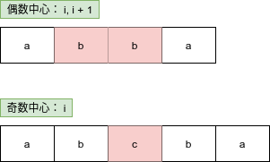
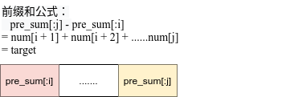
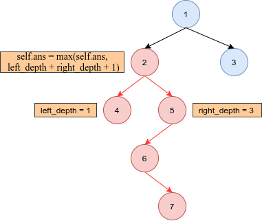

#  Python剑指offer打卡-21

[toc]

## 回文子串

题目类型：字符串

题目难度：:star2::star2::star2::star2:

- 问题描述

  ```
  问题描述：
          给定一个字符串，你的任务是计算这个字符串中有多少个回文子串。
  具有不同开始位置或结束位置的子串，即使是由相同的字符组成，也会被
  视作不同的子串。
  
  解题方法：
  （1）中心扩散法（注意偶数扩散和奇数扩散）
  方法在奇数下不能使用单个中心点得到偶数下的回文子串，因此，需要将
  偶数和奇数进行分别处理，高阶奇偶变化可以由低阶奇偶有限次扩展得到。
  时间复杂度:O(N^2)
  空间复杂度：O(1)
  
  （2）中心扩散法（消除奇偶，单层循环处理）
  枚举所有可能的中心点，有2*n - 1个中心点（共有n 个奇数中心点和n - 1个偶数中心点）
  时间复杂度:O(N^2)
  空间复杂度：O(1)
  ```

- 代码（[解题思路](https://leetcode-cn.com/problems/palindromic-substrings/solution/liang-dao-hui-wen-zi-chuan-de-jie-fa-xiang-jie-zho/)）

  图解中心位置
  
  
  
  ```python
  class Solution:
      def countSubstrings1(self, s: str) -> int:
  
          def spread(l, r):
              """中心扩散"""
              count = 0
              while l >= 0 and r <= len(s) - 1 and s[l] == s[r]:
                  l -= 1
                  r += 1
                  count += 1
              return count
  
          res = 0
          # 奇数中心扩散
          for i in range(len(s)):
              res += spread(i, i)
          # 偶数中心扩散
          for i in range(len(s) - 1):
              res += spread(i, i + 1)
  
          return res
  
      def countSubstrings2(self, s: str) -> int:
          """暴力法"""
  
          n = len(s)
          ans = 0
  
          for i in range(2*n - 1):
              l, r = i//2, i//2 + i%2
              while l >= 0 and r < n and s[l] == s[r]:
                  l -= 1
                  r += 1
                  ans += 1
          return ans
  ```

##  根据身高重建队列

题目类型：数组

题目难度：:star2::star2:

- 问题描述

  ```
  问题描述：
          假设有打乱顺序的一群人站成一个队列，数组 people 表示队列中一些人的属性（不
  一定按顺序）。每个 people[i] = [hi, ki] 表示第 i 个人的身高为 hi ，前面正好有 ki 个
  身高大于或等于 hi 的人。请你重新构造并返回输入数组people 所表示的队列。返回的
  队列应该格式化为数组 queue ，其中 queue[j] = [hj, kj] 是队列中第 j个人的属性（qu
  eue[0] 是排在队列前面的人）。
  ```

- 代码

  ```python
  class Solution:
  
      def reconstructQueue1(self, people: List[List[int]]) -> List[List[int]]:
          res = []
          # h_i: decrease
          # k_i: increase
          # 身高降序排列，排名升序排列
          people = sorted(people, key=lambda x: (-x[0], x[1]))
          # 保证范围内的排序不出边界，并维护位置上的相对性
          for p in people:
              if p[1] >= len(res):
                  res.append(p)
              elif p[1] < len(res):
                  res.insert(p[1], p)
  
          return res
      
      def reconstructQueue2(self, people):
  
          people = sorted(people, key=lambda x: (-x[0], x[1]))
          i = 0
          while i < len(people):
              if i > people[i][1]:
                  # insert->delete
                  people.insert(people[i][1], people[i])
                  people.pop(i + 1)
              i += 1
  ```

##  找到所有数组中消失的数字

题目类型：原地哈希

题目难度：  :star2::star2:

- 问题描述

  ```
  问题描述：
  	给你一个含 n 个整数的数组 nums ，其中 nums[i] 在区间 [1, n] 内。请你找出所有在
   [1, n] 范围内但没有出现在 nums 中的数字，并以数组的形式返回结果。进阶：你能在不使
   用额外空间且时间复杂度为 O(n) 的情况下解决这个问题吗? 你可以假定返回的数组不算在额
   外空间内。
  示例：
  输入：nums = [4,3,2,7,8,2,3,1]
  输出：[5,6]
  
  输入：nums = [1,1]
  输出：[2]
  
  解题方法：
  (1)暴力法
  时间复杂度：O(N)
  空间复杂度：O(N)
  (2)原地置换（索引与值对齐原则）
  时间复杂度：O(N)
  空间复杂度：O(1)
  ```

- 代码

  图解索引对齐原则
  
  
  
  ```python
  class Solution:
      
      def findDisappearedNumbers1(self, nums: List[int]) -> List[int]:
          """暴力法"""
          
          res = []
          for val in range(1, len(nums) + 1):
  
              if val not in nums:
                  res.append(val)
  
          return res
  
      def findDisappearedNumbers2(self, nums):
          """原地置换"""
          # 索引对其原则
          
          n = len(nums)
          for num in nums:
              # index 存在与0～n-1之间
              x = (num - 1)%n
              nums[x] += n
          # 找出缺失数字
          # num是可以等于8，因此，此处小于等于n
          res = [i + 1 for i, num in enumerate(nums) if num <= n]
          return res
  ```
  

## 和为k的子数组

题目类型：字符串

题目难度： :star2::star2::star2::star2::star2:

- 问题描述

  ```
  问题描述：
      给定一个整数数组和一个整数 k，你需要找到该数组中和为 k 的连续的子数组
  的个数。
  注意：题目要求连续的的子数组
  
  示例：
  输入:nums = [1,1,1], k = 2
  输出: 2 , [1,1] 与 [1,1] 为两种不同的情况。
  
  解题方法：
  (1)暴力法
  时间复杂度：O(N^2)
  空间复杂度：O(1)
  (2)前缀表达式
  pre_A + k = pre_B
  时间复杂度：O(N)
  空间复杂度：O(N)
  ```

- 代码（[解题思路](https://leetcode-cn.com/problems/subarray-sum-equals-k/solution/xiong-mao-shua-ti-python3-qian-zhui-he-zi-dian-yi-/)）

  图解暴力法：
  
  
  
  图解前缀法：
  
  
  
  ```python
  class Solution:
  
      def subarraySum1(self, nums, k):
          """暴力法"""
          count = 0
          for start in range(len(nums)):
              sum = 0
              for end in range(start, -1, -1):
                  sum += nums[end]
                  if sum == k:
                      count += 1
  
          return count
  
      def subarraySum2(self, nums, k):
          """前缀和表达"""
  
          # 统计当前前缀和
          nums_times = defaultdict(int)
          nums_times[0] = 1
          cur_sums = 0
          count = 0
  
          for i in range(len(nums)):
              cur_sums += nums[i]
              if cur_sums - k in nums_times:
                  count += nums_times[cur_sums - k]
              nums_times[cur_sums] += 1
  
          return count
  ```

## 二叉树的直径

题目类型：二叉树

题目难度：:star2::star2:

- 问题描述

  ```
  问题描述：
      给定一棵二叉树，你需要计算它的直径长度。一棵二叉树的直径长度是任意两个结点
  路径长度中的最大值。这条路径可能穿过也可能不穿过根结点。
  
  实例：
  给定二叉树
  
            1
           / \
          2   3
         / \
        4   5
  返回 3, 它的长度是路径 [4,2,1,3] 或者 [5,2,1,3]
  
  解题方法：
  	题目相似与求解二叉树的深度，区别在于引入了直径的概念，深度的突破点在
  于左右分开，而直径则要求左右相连，且最大。
  深度优先遍历
  时间复杂度：O(N)
  空间复杂度：O(height)
  ```

- 代码（[解题思路](https://leetcode-cn.com/problems/diameter-of-binary-tree/solution/er-cha-shu-de-zhi-jing-by-leetcode-solution/)）

  图解

  

  ```python
  class TreeNode:
      def __init__(self, val=0, left=None, right=None):
          self.val = val
          self.left = left
          self.right = right
  
  
  class Solution:
      def diameterOfBinaryTree(self, root: TreeNode) -> int:
          # 标识路径
          self.ans = 1
  
          def dfs(root):
              if root is None:
                  return 0
  
              left = dfs(root.left)
              right = dfs(root.right)
              # 当前节点，左右结点的最长路径长度
              self.ans = max(self.ans, left + right + 1)
  
              return max(left, right) + 1
  
          dfs(root)
  
          return self.ans - 1
  ```

  

  

