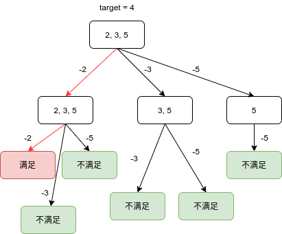
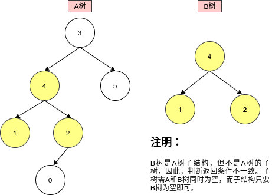

# Python剑指offer打卡-26

[toc]

## 矩阵置零

题目类型：矩阵

题目难度：:star2:

- 问题描述

  ```
  问题描述：
          给定一个m x n 的矩阵，如果一个元素为 0 ，则将其所在行和列的所有元素都设为0。
  请使用原地算法。
  进阶：
          一个直观的解决方案是使用 O(mn)的额外空间，但这并不是一个好的解决方案。一个简
  单的改进方案是使用 O(m+n) 的额外空间，但这仍然不是最好的解决方案。你能想出一个仅
  使用常量空间的解决方案吗？
  
  解题方法：
  方法一：
  设置行列标记，行标记或者列标记为零时，元素置为零。
  时间复杂度：O(m*n)
  空间复杂度：O(m + n)
  ```
  
- 代码

  算法图解

  

  方法一：
  
  ```python
    class Solution:
      def setZeroes(self, matrix: List[List[int]]) -> None:
          """
          Do not return anything, modify matrix in-place instead.
          """
  
          # 初始化
          m, n = len(matrix), len(matrix[0])
          rows, cols = [False] * m, [False] * n
  
          # 设置标记
          for i in range(m):
              for j in range(n):
                  if matrix[i][j] == 0:
                      rows[i] = cols[j] = True
  
          # 置零
          for i in range(m):
              for j in range(n):
                  if rows[i] or cols[j]:
                      matrix[i][j] = 0
  ```
  
  方法二：
  
  ```python
  class Solution:
      def setZeroes(self, matrix: List[List[int]]) -> None:
          """
          Do not return anything, modify matrix in-place instead.
          """
  
          m, n = len(matrix), len(matrix[0])
          row_zeros, col_zeros = set(), set()
  
          for i in range(m):
              for j in range(n):
                  if matrix[i][j] == 0:
                      row_zeros.add(i)
                      col_zeros.add(j)
          # 输出
          for i in range(m):
              for j in range(n):
                  if i in row_zeros or j in col_zeros:
                      matrix[i][j] = 0
  ```

## 组合总和

题目类型：DFS

题目难度：:star2::star2:

- 问题描述

  ```
  问题描述：
  	给定一个无重复元素的正整数数组 candidates 和一个正整数 target ，找出 candidates 中所有可以使数字和为目标数 target 的唯一组合。candidates 中的数字可以无限制重复被选取。如果至少一个所选数字数量不同，则两种组合是唯一的。 对于给定的输入，保证和为 target 的唯一组合数少于 150 个。
  	
  解题方法：
  DFS
  ```

- 代码

  算法图解

  

  ```python
  class Solution:
      def combinationSum(self, candidates: List[int], target: int) -> List[List[int]]:
  
          def dfs(candidates, begin, size, res, path, target):
  
              if target < 0:
                  return 
    
              if target == 0:
                  res.append(path)
              
              for index in range(begin, size):
                  dfs(candidates, index, size, res, path + [candidates[index]], target - candidates[index])
          
          size = len(candidates)
          if size < 0:
              return []
          
          res, path = [], []
          dfs(candidates, 0, size, res, path, target)
          
          return res
  ```

## 另一棵树的子树

题目类型：DFS

题目难度：:star2::star2:

<font color =red>注意</font>：此题和二叉树的子结构有区别，最终回朔返回的条件不同。

- 问题描述

  ```
  问题描述：
  	 给你两棵二叉树 root 和 subRoot 。检验 root 中是否包含和 subRoot 
  具有相同结构和节点值的子树。如果存在，返回 true ；否则，返回 false 。
  二叉树 tree 的一棵子树包括 tree 的某个节点和这个节点的所有后代节点。
  tree 也可以看做它自身的一棵。
  
  解题方法：
  DFS
  ```

- 代码

  算法图解

  

  ```python
  class Solution:
      def isSubtree(self, root: TreeNode, subRoot: TreeNode) -> bool:
  
          if not root and not subRoot:
              return True
          elif not root or not subRoot:
              return False
          
          return self.isSameTree(root, subRoot) or self.isSubtree(root.left, subRoot) 
     		or self.isSubtree(root.right, subRoot)
      
      def isSameTree(self, root1, root2):
          if not root1 and not root2:
              return True
          elif not root1 or not root2:
              return False
  
          return root1.val == root2.val and self.isSameTree(root1.left,\
                   root2.left) and self.isSameTree(root1.right, root2.right)
  ```


## 零钱兑换

题目类型：动态规划

题目难度：:star2::star2::star2::star2:

- 问题描述

  ```
  问题描述：
          给你一个整数数组 coins ，表示不同面额的硬币；以及一个整数 amount ，
  表示总金额。计算并返回可以凑成总金额所需的最少的硬币个数 。如果没有任
  何一种硬币组合能组成总金额，返回-1 。你可以认为每种硬币的数量是无限的。
  
  解题方法：
  动态规化
  1.状态定义：dp[i]表示组成和为i的零钱个数
  2.起始状态：dp[0]表示为零
  3.状态转移：dp[i] = min(dp[i], dp[i - coin] + 1)
  4.返回值: dp[-1]
  ```

- 代码（[解题思路](https://leetcode-cn.com/problems/coin-change/solution/322-ling-qian-dui-huan-by-leetcode-solution/)）

  算法图解

  

  ```python
  class Solution:
      def coinChange(self, coins: List[int], amount: int) -> int:
  
          dp = [0] + [10001] * amount
  
          for i in range(1, amount + 1):
              for coin in coins:
                  diff = i - coin
                  if diff >= 0:
                      # dp[7] = min(dp[7 - 1], dp[7 - 5], dp[7 - 2]) + 1
                      dp[i] = min(dp[i], dp[diff] + 1)
  
          return dp[-1] if dp[-1] != 10001 else -1
  ```


## 最长递增子序列（<font color=red>重点</font>）

题目类型：数组、动态规划

题目难度：:star2::star2::star2:

- 问题描述

  ```
  问题描述：
      给定一个未排序的整数数组 nums ，找出数字连续的最长序列（不要求序列元素在原
  数组中连续）的长度。请你设计并实现时间复杂度为O(n) 的算法解决此问题。
  
  解题方法：
  主要思路在于寻找连续子序列的起始点x,而起始点的上一位x - 1必然不存在数组中
  哈希表
  时间复杂度：O(N)
  空间复杂度：O(N)
  ```

- 代码

  ```python
  class Solution:
      def longestConsecutive(self, nums: List[int]) -> int:
          
          if not nums: return 0
          num_sets = set(nums)
          longest_streak = 1
  
          for num in num_sets:
              # 寻找前驱
              if num - 1 not in num_sets:
                  cur_num = num
                  cur_streak = 1
                  # 遍历后继
                  while cur_num + 1 in num_sets:
                      cur_num += 1
                      cur_streak += 1
                  # 标记最长长度
                  longest_streak = max(longest_streak, cur_streak)
              
          return longest_streak
  ```
  
  