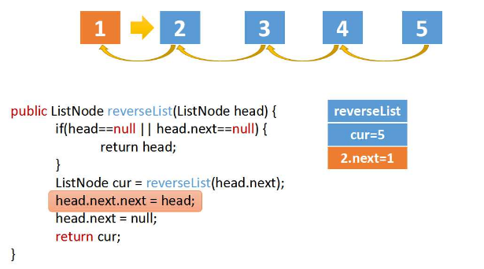
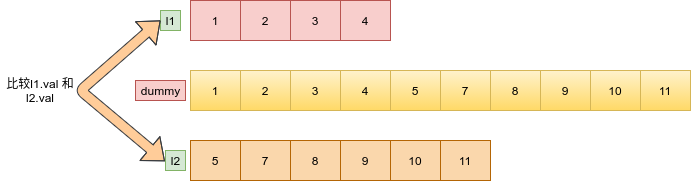

# 剑指offer打卡-3

[toc]

## 链表中倒数第k个结点（<font color = red>重点</font>）

题目类型：链表、双指针

题目难度：:star2::star2::star2:

- 问题描述

  ```python
  问题描述：
  输入一个链表，输出该链表中倒数第k个结点
  
  解决方法：
  方法1：
  使用栈存储，先进后出。
  
  方法2：
  双指针(双指针相差k，先前指针走完时，正好后指针到指定结点)
   former + after = after + former
   K + M = Ｍ + K
  时间复杂度：O(N)
  空间复杂度：O(1)
  ```

- 代码（[解题思路](https://leetcode-cn.com/problems/lian-biao-zhong-dao-shu-di-kge-jie-dian-lcof/solution/mian-shi-ti-22-lian-biao-zhong-dao-shu-di-kge-j-11/))

  算法图解：

  

  ```python
  class Solution:
      
      def FindKthToTail(self, head, k):
          """双指针，两个指针之间相差k值"""
  
          former, latter = head, head
          for _ in range(k):
              # 提前判断K是否满足要求
              if not former: return None
              former = former.next
  
          while former:
              former = former.next
              latter = latter.next
  
          return latter
  ```

## 链表的翻转（<font color = red>重点</font>）

题目类型：链表

题目难度：:star2::star2:

- 问题描述

  ```python
  问题描述：
  输入一个链表，反转链表后，输出新链表的表头。
  
  解决方案：
  链表的遍历插入
  （1）迭代法
  时间复杂度：O(N)
  空间复杂度：O(1)
  （2）递归法
  ```

- 代码：迭代法（[解题思路](https://leetcode-cn.com/problems/reverse-linked-list/solution/shi-pin-jiang-jie-die-dai-he-di-gui-hen-hswxy/)）

  算法图解：

  

  ```python
  class Solution:
  
      def reverseList(self, pHead):
          """链表的翻转"""
  
          cur, pre = pHead, None
          while cur:
              tmp = cur.next
              cur.next = pre
              pre = cur
              cur = tmp
  
          return pre
  ```
  
- 代码：递归法（[解题思路](https://leetcode-cn.com/problems/fan-zhuan-lian-biao-lcof/solution/dong-hua-yan-shi-duo-chong-jie-fa-206-fan-zhuan-li/)）

  算法图解（**注意每次返回的都是同一个节点**）：

  

  ```python
  class Solution:
      def reverseList(self, head: ListNode) -> ListNode:
  
          if head is None or head.next is None:
              return head
  
          node = self.reverseList(head.next)
          head.next.next = head
          head.next = None
  
          return node
  ```

## 合并两个排序的链表（<font color = red>重点</font>）

题目类型：链表

题目难度：:star2::star2:

- 问题描述

  ```python
  问题描述：
  	输入两个单调递增的链表，输出两个链表合成后的链表，当然我们需要合
   成后的链表满足单调不减规则。
  
  解决方案：
  1. 构建一个新的链表用于添加合并后的有序链表
  2. 递归
  
  时间复杂度：min(O(len(l1), len(l2)))
  空间复杂度：O(1)
  ```

- 代码（[解题思路](https://leetcode-cn.com/problems/he-bing-liang-ge-pai-xu-de-lian-biao-lcof/solution/mian-shi-ti-25-he-bing-liang-ge-pai-xu-de-lian-b-2/)）

  算法图解：
  
  
  
  ```python
  class ListNode:
       def __init__(self, x):
           self.val = x
           self.next = None
  
  
  class Solution:
      
      def mergeTwoLists(self, l1: ListNode, l2: ListNode) -> ListNode:
  
          cur = dummy = ListNode(0)
  
          while l1 and l2:
              if l1.val < l2.val:
                  cur.next, l1 = l1, l1.next
              else:
                  cur.next, l2 = l2, l2.next
              cur = cur.next
          
          cur.next = l1 if l1 else l2
  
          return dummy.next
  ```

## 复杂链表的复制

题目类型：链表

题目难度：:star2::star2::star2::star2:

- 问题描述

  ```python
  问题描述：
  	输入一个复杂链表（每个节点中有节点值，以及两个指针，**一个指向下一
  个节点，另一个特殊指针指向任意一个节点**），返回结果为复制后复杂链表的h
  ead。（注意，输出结果中请不要返回参数中的节点引用，否则判题程序会直接返
  回空。
  
  解决方案：
  A---  a***  --->B  ***>b
  A.next.random = a.random.next问题描述：
  ```

  实例：

  

- 代码（[解题思路](https://leetcode-cn.com/problems/fu-za-lian-biao-de-fu-zhi-lcof/solution/jian-zhi-offer-35-fu-za-lian-biao-de-fu-zhi-ha-xi-/)）

- 计算图示：

   
  
  ```python
  class Solution:
  
      def copyRandomList(self, head):
          """复制复杂链表"""
  
          if head is None:
              return  None
  
          # 添加附加结点
          cur = head
          while cur:
              tmp = ListNode(cur.val)
              tmp.next = cur.next
              cur.next = tmp
              cur = tmp.next
  
          # 附加结点随机指针指向
          cur = head
          while cur:
              if cur.random:
                  cur.next.random = cur.random.next
              cur = cur.next.next
  
          # 主结点和复附属结点连接
          cur = res = head.next
          pre = head
          while cur.next:
              pre.next = pre.next.next
              cur.next = cur.next.next
              pre = pre.next
              cur = cur.next
          pre.next = None  # 对尾结点进行处理
          return res
  ```

## 两个链表的第一个公共结点（浪漫相遇）:heart:

题目类型：链表、双指针

题目难度：:star2::star2:


- 问题描述

  ```python
  问题描述：
  输入两个链表，找出它们的第一个公共节点。
  
  解决方案：
  1. 暴力搜索
  No Recommend
  2.使用栈从后向前找出第一个不相等的结点
  A:1 2 5 6
  公共结点---->10 11 55 88
  B:2 4 8 9
  3. 交替遍历指针
  时间复杂度：（M + N）
  空间复杂度：（１）
  p1 -> --->......p1=p2
  p2 --> ---->......return p1
  实例：
  a:(1 2 3 4 ) 10 10 10
  b:(0 7 8 9 6 5 2)  10 10 10
  c(公共部分): 10 10 10
  a + c + b = b + c + a
  
  时间复杂度：O(a + b)
  空间复杂度：O(1)
  ```

- 代码（[解题思路](https://leetcode-cn.com/problems/liang-ge-lian-biao-de-di-yi-ge-gong-gong-jie-dian-lcof/solution/shuang-zhi-zhen-fa-lang-man-xiang-yu-by-ml-zimingm/)）

  ```python
  class Solution:
  
      def findFirstCommonNode(self, pHead1, pHead2):
          """烂漫相遇问题（我走过你来时的路）"""
  
          node1, node2 = pHead1, pHead2
          
          while node1 != node2:
              node1 = node1.next if node1 else pHead2
              node2 = node2.next if node2 else pHead1
              
          return node1
  ```

## 参考

[数据结构与算法题目](https://blog.csdn.net/storyfull/category_9475477_2.html)

[剑指offer（python）](https://blog.csdn.net/ggdhs/category_8914921.html)

[旋转数组的通用解决办法](https://zhuanlan.zhihu.com/p/136849860)