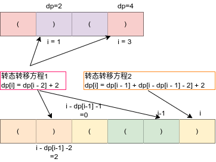
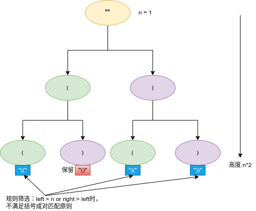

# Python剑指offer打卡-36

[toc]

## 最长有效括号

题目类型：动态规划

题目难度：:star2::star2::star2::star2:

- 问题描述

  ```
  问题描述：
  给你一个只包含 '(' 和 ')' 的字符串，找出最长有效（格式正确且连续）括号子串的长度。
  
  示例：
  输入：s = ")()())"
  输出：4
  解释：最长有效括号子串是 "()()"
  
  解题方法：
  动态规划
  时间复杂度：O(N)
  空间复杂度：O(N)
  
  原题链接：https://leetcode-cn.com/problems/longest-valid-parentheses/
  相似题目：有效的括号、括号生成
  ```

- 代码

  图解算法

  

  ```python
  class Solution:
      def longestValidParentheses(self, s: str) -> int:
          n = len(s)
          # 定义dp
          dp = [0] * n  # 到第i位置的最大括号
          res = 0
          # 转态转移
          for i in range(1, n):
              if s[i] == ")":
                  if s[i - 1] == "(":
                      # "()()()"
                      dp[i] = (dp[i - 2] if i >= 2 else 0) + 2
                  else:
                      # "()(())"
                      if i - dp[i - 1] >= 1 and s[i - dp[i - 1] - 1] == "(":
                          dp[i] = dp[i - 1] + (dp[i - dp[i - 1] - 2] if i - dp[i - 1] >= 2 else 0) + 2
  
                  res = max(dp[i], res)
          # 返回值
          return res
  ```

## 括号生成

题目类型：DFS

题目难度：:star2::star2::star2:

- 问题描述

  ```
  问题描述：
  数字 n 代表生成括号的对数，请你设计一个函数，用于能够生成所有可能的并且 有效的 括号组合。
  
  示例：
  输入：n = 3
  输出：["((()))","(()())","(())()","()(())","()()()"]
  
  解题方法：
  DFS
  时间复杂度：O()
  空间复杂度：O()
  
  原题链接：https://leetcode-cn.com/problems/generate-parentheses/
  ```

- 代码

  图解算法

  

  ```python
  class Solution:
  
      def generateParenthsis(self, n: int):
          if n <= 0: return []
          res = []
  
          def dfs(paths, left, right):
              if left > n or right > left: return
              if len(paths) == n*2:
                  res.append(paths)
                  return
              dfs(paths + "(", left + 1, right)
              dfs(paths + ")", left, right + 1)
          dfs("", 0, 0)
  
          return res
  ```

## 平方数之和

题目类型：二分法、双指针

题目难度：:star2::star2:

- 问题描述

  ```
  问题描述：
  给定一个非负整数 c ，你要判断是否存在两个整数 a 和 b，使得 a2 + b2 = c 。
  
  示例：
  输入：c = 5
  输出：true
  解释：1 * 1 + 2 * 2 = 5
  
  解题方法：
  双指针
  时间复杂度：O(sqrt(c))
  空间复杂度：O(1)
  
  原题链接：https://leetcode-cn.com/problems/sum-of-square-numbers/
  相似题目：x的平法根、二维数据查找
  ```

- 代码

  ```python
  class Solution:
      def judgeSquareSum(self, c: int) -> bool:
  
          low, high = 0, int(c**0.5)
          while low <= high:
              sum_of = low*low + high * high
              if sum_of < c:
                  low += 1
              elif sum_of > c:
                  high -= 1
              else:
                  return True
          return False
  ```

## 轮转数组

题目类型：字符串

题目难度：:star2::star2:

- 问题描述

  ```
  问题描述：
  给你一个数组，将数组中的元素向右轮转 k 个位置，其中 k 是非负数。
  （注意：使用O(1)的空间复杂度）
  示例：
  输入: nums = [1,2,3,4,5,6,7], k = 3
  输出: [5,6,7,1,2,3,4]
  解释:
  向右轮转 1 步: [7,1,2,3,4,5,6]
  向右轮转 2 步: [6,7,1,2,3,4,5]
  向右轮转 3 步: [5,6,7,1,2,3,4]
  
  解题方法：
  局部翻转排序算法
  时间复杂度：O(n)
  空间复杂度：O(1)
  
  原题链接：https://leetcode-cn.com/problems/rotate-array/
  ```

- 代码

  图解算法

  

  ```python
  class Solution:
      def rotate(self, nums: List[int], k: int) -> None:
          """
          Do not return anything, modify nums in-place instead.
          """
  
          def reverse(i, j):
              while i < j:
                  nums[i], nums[j] = nums[j], nums[i]
                  i += 1
                  j -= 1
          n = len(nums)
          k %= n
          # 整体翻转
          reverse(0, n - 1)
          # 左半部分
          reverse(0, k - 1)
          # 有半部分
          reverse(k, n - 1)
  ```

## 阶乘后的零

题目类型：数学

题目难度：:star2::star2:

- 问题描述

  ```
  问题描述：
  给定一个整数 n ，返回 n! 结果中尾随零的数量。
  提示 n! = n * (n - 1) * (n - 2) * ... * 3 * 2 * 1
  
  解题方法：
  归纳总结
  1. 肯定不可能真去把 n! 的结果算出来，阶乘增长可是比指数增长都恐怖
  2. 两个数相乘结果末尾有 0，一定是因为两个数中有因子 2 和 5，因为 10 = 2 x 5
  3. 也就是说，问题转化为：n! 最多可以分解出多少个因子 2 和 5
  4. 举例来说，n = 25，那么 25! 最多可以分解出几个 2 和 5 相乘？这个主要取决于能分解出几个因子 5，因为每个
  偶数都能分解出因子 2，因子 2 肯定比因子 5 多得多
  5. 现在，问题转化为：n! 最多可以分解出多少个因子 5
  6. 假设 n = 125，来算一算 125! 的结果末尾有几个 0
  7. 125 / 5 = 25，这一步就是计算有多少个像 5，15，20，25 这些 5 的倍数，它们一共可以提供一个因子 5
  8. 像 25，50，75 这些 25 的倍数，可以提供两个因子 5，那么我们再计算出 125! 中有 125 / 25 = 5 个 25 的倍
  数，它们每人可以额外再提供一个因子 5
  9. 我们发现 125 = 5 x 5 x 5，像 125，250 这些 125 的倍数，可以提供 3 个因子 5，那么我们还得再计算出 125!
  中有 125 / 125 = 1 个 125 的倍数，它还可以额外再提供一个因子 5
  10.125! 最多可以分解出 25 + 5 + 1 = 31 个因子 5，也就是说阶乘结果的末尾有 31 个 0
  
  时间复杂度：O(N)
  空间复杂度：O(1)
  
  原题链接：https://leetcode-cn.com/problems/factorial-trailing-zeroes/
  ```

- 代码

  ```python
  class Solution:
      def trailingZeroes(self, n: int) -> int:
  
          zero_cnts = 0
  
          for i in range(5, n + 1, 5):
              current = i
              while current % 5 == 0:
                  zero_cnts += 1
                  current //= 5
  
          return zero_cnts
  ```

## 