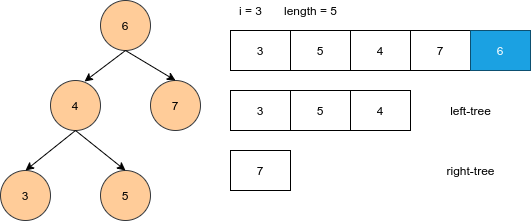
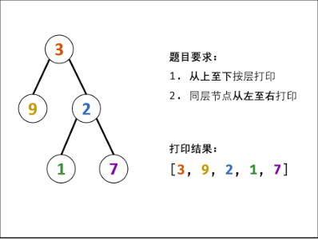

# Python剑指offer打卡-6

[toc]

## 二叉树中和为某一值的路径

题目类型：树

题目难度：:star2::star2::star2:

- 问题描述

  ```python
  问题描述：
          输入一颗二叉树的根节点和一个整数，打印出二叉树中结点值的和为输入整
  数的所有路径。路径定义为从树的根结点开始往下一直到叶结点所经过的结点形
  成一条路径。(注意: 在返回值的list中，数组长度大的数组靠前).
  
  示例:
  给定如下二叉树，以及目标和 target = 22，
                [5]
                 / \
             [4]  [8]
             /       / \
          [11]  13[4]
            /  \      / \
          7  [2] [5] 1
  输出值：
  [
     [5,4,11,2],
     [5,8,4,5]
  ]
  
  解决方案：
  递归
  
  注意：
  路径表示为根结点到叶子结点的全路径
  ```

- 代码（[解题思路](https://leetcode-cn.com/problems/er-cha-shu-zhong-he-wei-mou-yi-zhi-de-lu-jing-lcof/solution/mian-shi-ti-34-er-cha-shu-zhong-he-wei-mou-yi-zh-5/))

  图解算法
  
  
  
  ```python
  class Solution:
  
      def FindPath(self, root, expectNumber):
  
          if root is None:
              return []
  
          res = []
          if root.val == expectNumber and root.left is None and root.right is None:
              res.append([root.val])
  
          left = self.FindPath(root.left, expectNumber - root.val)
          right = self.FindPath(root.right, expectNumber - root.val)
          for path in left + right:
              # 向上添加路径
              res.append([root.val] + path)
  
          return res
  ```

## 判断是否是二叉搜索树的后序遍历序列结果

题目类型：树

题目难度：:star2::star2::star2:

- 问题描述

  ```python
  问题描述：
          输入一个整数数组，判断该数组是不是某二叉搜索树的后序遍历的结果。如果是
  则输出Yes,否则输出No。假设输入的数组的任意两个数字都互不相同。
  
  解决方案：
  BST:整体上应该保证结点数值右大左小
  递归
  
  注意：
  即：空列表也空树的结果
  if []: return True
  ```

- 代码

  图解
  
  
  
  ```python
  class Solution:
      def VerifySquenceOfBST(self, sequence):
          # write code here
          if not sequence:
              return False
          
          def isTree(sequence):
              """判断是否为搜索树"""
              
              root = sequence[-1]
              length = len(sequence)
              # 左小右大原则
              # 左子树
              for i in range(length):
                  if sequence[i] > root:
                      break
              left = True
              # 右子树
              for j in range(i, length - 1):
                  if sequence[j] < root:
                      return False
              right = True
              # 递归遍历
              if i > 0:
                  left = isTree(sequence[:i])
              if i < length - 1:
                  right = isTree(sequence[i: length - 1])
              
              return left and right
          
          return isTree(sequence)
  ```

## 从上往下打印二叉树（<font color = red>重点</font>）

题目类型：树

题目难度：:star2::star2::star2:

- 问题描述

  ```python
  问题描述：
  从上往下打印出二叉树的每个节点，同层节点从左至右打印
  
  解决方案：
  简单的层序遍历
  ```

- 代码

  **图解**
  
  
  
  ```python
  class Solution:
      
          def levelOrder(self, root: TreeNode) -> List[int]:
              """"层序遍历"""
              
                  if not root: return []
                  
                  res, queue = [], collections.deque()
                  queue.append(root)
                  
                  while queue:
                          node = queue.popleft()
                          res.append(node.val)
                          if node.left: queue.append(node.left)
                          if node.right: queue.append(node.right)
                              
         	        return res
      
  	def levelOrder(self, root):
  		"""层序遍历（每一层遍历）"""
          
  		if root is None: return []
  		res, deque = [], collections.deque()
  		deque.append(root)
  		
  		while deque:
  			tmp = []
  			for _ in range(len(deque)):
  				node = deque.popleft()
  				tmp.append(node.val)
  				if node.left: deque.append(node.left)
  				if node.right: deque.append(node.right)
  			res.append(tmp)
  
  		rerurn res
  	
              def levelOrder(self, root: TreeNode) -> List[List[int]]:
              	"""Z字形遍历"""
                  
                  if not root: return []
                  res, deque = [], collections.deque([root])
  
                  while deque:
                      tmp = collections.deque()
                      for _ in range(len(deque)):
                          node = deque.popleft() # 从左向右遍历
                          if len(res) % 2: tmp.appendleft(node.val) # 奇数层,队列首部
                          else: tmp.append(node.val) # 偶数层，队列尾部
                          if node.left: deque.append(node.left)
                          if node.right: deque.append(node.right)
  
                      res.append(list(tmp))
                  return res
  ```

## 最小的k个数（<font color = red>重点</font>）

题目类型：数组、排序

题目难度：:star2::star2::star2:

- 问题描述

  ```
  问题描述：
         输入n个整数，找出其中最小的K个数。例如输入4,5,1,6,2,7,3,8这
  8个数字，则最小的4个数字是1,2,3,4,。
  
  解决方案：
  (1) heapq
      构建堆，heapq构造的是小顶堆，即堆顶元素最小，因此为了构造大顶堆
  ，需要将元素都加负号，来颠倒他们的大小关系，相反数的小顶堆，就相当
  于原来数的大顶堆。求前K个最大的数，用小顶堆，K个小的数，用大顶堆。
  
  (2) quick sort
  未优化：所有数字先有序化，后截取指定区间内的数字
  时间复杂度：O(nlogn)
  空间复杂度：O(n)
  优化：旨在k区间内进行寻找
  若 k = l，我们就找到了最小的 k 个数，就是左侧的数组；
  若 k<l，则最小的 k 个数一定都在左侧数组中，我们只需要对左侧数组递归
  地 parition 即可；
  若 k>l，则左侧数组中的 l 个数都属于最小的 k 个数，我们还需要在右侧
  数组中寻找最小的 k-l 个数，对右侧数组递归地 partition 即可。
  时间复杂度：O(n)
  空间复杂度：o(logn)
  ```

- 代码（[解题思路](https://leetcode-cn.com/problems/zui-xiao-de-kge-shu-lcof/solution/jian-zhi-offer-40-zui-xiao-de-k-ge-shu-j-9yze/)）

  图解最大堆

  

  ```python
  import heapq  # 默认构建最小堆，即父节点的值大于其任意子节点的值
  
  
  class Solution:
  
      def getLeastNumbersfForHeap(self, arr, k):
          """"获取最小k个数字"""
  
          if k == 0:
              return list()
  
          # 构建最大堆
          hp = [-x for x in arr[:k]]
          heapq.heapify(hp)
  
          for i in range(k, len(arr)):
              if hp[0] <= -arr[i]:
                  heapq.heappop(hp)
                  heapq.heappush(hp, -arr[i])
          res = [-x for x in hp]
  
          return res
  
      def getLeastNumbersForSort1(self, numbs, k):
  
          def quickSort(nums, start, end):
              """"快速排序法"""
  
              if start >= end:
                  return list()
  
              low = start
              high = end
              mid = nums[start]
  
              while low < high:
                  while low < high and nums[high] >= mid:
                      high -= 1
                  nums[low] = nums[high]
                  while low < high and nums[low] < mid:
                      low += 1
                  nums[high] = nums[low]
              # 交换基准
              nums[low] = mid
              quickSort(nums, start, low - 1)
              quickSort(nums, low + 1, end)
          quickSort(numbs, 0, len(numbs) - 1)
  
          return numbs[:k]
      
      def getLeastNumbers2(self, arr: List[int], k: int) -> List[int]:
  
          def quickSort(nums, start,  end):
  
              if start >= end:
                  return nums[:k]
              
              low = start
              hight = end
              pivot = nums[start]
              while low < hight:
                  while low < hight and pivot <= nums[hight]:
                      hight -= 1
                  nums[low] = nums[hight]
                  while low < hight and pivot > nums[low]:
                      low += 1
                  nums[hight] = nums[low]
              nums[low] = pivot
  
              if k < low: quickSort(nums, start, low - 1)
              if k > hight: quickSort(nums, low + 1, end)
          
          quickSort(arr, 0, len(arr) - 1)
  
          return arr[:k]
  ```

## 数据流中的中位数

题目类型：数组

题目难度：:star2::star2:

- 问题描述

  ```
  问题描述：
  中位数是有序列表中间的数。如果列表长度是偶数，中位数则是中间两个数的平均值。
  
  例如，
  
  [2,3,4] 的中位数是 3
  
  [2,3] 的中位数是 (2 + 3) / 2 = 2.5
  ```

- 代码（[解题思路](https://leetcode-cn.com/problems/find-median-from-data-stream/solution/tu-jie-pai-xu-er-fen-cha-zhao-you-xian-dui-lie-by-/)）

  ```python
  import heapq
  
  
  class Solution:
  
      def __init__(self):
          """初始化最大最小堆"""
  
          self.max_heap = []
          self.min_heap = []
  
      def addNum(self, num: int) -> None:
          """添加元素"""
  
          # 相等保证最小堆个数大于等于最大堆（最大相差一个）
          # 最大堆－>最小堆　　—>最大堆
          if len(self.max_heap) == len(self.min_heap):
              heapq.heappush(self.min_heap, -heapq.heappushpop(self.max_heap, -num))
          else:
              heapq.heappush(self.max_heap, -heapq.heappushpop(self.min_heap, num))
  
      def findMedian(self) -> float:
          if len(self.min_heap) == len(self.max_heap):
              return (-self.max_heap[0] + self.min_heap[0]) / 2
          else:
              return self.min_heap[0]
  ```


## 参考

[最大最小堆整理 & heapq最小最大堆](https://blog.csdn.net/weixin_36372879/article/details/84573144)

[数据结构与算法(4)——优先队列和堆](https://zhuanlan.zhihu.com/p/39615266)