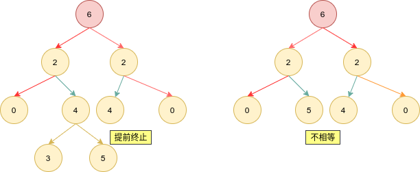

# Python剑指offer打卡-7

[toc]

## 二叉树的下一个节点（<font color = red>重点</font>）

题目类型：树

题目难度：:star2::star2::star2:

- 问题描述

  ```
  问题描述：
  	给定一个二叉树和其中的一个结点，请找出中序遍历顺序的下一个结点并且
  回。注意，树中的结点不仅包含左右子结点，同时（包含指向父结点的指针）。
  ```

- 代码（[解题思路](https://blog.nowcoder.net/n/d3cb177d45804e87bba90b325321d43c)）

  图解

  

- ```python
  class TreeLinkNode:
  
      def __init__(self, val):
          self.val = val
          self.left = None
          self.right = None
          self.parent = None
  
  
  class Solution:
  
  	def getNextNode(self, pHead):
  		"""获得中序遍历的下一个结点"""
  		
  		if pHead.right:
  			tmpNode = pHead.right
  			while tmpNode.left:
  				tmpNode = tmpNode.left
  			
  			return tmpNode
  		else:
  			tmpNode = pHead
  			while tmpNode.parents:
  				if tmpNode.parents.left == tmpNode:
  					return tmpNode.parent
  				tmpNode = tmpNode.parents
  
  			return None
  ```

## 判断二叉树是否对称

题目类型：树

题目难度：:star2::star2:

- 问题描述

  ```
  问题描述：
  	请实现一个函数，用来判断一颗二叉树是不是对称的。注意，如果一个二叉树
  同此二叉树的镜像是同样的，定义其为对称的.
  示例：
      1
    2   2
  3  4 4  3
  ```

- 代码（[解题思路](https://leetcode-cn.com/problems/dui-cheng-de-er-cha-shu-lcof/solution/mian-shi-ti-28-dui-cheng-de-er-cha-shu-di-gui-qing/)）

  图解算法
  
  
  
  递归
  
  ```python
  class Solution:
      
      def isSymmetric(self, root):
  
          def recur(L, R):
              if not L and not R: return True
              # 存在一个提前终止
              if not L or not R or L.val != R.val: return False
              return recur(L.left, R.right) and recur(L.right, R.left)
  
          return recur(root.left, root.right) if root else True
  ```
  
  非递归(迭代法)
  
  ```python
  class Solution:
      def isSymmetric(self, root: TreeNode) -> bool:
  
  
          if not root: return False
          deque = [(root.left, root.right)]
          while deque:
              L, R = deque.pop(0)
              # 出口
              if not L and not R:
                  continue
              if not L or not R or L.val != R.val:
                  return False
              # 层序遍历
              deque.append((L.left, R.right))
              deque.append((L.right, R.left))
  
          return True
  ```

## 按之字形顺序打印二叉树

题目类型：树

题目难度：:star2::star2:

- 问题描述

  ```
          请实现一个函数按照之字形打印二叉树，即第一行按照从左到右的顺序打印
   ，第二层按照从右至左的顺序打印，第三行按照从左到右的顺序打印，其他行以
   此类推。
   
  解题：
  构造奇偶条件，遍历不同顺序(偶头奇尾法)
  ```

- 代码（[解题思路](https://leetcode-cn.com/problems/cong-shang-dao-xia-da-yin-er-cha-shu-iii-lcof/solution/mian-shi-ti-32-iii-cong-shang-dao-xia-da-yin-er--3/)）

  ```python
  # Definition for a binary tree node.
  import collections
  
  class TreeNode:
       def __init__(self, x):
           self.val = x
           self.left = None
           self.right = None
  
  class Solution:
      def levelOrder(self, root: TreeNode) -> List[List[int]]:
  
          if not root: return []
          res, deque = [], collections.deque([root])
  
          while deque:
              tmp = collections.deque()
              for _ in range(len(deque)):
                  node = deque.popleft() # 从左向右遍历
                  if len(res) % 2: tmp.appendleft(node.val) # 奇数层（1, 3., 5......）,队列首部,从右向左
                  else: tmp.append(node.val) # 偶数层（0, 2, 4, 6......），队列尾部
                  if node.left: deque.append(node.left)
                  if node.right: deque.append(node.right)
              
              res.append(list(tmp))
          return res
  ```

## 把二叉树打印成多行

题目类型：树

题目难度：:star2::star2:

- 问题描述

  ```
  问题描述：
  	从上到下按层打印二叉树，同一层结点从左至右输出。每一层输出一行。
  ```

- 代码（[解题思路](https://leetcode-cn.com/problems/cong-shang-dao-xia-da-yin-er-cha-shu-ii-lcof/solution/mian-shi-ti-32-ii-cong-shang-dao-xia-da-yin-er-c-5/)）

  ```python
  import collections
  
  class TreeNode:
       def __init__(self, x):
           self.val = x
           self.left = None
           self.right = None
  
  class Solution:
      def levelOrder(self, root: TreeNode) -> List[List[int]]:
  
          if not root: return []
          res, queue = [], collections.deque([root])
  
          while queue:
              tmp = []
              for _ in range(len(queue)):
                  node = queue.popleft()
                  tmp.append(node.val)
                  if node.left: queue.append(node.left)
                  if node.right: queue.append(node.right)
  
              res.append(tmp)
          return res
  ```

## 二叉搜索树的第 k 大节点

题目类型：树

题目难度：:star2::star2:

- 问题描述

  ```
  问题描述：
  	给定一棵二叉搜索树，请找出其中的第k大的结点。例如， （5，3，7，2，4，
  6，8） 中，按结点数值大小顺序第三个大结点的值为6。
  
  解决方法：
  	二叉搜索树的中序遍历为有序序列（递增序列），将其转换为逆序列，可以求得
  最大kth数值，并实现提前返回，减少时间复杂度。
  ```

- 代码（[解题思路](https://leetcode-cn.com/problems/er-cha-sou-suo-shu-de-di-kda-jie-dian-lcof/solution/mian-shi-ti-54-er-cha-sou-suo-shu-de-di-k-da-jie-d/)）

  ```python
  class Solution:
      def kthLargest(self, root: TreeNode, k: int) -> int:
          
          def dfs(root):
              
              if not root: return
              dfs(root.right)
              if self.k == 0: return  # 实现提前放回，节省内存消耗
              self.k -= 1
              if self.k == 0: self.res = root.val
              dfs(root.left)
  
          self.k = k
          dfs(root)
          return self.res
  ```

  ## 参考

[python collections 模块中的 deque](https://blog.csdn.net/HappyRocking/article/details/80058623?utm_medium=distribute.pc_relevant.none-task-blog-BlogCommendFromMachineLearnPai2-2.control&depth_1-utm_source=distribute.pc_relevant.none-task-blog-BlogCommendFromMachineLearnPai2-2.control)