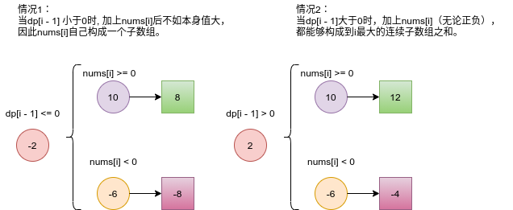

# Python剑指offer打卡-8

[toc]

## 序列化二叉树

- 问题描述

  ```
  请实现两个函数，分别用来序列化和反序列化二叉树。
  
  你可以将以下二叉树：
      1
     / \
    2   3
       / \
      4   5
  序列化为 "[1,2,3,null,null,4,5]"
  ```
  
- 代码

  ```python
  import collections
  
  
  class Codec:
  
      def serialize(self, root):
          """Encodes a tree to a single string.
          
          :type root: TreeNode
          :rtype: str
          """
  
          if not root: return "[]"
          res, queue = [], collections.deque()
          queue.append(root)
          while queue:
              node = queue.popleft()
              if node:
                  res.append(str(node.val))
                  queue.append(node.left)
                  queue.append(node.right)
              else:
                  res.append("null")
          
          return "[" + ",".join(res) + "]"        
  
      def deserialize(self, data):
          """Decodes your encoded data to tree.
          
          :type data: str
          :rtype: TreeNode
          """
  
          if data=="[]": return None
          vals, i = data[1:-1].split(','), 1 # 消除左右括号
          root = TreeNode(int(vals[0]))
          queue = collections.deque()
          queue.append(root)
  
          while queue:
              node = queue.popleft()
              if vals[i] != "null":
                  node.left = TreeNode(str(vals[i]))
                  queue.append(node.left)
              i += 1
              if vals[i] != "null":
                  node.right = TreeNode(str(vals[i]))
                  queue.append(node.right)
              i += 1
          return root
  ```

## 连续子数组的最大和（<font color = red>重点</font>）

题目类型：数组、动态规划

题目难度：:star2::star2::star2:

- 题目说明  

  ```
  问题描述：
  	输入一个整型数组，数组中的一个或连续多个整数组成一个子数组。求所有子数组
  的和的最大值。要求时间复杂度为O(n)。
  
  解题方法：
  动态规划
  (1) 状态定义： 设动态规划列表 dp ，dp[i] 代表以元素 nums[i]结尾的连续子数组最大和。
  为何定义最大和 dp[i] 中必须包含元素 nums[i]：保证 dp[i]递推到dp[i+1] 的正确性；如
  果不包含 nums[i]，递推时则不满足题目的 连续子数组 要求。
  (2) 转移方程：若dp[i−1]≤0 ，说明 dp[i - 1]对 dp[i]产生负贡献，
  即 dp[i-1] + nums[i]不如 nums[i]本身大。
  当 dp[i - 1] > 0时：执行 dp[i] = dp[i-1] + nums[i]；
  当 dp[i−1]≤0 时：执行 dp[i] = nums[i]；
  (3) 初始状态： dp[0] = nums[0]，即以 nums[0]结尾的连续子数组最大和为 nums[0] 。
  (4) 返回值： 返回 dp 列表中的最大值，代表全局最大值。
  
  dp[i]的长度，时间复杂度O(n)
  直接使用nums数组进行存储，空间复杂度O(1)
  ```


- 代码（[解题思路](https://leetcode-cn.com/problems/lian-xu-zi-shu-zu-de-zui-da-he-lcof/solution/cong-bao-li-po-jie-dao-dong-tai-gui-hua-yfvkp/)）
  
  状态转移方程：
  $$
  dp[j]={ dp[j−1]+nums[j],dp[j−1]>0   \\
  dp[j]=nums[j],   dp[j−1]≤0}\\
    
  $$
  
  
  
  情况描述：
  
  
  
  ```python
  class Solution:
      def maxSubArray(self, nums: List[int]) -> int:
  
          for i in range(1, len(nums)):
              nums[i] += max(nums[i-1], 0)
          
          return max(nums)
  ```

##　二叉树的深度

题目类型：树

题目难度：:star2:

- 问题描述

  ```
  问题描述：
  	输入一棵二叉树的根节点，求该树的深度。从根节点到叶节点依次经过的节点
  （含根、叶节点）形成树的一条路径，最长路径的长度为树的深度。
  例如：
  给定二叉树 [3,9,20,null,null,15,7]，
  深度: 3
  
  解法：
  (1)后续遍历DFS
  二叉树的深度=max(左子树的深度，右子树的深度) + 1
  (2)层序遍历(BFS)
  每一层的结点单独进行遍历，并设置计数
  ```

- 代码

  ```python
  class TreeNode:
  
      def __init__(self, val):
          self.val = val
          self.left = None
          self.right = None
  
  
  class Solution:
  
      def maxDepth(self, root: TreeNode) -> int:
          """DFS"""
  
          if not root: return 0
  
          return max(self.maxDepth(root.left), self.maxDepth(root.right) )+ 1
  
      def maxDepth1(self, root: TreeNode) -> int:
          """层序遍历"""
  
          if not root: return None
          queue, res = [root], 0
          while queue:
              tmp = []
              # 每一层单独进行遍历
              for node in queue:
                  if node.left: tmp.append(node.left)
                  if node.right: tmp.append(node.right)
              queue = tmp
              res += 1
          return res
  ```

## 二叉搜索树与双向链表

题目类型：树

题目难度：:star2::star2:

- 题目说明

  ```
  问题描述：
  	输入一棵二叉搜索树，将该二叉搜索树转换成一个排序的循环双向链表。要求不
  能创建任何新的节点，只能调整树中节点指针的指向。
  
  解题方法:
  二叉搜索树的中序遍历是有序的
  ```

- 代码（[解题思路](https://leetcode-cn.com/problems/er-cha-sou-suo-shu-yu-shuang-xiang-lian-biao-lcof/solution/mian-shi-ti-36-er-cha-sou-suo-shu-yu-shuang-xian-5/)）

  图解算法
  
  
  
  ```python
  class Node:
      def __init__(self, val, left=None, right=None):
          self.val = val
          self.left = left
          self.right = right
          
  class Solution:
      def treeToDoublyList(self, root: 'Node') -> 'Node':
  
          def dfs(cur):
              """中序遍历能够实现二叉搜索树有序化"""
              if not cur: return None
              dfs(cur.left)
              # 实现双向链表
              
              if self.pre:
                  self.pre.right, cur.left = cur, self.pre
              else:
                  self.head = cur
              self.pre = cur 
              dfs(cur.right)
  
          if not root: return None
          self.pre = None
          dfs(root)
          # 实现头尾相连(循环双向链表)
          self.pre.right, self.head.left = self.head, self.pre
  
          return self.head
      
  ```

## 矩形覆盖

题目类型：动态规划

题目难度：:star2:

- 问题描述

  ```
  问题描述：
  	我们可以用2*1的小矩形横着或者竖着去覆盖更大的矩形。请问用
  n个2*1的小矩形无重叠地覆盖一个2*n的大矩形，总共有多少种方法？
  
  解题方法：
  1.递归（时间复杂度大）
  2. 双指针（合理）
  ```
  
- 代码（[解题思路](https://blog.csdn.net/zgljl2012/article/details/48481343)）

  图示

  

- ```python
  class Solution:
  
      def rectCover(self, n: int) -> int:
          if n == 0 or n == 1 or n == 2:
              return n
          return self.rectCover(n - 1) + self.rectCover(n - 2)
      
          def rectCover(self, number):
              # write code here
              if number == 0:
                  return number
  
              a, b = 1, 1
              for _ in range(number):
                  a, b = b, a + b
  
              return a
  ```

## 参考

[图解算法数据结构](https://leetcode-cn.com/leetbook/read/illustration-of-algorithm/55187i/)

