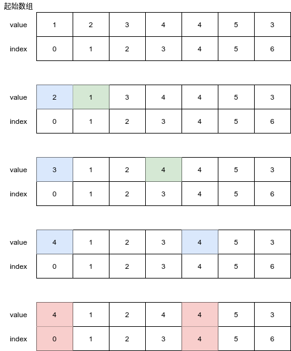
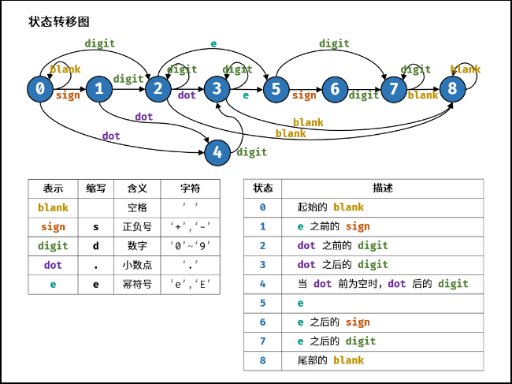

# Python剑指offer打卡-9

[toc]

## 平衡二叉树

题目类型：树

题目难度：:star2:

- 问题描述

  ```
  题目描述：
  　　给定一个二叉树，判断它是否是高度平衡的二叉树。
  
  解题方法：
          二叉树的每个节点的左右子树的高度差的绝对值不超过 1，则二叉树是
  平衡二叉树。根据定义，一棵二叉树是平衡二叉树，当且仅当其所有子树也
  都是平衡二叉树，因此可以使用递归的方式判断二叉树是不是平衡二叉树，
  递归的顺序可以是自顶向下或者自底向上，其中自低向上复杂度最优。
  ```

- 代码

  图解算法
  
  
  
  ```python
  class Solution:
  
      def isBalanced(self, root) -> bool:
          
          def height(root):
              
              if not root: return 0
              leftHight = height(root.left)
              rightHight = height(root.right)
              if leftHight == -1 or rightHight == -1 or abs(leftHight - rightHight) > 1:
                  return -1
              else:
                  # 求解当前结点的高度
                  return max(leftHight, rightHight) + 1
  
          return height(root) >= 0
  ```

## 数组中的重复数字

题目类型：数组

题目难度：:star2:

- 问题描述

  ```python
  问题描述：
  	在一个长度为 n 的数组 nums 里的所有数字都在 0～n-1 的范围内。数组中
  某些数字是重复的，但不知道有几个数字重复了，也不知道每个数字重复了几次。
  请找出数组中任意一个重复的数字。
  
  解题方法:
  方法一：
  集合
  时间复杂度：O(N)
  空间复杂度：O(N)
  
  方法二：
  重点理解数组元素值的限定问题
  原地交换：索引与值的对应关系（一对多），不重复情况下索引与值一一对应。
  时间复杂度：O(N)
  空间复杂度：O(1)
  ```

- 代码（[解题思路](https://leetcode-cn.com/problems/shu-zu-zhong-zhong-fu-de-shu-zi-lcof/solution/mian-shi-ti-03-shu-zu-zhong-zhong-fu-de-shu-zi-yua/)）

  原地交换图示（注意索引与值的对应关系）：
  
  
  
  
  
  ```python
  class Solution:
  
      def findRepeatNumber(self, nums: [int]) -> int:
          """"集合"""
  
          dic = set()
          for num in nums:
              if num in dic: return num
              dic.add(num)
  
          return -1
  
      def findRepeatNumber_1(self, nums: [int]) -> int:
          """原地交换：索引与值的对应关系"""
          i = 0
          while i < len(nums):
              if nums[i] == i:  # 索引与值相对应
                  i += 1
                  continue
  
            if nums[nums[i]] == nums[i]: return nums[i]  # 索引与值(一对多)重复
              nums[nums[i]], nums[i] = nums[i], nums[nums[i]]  #将值和索引交换到正确的索引位置上
  
          return -1
  ```
  
- 变形（需要打印出重复出现的数字）

- 问题描述

  ```
  	给定一个整数数组 a，其中1 ≤ a[i] ≤ n （n为数组长度）, 其中有些元素出现两次而其他元素出
  现一次。找到所有出现两次的元素。
  你可以不用到任何额外空间并在O(n)时间复杂度内解决这个问题吗？
  实例：
  输入:
  [4,3,2,7,8,2,3,1]
  输出:
  [2,3]
  ```

- 代码

  ```python
  class Solution:
      def findDuplicates(self, nums: List[int]) -> List[int]:
  
          if not nums:
              return []
          
          res = []
          n = len(nums)
  
          for i in range(n):
              num = abs(nums[i])
              if nums[num - 1] < 0:
                  res.append(num)
              else:
                  nums[num - 1] = -nums[num - 1]
          
          return res
  ```
## 构建数组乘积

题目类型：数组

题目难度：:star2:

- 问题描述

  ```
  问题描述：
  	给定一个数组 A[0,1,…,n-1]，请构建一个数组 B[0,1,…,n-1]，其中B[i] 的值
  是数组 A 中除了下标 i 以外的元素的积, 即B[i]=A[0]×A[1]×…×A[i-1]×A[i+1]
  ×…×A[n-1]。不能使用除法。
  
  解题方法：
  时间复杂度：O(N)
  空间复杂度：O(N)
  ```

  

- 代码（[解题思路](https://leetcode-cn.com/problems/gou-jian-cheng-ji-shu-zu-lcof/solution/mian-shi-ti-66-gou-jian-cheng-ji-shu-zu-biao-ge-fe/)）

  ```python
  class Solution:
      
      def constructArr(self, a: List[int]) -> List[int]:
          
          b, tmp = [1]*len(a), 1
          
          # 计算下三角(左)
          for i in range(1, len(a)):
              b[i] = b[i - 1] * a[i-1]
              
          for i in range(len(a) - 2, -1, -1):
              tmp *= a[i + 1]  # 计算上三角(右)
              b[i] *= tmp  # 左右相乘(下三角乘以上三角)
          
          return b
  ```

## 正则表达式匹配

题目类型：字符串

题目难度：:star2::star2:

- 问题描述

  ```
  问题描述：
  	请实现一个函数用来匹配包含'. '和'*'的正则表达式。模式中的字符'.'表示
  任意一个字符，而'*'表示它前面的字符可以出现任意次（含0次）。在本题中，
  匹配是指字符串的所有字符匹配整个模式。例如，字符串"aaa"与模式"a.a"和
  "ab*ac*a"匹配，但与"aa.a"和"ab*a"均不匹配。
  
  解题方法：
  1.回朔法
  2.动态规划法
  ```

- 代码（[解题思路](https://leetcode-cn.com/problems/zheng-ze-biao-da-shi-pi-pei-lcof/solution/hui-su-dong-tai-gui-hua-by-ml-zimingmeng/)）

  ```python
  class Solution:
  
      def isMathch(self, s: str, p: str) -> bool:
  	"""回朔法"""
          if not p: return not s
          # 首字符匹配
          first_match = bool(s and p[0] in {s[0], "."})
  
          # 如果第二个字符为"*"，则分为“*”字符前字符出现零次或一次以上两种情况
          if len(p)>=2 and p[1] == "*":
              return self.isMathch(s, p[2:]) \
                     or first_match and self.isMathch(s[1:], p)
          else:
              return first_match and self.isMathch(s[1:], p[1:])
  ```
## 表示数值的字符串

题目类型：字符串

题目难度：:star2::star2::star2::star2:

- 问题描述

  ```
  问题描述：
  请实现一个函数用来判断字符串是否表示数值（包括整数和小数）。例如，字符串"+100"、"5e2"、"-123"、"3.1416"、"-1E-16"、"0123"都表示数值，但"12e"、"1a3.14"、"1.2.3"、"+-5"及"12e+5.4"都不是。
  
  解题方法：
  有限自动机，构建状态转移表。
  ```

- 代码（[解题思路](https://leetcode-cn.com/problems/biao-shi-shu-zhi-de-zi-fu-chuan-lcof/solution/mian-shi-ti-20-biao-shi-shu-zhi-de-zi-fu-chuan-y-2/)）

  状态转移表

  

  ```python
  class Solution:
      
      def isNumber(self, s: str) -> bool:
  
              # 状态转移表
              states = [
                  {" ": 0, ".": 4, "s": 1, "d": 2},
                  {"d": 2, ".": 4},
                  {"d": 2, ".": 3, "e": 5, " ": 8},
                  {"d": 3, "e":5, " ": 8}, 
                  {"d": 3},
                  {"d": 7, "s": 6},
                  {"d": 7},
                  {"d": 7, " ": 8},
                  {" ": 8}
              ]
  
              # 起始状态
              p = 0
              for c in s:
                  if "0" <= c <= "9": t="d"
                  elif c in "+-": t="s"
                  elif c in ". ": t=c # 注意存在blank
                  elif c in "eE": t="e"
                  else: t="?"
  
                  # 转态跳转
                  if t not states[p]: return False
                  p = states[p][t]
  
              # 终止状态
              return p in (2, 3, 7, 8)、=；
  ```
